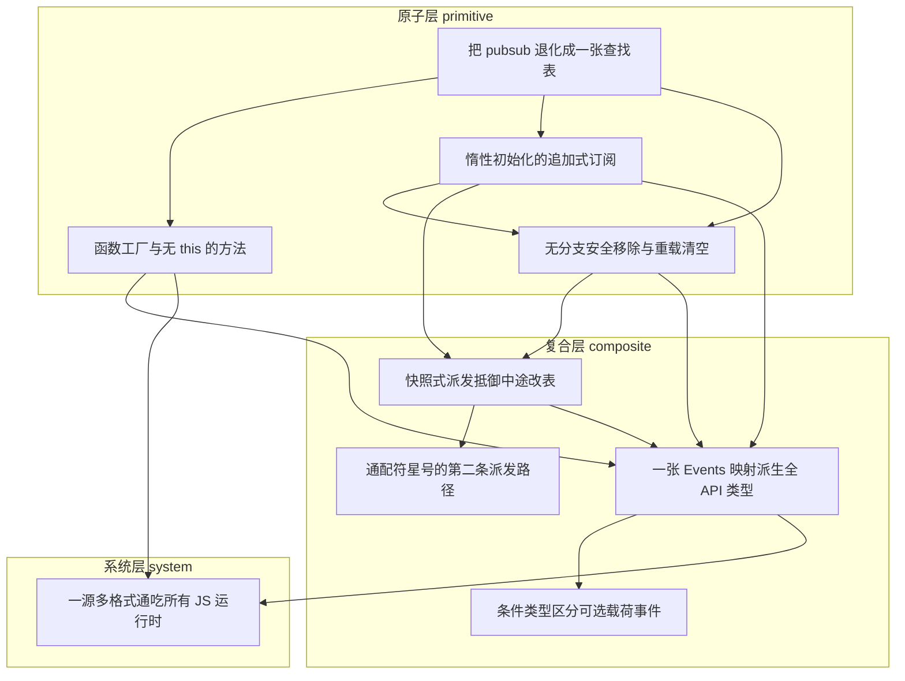

# 导读：mitt 源码解读

## 这本书在讲什么：一句话主线

你大概听过 mitt 的招牌——一个事件发射器，压缩后只有两百来字节。两百字节塞下一个完整的事件系统，靠的不是什么神功，而是一个执拗的选择：**把整个发射器削到只剩一张 `Map<事件类型, 处理器数组>` 当唯一家当，能力一律不内置，全从这张表往外长，代价一律往边界甩。**

这句话是全书的脊柱，它可以拆成三层往各章铺开：

- **primitive 层（①–④）把这张表立起来。** ① 宣布「它就是一张表，没有第二个字段」；② 让方法靠闭包、而不是靠 `this` 绑到这张表上，从此方法能被摘下来随便传；③④ 定下围着这张表读写、删除的三步操作——订阅是「首个处理器来了才建数组、追加不查重」，移除是「用一个位运算把删除压成无分支的一行」。
- **composite 层（⑤–⑧）解决这张表衍生出的四道难题。** 派发时要抵御处理器在半路改表（⑤快照）、要监听「所有事件」却不愿再建第二张表（⑥通配符当保留键）、要给这张同时装着各种处理器的异质表套上精确类型（⑦一张清单派生全 API）、要区分哪些事件能「不带数据」就触发（⑧条件类型当筛子）。
- **system 层（⑨）把这张表对应的同一个函数，换上三套模块外壳分发出去**，让打包器、Node、浏览器、类型检查器各领各的那一份。

而贯穿这一切的，是同一个算账姿态：拒绝内置、拒绝新增结构——凡是被这张表排除在外的能力（去重、只触发一次、异步、类型校验、模块格式），一律靠约定、快照、断言、条件映射这些「贴在边界上的补丁」补回来，或者干脆把责任推给调用方。认出这个姿态，你就抓住了 mitt 的全部设计逻辑。

## 怎么读这本书：两条阅读路线

### 一、线性路线（从头读到尾）

按依赖顺序读，每章承接了什么、又打开了什么：

- **① 把 pubsub 退化成一张查找表**：开场立地基。砍掉优先级、`once`、异步，宣布「一张 `Map` 就是发射器的全部状态」。
- **② 函数工厂与无 this 的方法**：接着地基问「方法凭什么摸得到这张表」。答案是用闭包在工厂调用那一刻把表坐标记死，方法从此不靠 `this`、能被安全解构传递。
- **③ 惰性初始化的追加式订阅**：第一次动手写这张表。定下「首个处理器才建数组 + 追加不查重」，对齐 Node `EventEmitter` 的脾气。
- **④ 无分支安全移除与重载清空**：接着动手删。用 `indexOf(handler) >>> 0` 把「找不到」的 `-1` 改写成必然越界的下标，让删除退化成无分支的一行；顺手让「不传处理器」表示清空全部。
- **⑤ 快照式派发抵御中途改表**：⚠️ **跳轨点之一**——从「单次读写操作」跨进「一轮派发的并发安全」。派发入门先 `.slice()` 复制一份，把本轮「会调到谁」冻结在入口瞬间。
- **⑥ 通配符星号的第二条派发路径**：派发的自然延伸。让 `'*'` 当表里的一个保留键，派发完类型匹配的处理器后再无条件走第二趟，用双参签名把类型信息补给通配符处理器。
- **⑦ 一张 Events 映射派生全 API 类型**：⚠️ **跳轨点之二**——从运行时切到类型层。给那张异质运行时表套上一层「事件名→数据类型」清单，让 `on('foo', e=>…)` 里的 `e` 自动收窄。
- **⑧ 条件类型区分「可不带数据」的事件**：类型层的延伸。用一句 `undefined extends Events[K] ? K : never` 在编译期筛出「能省掉参数」的事件，给触发动作开两条通道。
- **⑨ 一源多格式通吃所有 JS 运行时**：⚠️ **跳轨点之三**——从单文件函数跨到多产物分发。一份源码产 ESM/CJS/UMD 三壳，靠 `package.json` 的条件映射给每种消费者标好该走哪扇门。

> 三个跳轨点都标了 ⚠️：如果你在线性阅读时撞上难度台阶（比如从运行时的 ⑥ 一下跳到类型层的 ⑦ 觉得突兀），可以按下文的「按主题路线」先绕行，把同一主题的章节串成一气读完，再回头接线性路线。

### 二、按主题路线

针对常见阅读目标，各给一条精简的章节子序列：

- **「只想搞懂运行时核心：订阅/移除/派发怎么围着一张表转」**：① → ② → ③ → ④ → ⑤。这条线把这张表从建立、绑定、写、删、到安全派发一次走完，是 mitt 运行时的脊梁，也是全书最值得先读的一条。
- **「只关心类型安全是怎么实现的」**：①（先认识那张异质表）→ ⑦ → ⑧。从「一张清单派生全 API 类型」到「条件类型区分可不带数据的事件」，两章把类型层讲透；读 ① 只为明白「为什么内部存储是异质的」。
- **「只看通配符 / catch-all 机制」**：⑤ → ⑥。先懂快照派发这条主路径，再看通配符这条第二路径如何复用同一张表、同一套快照手法。
- **「只关心库怎么发布、能被各种运行时消费」**：⑨（可补 ②⑦ 做前置）。单章即可看懂分发机制，配上 ②⑦ 能看清「被分发的里子到底是哪个函数、类型从哪来」。
- **「想看 mitt 最招牌的『极简交易』哲学」**：① → ④ → ⑤ → ⑦。四笔最典型的交易：砍掉内置能力、砍掉删除分支、砍掉对「中途改表」的顾虑、砍掉类型样板。

## 贯穿全书的核心原理

下面四条是全书反复出现的底层机制——它们在多章以不同化身现身。读者一旦认出「这其实是同一个原理的又一次现身」，理解就会贯通。统领它们的一句话是：**为极简做交易、把代价推给边界**，这是 mitt 每一章「关键权衡」统一的算账方式。

**原理 A：一张表就是全部家当（单一状态容器）。** 本质：不内置任何能力，也不为任何新需求新增第二套结构，一切衍生品都长在这张 `Map` 上。现身：① 把它立成运行时唯一状态；⑥ 让通配符复用同一张表而不建第二张注册表；⑦ 在类型层用一张「事件名→数据类型」清单镜像它，作为唯一类型源；⑨ 分发时只给函数换外壳、不动这张表本身。这是全书最根本的复现原理——认出「这其实还是那张表」，全书结构就通了。

**原理 B：让既有的规则替你做判断，省掉显式分支。** 本质：不写 `if`，而是把判断交给某个已存在的规则或约定去悄悄完成。现身：③ 拿一次 `get` 的返回值同时回答「类型在不在」和「把数组给我」，省掉冗余的 `has` 查询；④ 用 `>>> 0` 借 `splice` 自带的越界钳制规则把 `-1` 抹平成「删零个」，并靠 `set([])` 守住「表里存的值恒为真」这条不变式；⑧ 借 TypeScript 既有的「可选属性 ⇒ 索引取值含 `undefined`」这条约定当判分依据，零额外配置就筛出了可省参数的事件。这三处都是同一招：把判断的责任外包给一个已经存在的规则。

**原理 C：在交出控制权之前先冻结一份，买下确定性。** 本质：一旦要把控制权交出去（交给用户回调、交给实现内部），就先在入口拍一份不可变的快照，之后外界怎么折腾都碰不到它。现身：⑤ `emit` 入门先 `.slice()`，把本轮「触发集合」冻结在调用那一刻；⑥ 把同一招用在通配符的第二趟派发上；这条思想还延伸到类型层——⑦ 里类型精度只活在公开 API 边界，一越过边界进入实现就退化为联合 + 断言，「精度只在边界存活」和运行时的「入口冻结」是同一个动作的两种化身。

**原理 D：对外承诺严格，内部用兜底过关。** 本质：给用户看的契约要精确、要挡住非法调用，但实现里用宽松的手段（断言、可选参数、非空断言）把流程走完，不为「严格」付运行时代价。现身：⑦ 公开接口呈现精确的「事件名 ↔ 数据类型」联动，内部存储却揉成联合、靠 `as` 断言在联合与具体之间来回转换（「类型安全是一种边界属性」）；⑧ 对外是两条严格的 `emit` 重载，内部却对所有键都把数据标成可选、用非空断言兜底。它在 ⑦ 与原理 C 交汇——「边界严格、内部宽松」正是「精度只在边界存活」的另一半。

## 全书脉络图

下图由 outline 的 `dependsOn` + `topoOrder` 程序化生成，与依赖图完全一致（箭头方向：前置 → 后继）。

