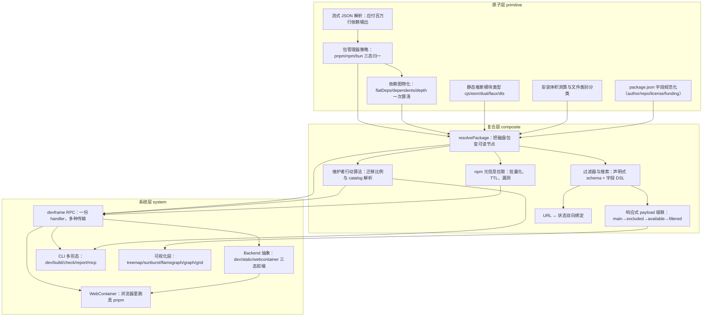

# 导读：node-modules-inspector 源码解读

## 这本书在讲什么：一句话主线

想象你打开一个装了上千个依赖的 monorepo，敲下 `pnpm ls --json --recursive`，stdout 像消防水管一样喷出几百兆字节——接下来要怎么把它变成一张能筛、能搜、能可视化、还能在浏览器里现装现跑的依赖面板？整本书就是这一句话。

更凝练地讲：全书把 pnpm/npm/bun 吐出来的乱 stdout 通过一层适配器压成一份 `PackageNode` 对象，让这个对象在管线里 mutate 着长出闭包字段、模块类型、体积、可读的 license/作者标签，再把同一份计算 handler 闭包成胶囊、按名字路由给 dev server、CLI、浏览器三种入口消费。撑起这条链路的是三个反复现身的原理——「适配器压平异构」「对象身份稳定地 mutate 富化」「一份计算分发到多种形态」，它们在不同章节里以不同化身重现，认出这三个就能抓住全书骨架。

全书因此可以按三段来读：第一章到第七章是**数据收集与图物化**（从字节流到可读节点），第八章到第十二章是**前端消费与状态管理**（从节点表到交互 UI），第十三章到第十七章是**部署与分发**（从一份 handler 到多种入口）。

## 怎么读这本书：两条阅读路线

### 一、线性路线（按 topoOrder）

按依赖顺序从头读到尾，每章承接什么、打开什么简述如下：

1. **流式 JSON 解析**：开篇地基，没有前置。打开的是「后续所有章节都建立在拿到一份依赖清单之上」这件事。
2. **包管理器策略**：把第一章的「读一根 stdout」升级成「同时面对 pnpm/npm/bun 三家」，三家差异被吞进各自适配器，对上吐同一份 schema。**跳轨点**：从「读字节流」切到「理解 npm 生态」，难度上一个台阶——如果你只关心前端可视化、不在乎数据来源，可以从这里跳到第八章。
3. **依赖图物化**：装载期一次性预算闭包/深度/反向依赖，让查询期读字段就行。这一章的 mutate-in-place + postTasks 延迟回填是全书第一次现身「对象身份稳定 + 渐进富化」这条原理。
4. **静态推断模块类型**：与第五章、第六章并列为针对单个包的三个静态分析维度。无前置，可独立读。
5. **安装体积测算**：与第四章并列。
6. **package.json 字段规范化**：与第四章、第五章并列。
7. **resolvePackage 流水线**：第一阶段的汇聚章，把前面 5 个 primitive 章串成一条 mutate 传送带。**跳轨点**：从「分块能力」切到「组装」，这一章读完，整条数据收集主线就闭合了。
8. **过滤器与搜索**：开启第二阶段（前端消费）。声明式 schema + 字段 DSL + 谓词闭包。
9. **维护者行动算法**：把「该升谁」这个主观问题投影成 semver 范围判定的客观题。**跳轨点**：从「筛选」切到「行动建议」，引入 cohort + 两阶段扫包换全局口径这套算路。
10. **npm 元信息拉取**：补全「上游已发得更高」「已被爆漏洞」这两个外部维度。
11. **响应式 payload 级联**：四层 computed + 不动点迭代换图语义正确。
12. **URL ↔ 状态双向绑定**：把所有筛选/选中状态压进 `location.hash`，刷新/分享/后退都收敛到同一处。**跳轨点**：从「计算」切到「可分享」。
13. **devframe RPC**：开启第三阶段（部署与分发）。业务闭包成胶囊，传输按名字路由。**跳轨点**：从前端跨到 Node 后端，引入 system 层。
14. **Backend 抽象**：同一份 UI 跑在 dev/static/webcontainer 三种部署上，靠能力字段可选 + 特征检测降级。
15. **WebContainer 运行时**：浏览器里跑真 pnpm，靠 stdout 前缀协议当唯一通道。
16. **CLI 多形态**：一份计算核心分发到 dev/build/check/report/mcp 五种 CLI 出口。
17. **可视化层**：同一份依赖图投影成 treemap/sunburst/flamegraph/graph/grid 五种视角。

### 二、按主题路线

如果你的阅读目标更具体，可以挑下面某一条子序列读。

**只关心「依赖图怎么算出来」**：读 1 → 2 → 3 → 7。这四章是数据收集主线的核心，读完你能讲清「从 `pnpm ls` 的 stdout 到一份带闭包/深度/反向依赖的 `PackageNode` Map」中间发生了什么。

**只关心「过滤与可视化」**：读 7 → 8 → 11 → 17。从可读节点出发，看声明式 schema 怎么变成谓词闭包、四层 computed 怎么用不动点保持图语义、最后同一份 filtered payload 怎么投影成五种图。

**只关心「部署、分发、传输」**：读 7 → 13 → 14 → 15 → 16。从「同一份 handler 怎么写」开始，看它怎么按名字路由给 websocket/静态 dump/MCP、怎么让同一份 UI 跑在三种部署上、怎么塞进浏览器里的 WebContainer、怎么被 CLI 五种子命令共用。

**只关心「npm 生态的怪异字段怎么处理」**：读 4 → 5 → 6 → 10。四个针对单个包的静态分析维度——模块类型、体积、字段规范化、远端 meta——各看 npm 三十年层叠约定里的一种怪。

**只关心「状态管理与可分享链接」**：读 8 → 12 → 11。声明式 schema 怎么当唯一真相源、URL 怎么当唯一真源、四层 payload 怎么响应式级联。

**只关心「维护者 actionable 报表」**：读 9 → 10 → 16。本地 cohort 判定、远端 npm meta、CLI report 命令把同一份计算渲染成 ANSI 表和 JSON。

## 贯穿全书的核心原理

下面这些原理在多章以不同化身现身。一旦认出它们，理解就会贯通。

**1. 「适配器压平异构源 + 统一 schema」**

本质：输入或输出端不可调和的差异，关进各自适配器模块，对上/对下吐同一份 schema，上层一份代码处理所有变体。说白了就是"差异塞进黑盒，对上长相一致"。

现身：
- 第 2 章（pnpm/npm/bun 三家清单 → 一份 `PackageNodeRaw` Map）
- 第 13 章（一份 handler → websocket/静态 dump/MCP 三种传输）
- 第 14 章（一份 Backend 接口 → dev/static/webcontainer 三种部署）
- 第 15 章（WebContainer 把自己伪装成 devframe Backend，复用 90% 上层代码）
- 第 16 章（一份计算核心 → dev/build/check/report/mcp 五种 CLI 出口）

认出这条原理后，你会注意到全书的 system 层几乎都在重演同一个适配器骨架——只是适配的对象从「包管理器」换成「传输」换成「部署」换成「CLI 出口」。

**2. 「对象身份稳定 + mutate 渐进富化」**

本质：管线里同一个对象引用从头到尾不变，字段在不同阶段渐进出现，靠 mutate 写入而不是重建。换来零拷贝与稳定引用，代价是调用方必须接受"同对象字段会变"的副作用契约。打比方：这条管线像一条传送带，节点从一头进来沿途经过几个工位，每个工位给它加一点东西，但节点本身（那个对象引用）从头到尾没换过。

现身：
- 第 3 章（`PackageNodeRaw` mutate 进 `PackageNodeBase`：双 DFS 写 `flatDependencies` / `depth` / `shallowestDependent` 等 6 个闭包字段）
- 第 7 章（`PackageNodeBase` mutate 进 `PackageNode`：写 `resolved` 子对象，类型按工序分三层 `extends`）
- 第 10 章（漏洞信息 mutate 进既有 npm meta 条目，换组合展示的读取便利）

这条原理和「类型按工序分 `extends`」是配套的：mutate 让对象身份稳定，`extends` 让每道工序有清晰类型边界。

**3. 「装载期预算 + 查询期 O(1) 读」/ 时间空间对调**

本质：把昂贵的计算从查询期整体挪到装载期，预算结果写成字段，查询期只剩读字段。前提是「改动稀有 vs 查询频繁」——只要查询比改动频繁几个数量级，预算就划算。

现身：
- 第 3 章（装载期跑全图双 DFS，预算闭包/深度/反向依赖）
- 第 9 章（两阶段扫包：第一遍全员累计 stats、第二遍才生成 item——为让 totalCount 是全局口径稳定值）
- 第 5 章（顺序级联分类：第一道过滤决定哪些字节算进来、第二道决定字节落到哪个桶、第三道并行 stat 称重）

**4. 「静态分析、不真正加载」/ 声明 vs 事实**

本质：分析期不能真去 `import` / `require`，但又必须给出确定答案，于是只读 manifest / 文件名，把"不可信的中间态"显式独立成一类让下游决定。换句话说：你拿到的是声明，不是事实；既然不能验证，就把可疑的中间态标出来。

现身：
- 第 4 章（cjs/esm/dual/faux/dts 5 类，`faux` 就是"看起来 ESM 实际不是"的不可信中间态）
- 第 5 章（不读文件内容，只看后缀/路径分类，颗粒度被锁死在文件名）
- 第 6 章（package.json 三十年累积的多种合法写法，靠正则 + 优先级裁决压成窄类型）

**5. 「不动点迭代 / 反复传播到收敛」**

本质：在 DAG 上算"可见性/可达性"时，一遍扫描不够，得反复传播到没变化为止。

现身：
- 第 3 章（`depth` / `shallowestDependent` / `flatClusters` 沿依赖边下推，跨多次 `resolveFlatDependencies` 调用最终一致）
- 第 11 章（excluded 层不动点：任一节点的全部父都被排除就把它也加进去，重复到收敛——剪掉 dev 链路时不会留下"父都没了却还挂着"的幽灵节点）
- 第 17 章（graph 视图孤儿回收：跑一轮不动点，让每个孤儿尽量挂在最像它归属的位置）

**6. 「缓存单位是 Promise 而不是值」/ 并发首调用合并**

本质：缓存变量类型是 `Promise<T> | null`，命中时仍 `return Promise`，让两个并发首调用拿到同一个共享 token，副作用只跑一遍。这是 React Query、SWR、Apollo Client 都在用的同款思路——缓存的不是值，是「这次工作」本身。

现身：
- 第 13 章（`_payload` / `_config` 缓存的是 Promise，并发首调用合并）
- 第 16 章（"调用即缓存"契约是五种 CLI 形态能共用一份 handler 的物理基础）

**7. 「双向同步 + 防自激消音器」**

本质：两条方向相反的监听互相锁死，靠"忽略器"标志位让自身触发的回写不触发反向监听，否则会无限回环。任何双向绑定的场景（表单 vs 数据模型、IDE 设置 vs 配置文件）都逃不开这个模式。

现身：
- 第 12 章（URL ↔ 状态双向锁死，`ignorableWatch` 让同步只走一轮）
- 第 8 章（select/exclude/compare 三类筛选合到同一份 reactive state，URL 双向同步需要 `ignorableWatch` 防循环）

**8. 「DAG 折叠成树 / 多对一仲裁」**

本质：依赖图本质是 DAG，但布局算法、查询直觉常常要求树结构。同一个包被多个父依赖时，靠一个仲裁规则（比如"最浅父"）硬折叠成一对一。

现身：
- 第 3 章（物化阶段预算 `shallowestDependent`——所有依赖它的父里最浅的那个 spec）
- 第 17 章（treemap 用 `shallowestDependent` 分桶，让同一份字节只在一个父下被累计，否则面积会算两遍）

## 全书脉络图

下面这张依赖图（编排层会按 `outline.json` 的 `dependsOn` 自动生成）画的是章节之间的"踩在谁肩膀上"关系——箭头从前置指向后继，意思是「读后继之前最好先读前置」。

读图时盯紧几处地标。**最显眼的根节点**是第一章到第六章里那几个无依赖的 primitive 章节（`json-stream-parser`、`module-type-analyzer`、`install-size-classifier`、`pkg-json-normalizer`），它们是全书地基——任何阅读路线都得从这之中至少一个起步。**第一个大汇聚点是第 7 章 `resolve-package-pipeline`**：它同时承接 5 个 primitive 章（`package-manager-strategy`、`dep-graph-materialize`、`module-type-analyzer`、`install-size-classifier`、`pkg-json-normalizer`），把分散的静态分析能力收成一条传送带——读这一章之前最好先把这 5 章过一遍。**第二个大汇聚点是第 13 章 `devframe-rpc`**：它承接 `resolve-package-pipeline`、`maintainer-action-cohort`、`npm-meta-fetch` 三个 composite 章，是 composite 层通往 system 层的咽喉——从这里开始章节进入"分发"主线。**跨 layer 关键边**有三条值得注意：`resolve-package-pipeline` 把 5 个 primitive 章汇聚进 composite 层；`devframe-rpc` 把 composite 层的产物再汇聚进 system 层；`visualizations` 直接从 composite 的 `computed-payload-cascade` 跳到 system——这是全书唯一一条绕过 `devframe-rpc` 进入 system 层的边，因为可视化只需要 filtered payload、不需要任何 RPC 传输。

掌握了这几处地标，你就能在阅读任何一章时知道它处于全书的哪个位置、它承接了什么、它打开了什么。

下图由 outline 的 `dependsOn` + `topoOrder` 程序化生成（箭头方向：前置 → 后继）：

