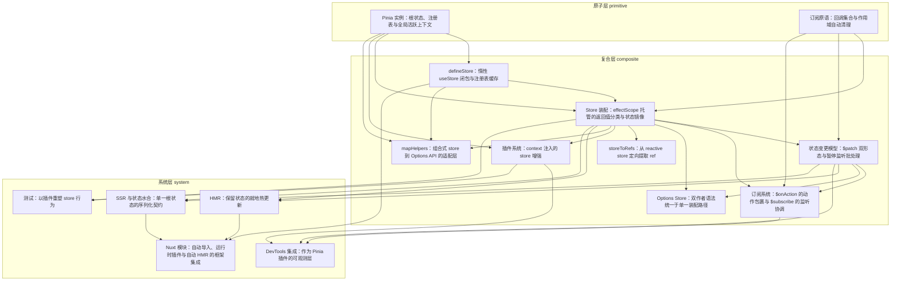

# 导读：Pinia 源码解读

## 这本书在讲什么：一句话主线

如果只能用一句话概括，Pinia 是「**一根脱离组件树的 effectScope 托管全库响应式资源的生死，一根模块级可变的 activePinia 指针换取免传参调用的人体工学，一个挂在 Pinia 实例上的根 `state.value` 对象作为外部观察者的唯一契约**」——三件不起眼的基础设施搭在一起，撑起了从 store 装配、状态变更、订阅通知、插件扩展、SSR 水合、HMR 热更、DevTools 可观测、Nuxt 集成到测试重塑的整个生态。

这句话拆开看：
- **detached effectScope** 把每个 store 的 ref/computed/watch 全圈在一起，让 `$dispose`、`disposePinia`、组件卸载都不会泄漏一个 effect（第 1、4、9 章的核心权衡）。
- **全局 `activePinia` 指针** 让你在组件 setup、路由守卫、action 互引里写 `useStore()` 都不必显式传 pinia——便利全给，但 SSR 串态的兜底责任留给 `inject`（第 1 章引出，第 3 章按调用解析）。
- **根 `state.value` 树** 把所有 store 的 state 收拢成单一可序列化对象，让 SSR 序列化、DevTools 展开、`store.$state` 读写都对着同一处工作（第 4 章建立镜像，第 13 章把它兑现为 SSR 契约，第 14 章让 Nuxt 借这条管道）。

读者合上这本书时，应该能复述的不是「Pinia 是一个状态管理库」——那是功能清单——而是上面这三件基础设施如何在不同章节以不同化身反复出现。一旦认出它们，整套 Pinia 的设计就会从「一千个零散的 API」坍缩成「三件地基撑起的所有花活」。

## 怎么读这本书：两条阅读路线

### 线性路线（按 topoOrder）

这是作者建议的主线路径。每章一句话点出它承接什么、打开了什么。

1. **Pinia 实例**（primitive）：建立容器本身——detached 作用域、根状态盒子、注册表、活跃指针。后面所有花活都站在这三件上。
2. **订阅原语**（primitive）：抽出一对最小的 `addSubscription`/`triggerSubscriptions`——一个回调集合 + 默认绑 `onScopeDispose`。它同时支撑 `$onAction` 与 `$subscribe`，本章本身不依赖第 1 章。
3. **defineStore 闭包**（composite）：定义阶段零副作用、调用阶段才解析容器与装配。store 被做成了 hook，换多容器隔离与解耦的初始化顺序。

> **跳轨点 1（primitive → composite，主题轴：从基础设施切到 store 入口）**：如果你想先写出第一个能跑的 store 而不关心订阅机制，可从这里进入。前两章不会让你卡住。

4. **Store 装配**（composite）：先占位注册、再跑 setup——这一招同时化解 store 互引死循环；setup 返回值靠 ref/computed/function 的运行时判别做三分类，并把 state 镜像进根状态树。
5. **状态变更模型 $patch**（composite）：把"改状态"和"通知订阅者"在时间上脱钩——补丁期间关监听、改完手动派发一次，换来"一批改动只产一条通知"。
6. **订阅系统 $onAction / $subscribe**（composite）：用一个 action 包裹器把瞬时函数调用撑成 before/after/onError 生命周期；用两个监听开关（sync/pre-post）让 watcher 与 $patch 在同一对开关上既不漏通知也不重复。

> **跳轨点 2（composite 运行期机制 → composite 作者语法）**：第 5、6 章是运行期数据流的深处，第 7 章切到「作者怎么写 store」的写作姿态。读者若被 Vue 调度时序绕晕，可暂先跳到第 7 章换口气。

7. **Options Store 双语法统一**（composite）：option store 不另起装配，只把 state/getters/actions 临时拼成 setup 函数后转交同一装配流水线——`$reset` 的有无就是这条统一路径的必然代价。
8. **storeToRefs**（composite）：因为 store 是个三类混合的 reactive 对象，Vue 原生 `toRefs` 行不通；写一套跟装配对称的定向提取（凭 `.effect` 识别 computed、凭 `isRef` 识别 state、跳过函数）。
9. **插件系统**（composite）：把外部增强器拉进 store 自己的 effectScope 里跑一遍，返回值就地合并——这让插件注入的 ref 自动归 store 托管，连框架自己的 DevTools 都靠它落地。
10. **mapHelpers**（composite）：纯适配层——不在装配时做事，只产出一批"被读时才解析 store"的访问器壳，把组合式 store 翻译给 Options API 组件。

> **跳轨点 3（composite 核心 → system 设施）**：第 10 章是核心机制的自然终点。从第 11 章起进入 system 层——这些章服务的是开发体验、跨请求隔离、框架集成与测试人体工学，而非核心数据流。读者若只关心核心，读完第 10 章即可暂止；若想看 Pinia 如何被实际工程使用，继续。

11. **HMR 热更新**（system）：不换对象、只换内核——造一个 `__hot:` 替身跑新代码，再把替身的内容原位搬进本体，状态/身份/订阅全保。
12. **DevTools 集成**（system）：整套可观测层是一个普通插件，复用对外的订阅频道听事件；为了把"动作流"与"状态流"缝合成因果，给每个 action 套代理打 `groupId`；最后用编译期常量 `__USE_DEVTOOLS__` 在生产整体 tree-shake。

> **跳轨点 4（dev 设施 → 跨网络/运行时）**：第 11、12 章服务开发期，第 13 章切到 SSR 这个面向多请求/跨网络的运行期问题。主题轴完全不同，按主题路线读者可径直走第 4→13→14 这条线。

13. **SSR 与状态水合**（system）：契约就是那一个根 `state.value`——序列化它、回填它，跨网络的状态搬移就完成了；setup store 多一段"按 key 灌值"胶水，并用 `skipHydrate` 跳过路由实例这类非状态对象。
14. **Nuxt 模块**（system）：把三件手活（导入、状态往返、HMR 样板）全搬进编译期变换 + 框架钩子——零样板接入，代价是强绑 Nuxt 约定。

> **跳轨点 5（框架集成 → 测试）**：第 15 章换到测试视角，主题与第 14 章完全不同，但思路同源（都是"在已有机制外加一层"，不另起一套）。

15. **测试库**（system）：不写测试专用 store，而是预装四段插件在装配期重塑 store——`createTestingPinia` 把插件当"装配完成钩子"用；唯一的逃生口是直捣 Vue `ComputedRefImpl` 的 `_value/_dirty/fn` 三个内部字段，换"覆盖只读 getter"这一个本不该可能的能力。

### 按主题路线

针对常见阅读目标，从全书中各抽一条精简子序列。每条都基于对 15 章 draft 的实际通读，标注"为什么这条线值得单读"。

- **「只想搞懂状态托管与作用域」**：第 1 章 → 第 4 章 → 第 9 章。这条线演透"detached effectScope 如何把全库响应式资源集体托管"——第 1 章立起根作用域、第 4 章在它下面给每个 store 开子作用域、第 9 章让插件跑在 store 自己的作用域里。读完你会看到 Vue 响应式的"资源池化"在 Pinia 里被一致地用了三次。
- **「只关心订阅机制」**：第 2 章 → 第 5 章 → 第 6 章。第 2 章是订阅原语本身（Set + 取消闭包 + `onScopeDispose`），第 5 章演 `$patch` 如何"暂停监听 → 改 → 手动派发"，第 6 章演 `$onAction` 包裹器与两个监听开关如何与 `$patch` 协调。这条线把"信号重组"看清楚：瞬时调用如何变成生命周期事件、响应式变更如何分流成 direct/patch 类型事件。
- **「只想看作者语法与装配」**：第 3 章 → 第 4 章 → 第 7 章 → 第 8 章。第 3 章看 `defineStore` 为什么返回 hook、第 4 章看装配的七步与三分类、第 7 章看 option store 如何被翻译进同一条装配流水线、第 8 章看从那个混合 reactive 对象定向提取出 ref。这条线足够你完整写出并使用任何一种语法的 store。
- **「只关心 SSR」**：第 4 章 → 第 13 章 → 第 14 章。第 4 章建立"state 镜像进根状态树"这条权衡，第 13 章把那棵树兑现为"序列化它就是 SSR 全部契约"，第 14 章看 Nuxt 如何借宿主 payload 管道把这套契约自动化。一条清晰的"建立契约 → 兑现契约 → 框架自动化契约"路径。
- **「只看插件与可扩展性」**：第 9 章 → 第 12 章 → 第 15 章。第 9 章建立插件机制，第 12 章让 DevTools 作为它的最大用户落地，第 15 章把插件当"装配完成钩子"用、做出整个测试库。读完你会看到"一个扩展点能撑多大空间"。
- **「只关心开发体验（HMR + DevTools）」**：第 11 章 → 第 12 章。两章都在 system 层、都在 dev 下生效、都在 prod 被 tree-shake。第 11 章保状态热更新、第 12 章可观测层——它们是 Pinia 为开发期单独写代码的两个代表。

## 贯穿全书的核心原理

下面这几条原理，在多章以不同化身反复现身。读者一旦认出"这其实是同一个原理的第三次现身"，理解就会贯通。

### 原理一：detached effectScope 托管响应式资源的"集体回收 vs 局部生命周期"

**本质**：把响应式资源（ref/computed/watch）放进一个不挂组件树的作用域里，让它们能被"一次性 stop"全部回收；同时不被组件卸载误伤。

现身章节：
- 第 1 章（primitive）：根作用域 `effectScope(true)` 承载整个 Pinia 的全部 effect，`disposePinia` 一键清空。
- 第 2 章（primitive）：订阅原语借 `onScopeDispose` 把取消闭包挂到当前作用域——订阅随组件/store 自动回收。
- 第 4 章（composite）：每个 store 在根作用域下开子作用域，`store.$dispose()` 一行 `scope.stop()` 干净回收。
- 第 9 章（composite）：插件被包在 `scope.run(() => extender(context))` 里执行，注入的 ref 自动归 store 托管。
- 第 6 章（composite）：`$subscribe` 的 watcher 跑在 store 子作用域里，停 store 时连带停 watcher。

这是 Pinia 资源管理的支点——一个 store 通常比组件活得久，但又必须能被批量销毁，detached 作用域就是 Vue 给的、用来切开"集体回收"与"局部生命周期"的那把刀。

### 原理二："先占位注册，再填内容"——破循环与时序错位

**本质**：先把身份（一个空壳/一个排队位置）登记下来，再去做产生内容的工作。任何"循环引用"或"时序不对齐"都可以靠这一招化解。

现身章节：
- 第 3 章（composite）：useStore 调用时未命中注册表才装配——同 id 同容器永远复用同一实例，避免重复创建。
- 第 4 章（composite）：装配时先把半成品 store 塞进注册表，再跑 setup——store 互引不死循环（A 引 B 时 B 拿到的是半成品 A，但不会再次触发 A 的装配）。
- 第 9 章（composite）：插件用"暂存队列 toBeInstalled + install 时一次性 flush"处理"框架自举需要在 app.use 之前 pinia.use(devtoolsPlugin)"的时序错位。

JS 模块系统的"模块记录对象先于求值存在"、依赖注入容器的"先注册再解析"、ORM 的"先 new 节点再连指针"——都是同一招骨架。

### 原理三："借宿主的时机/通道，不另起一套"——复用换零自研

**本质**：需要某个能力时，先看宿主（Vue/Nuxt/打包器）是否已经提供等价的时机或通道，借过来用；不要在自己内部平行造一份。

现身章节：
- 第 1 章（primitive）：getActivePinia 借 Vue 的依赖注入系统——注入优先、全局指针兜底，免自研上下文传递。
- 第 2 章（primitive）：订阅原语借 Vue 的 `onScopeDispose`，不自己管订阅生命周期。
- 第 4 章（composite）：装配借 Vue 的 reactive/computed/ref 做返回值分类与状态镜像。
- 第 9 章（composite）：插件借 store 自己的 effectScope 跑增强器，不另开插件资源池。
- 第 10 章（composite）：mapHelpers 借 Vue 的 computed/method 求值钩子，把组合式 store 的解析时机挂到求值那一刻——不另起一套实例化路径。
- 第 12 章（system）：DevTools 借插件装配通路 + 对外订阅频道——不侵入核心。
- 第 14 章（system）：Nuxt 集成借宿主的 payload 管道、自动导入表、Vite transform——零自研序列化协议。

### 原理四："暂停 → 操作 → 恢复"——把自己内部的通知与外部事件隔开

**本质**：当系统自己在某个窗口里要触发一次通知、又不希望这次通知被订阅者当成外部事件，就用一对开关把这段时间静音。

现身章节：
- 第 5 章（composite）：`$patch` 期间关 `isListening`/`isSyncListening`，改完手动派发一次"patch类型"事件。
- 第 6 章（composite）：两个开关分别管 sync/pre-post watcher，让 watcher 自动通知与 `$patch` 手动派发不重复——还要用 `activeListener = Symbol()` 做"最后者胜"的去抖。
- 第 11 章（system）：HMR 搬运状态树大切换时复用同一对开关，短暂静音 watcher，避免被订阅系统误记为一次用户变更。
- 第 12 章（system）：DevTools 编辑入口前后切换 `isTimelineActive`，订阅回调首行 `if (!isTimelineActive) return` 把面板自激回响吞掉。

这是 Pinia 处理"自动通知 vs 手动通知"协调的通解骨架，在 Vue 异步调度之上做批处理的库都会撞上同一道题。

### 原理五："差异折在最外层、内核只跑一条路"

**本质**：面对多种作者语法、多种数据形态、多种宿主约定时，在边界处用一个布尔/标志/翻译器把差异折平，让内部主流程保持线性。

现身章节：
- 第 3 章（composite）：定义阶段一眼判定 `isSetupStore` 布尔，把 setup vs option 的差异折进一个布尔。
- 第 7 章（composite）：option store 不另起装配，临时把 state/getters/actions 拼成一个 setup 函数交给同一条 `createSetupStore`——差异压成"一个布尔标志 + 三处局部 if"。
- 第 8 章（composite）：`storeToRefs` 不区分 store 来自哪种语法，只按运行时类型（`.effect` / `isRef` / `isReactive`）分流。
- 第 11 章（system）：HMR `_hotUpdate` 对外是同一个接口，内部按 option/setup 语法走两条状态迁移路径（深调和 vs 整值覆盖）。

### 原理六："那一个根状态树"作为外部观察者的唯一契约

**本质**：把每个 store 的 state 都额外镜像进挂在 Pinia 实例上的一个根对象 `pinia.state.value`——所有外部观察者（SSR、DevTools、`store.$state`、Nuxt payload）都对着这一处工作，不必去各处收集。

现身章节：
- 第 1 章（primitive）：根状态盒子 `ref({})` 在容器创建时就立起，为后续镜像预留位置。
- 第 4 章（composite）：装配时把每个 state ref 额外写一份引用进根状态树——"镜像"的字面落实。
- 第 5 章（composite）：`store.$state` 的 getter/setter 都连回根状态树对应子树，setter 内部转调 `$patch`。
- 第 13 章（system）：SSR 的全部契约就是序列化这棵树、回填这棵树。
- 第 14 章（system）：Nuxt 把 `pinia.state.value` 原样挂进宿主 payload 的 `pinia` 子键。

### 原理七："树摇/编译期开关把开发期代码切掉"——开发期 vs 生产期的对称设计

**本质**：开发期想尽可能多埋观测与干预，生产期想尽可能小而稳——用编译期常量把同一段代码切成两份，让生产构建整体剔除。

现身章节：
- 第 3 章（composite）：`defineStore` 入口函数挂 `#__NO_SIDE_EFFECTS__` 注解，让打包器剔除未被调用的 store。
- 第 11 章（system）：`acceptHMRUpdate` 在 prod 直接退化为空函数 `() => {}`。
- 第 12 章（system）：整套 DevTools 注册被 `if (__USE_DEVTOOLS__ && IS_CLIENT) pinia.use(devtoolsPlugin)` 包住，prod 整段死代码消除。
- 第 14 章（system）：HMR 接管代码在编译期静态注入，prod 构建不会包含相关分支。

## 全书脉络图

下面的依赖图由编排层依据 `outline.json` 的 `dependsOn` 字段程序化生成，箭头方向是「前置 → 后继」，即"后继章踩在前置章的肩膀上"。读这张图时盯住三件事：

第一，**最显眼的根节点是 `pinia-instance-active-context`（第 1 章）**——它是 primitive 层的两大根节点之一（与 `subscription-primitive` 并列），被第 3、4、9、10 章直接依赖，间接支撑了几乎每一章 composite 与 system。这本书从它起手不是偶然——后续所有机制都建在"detached 作用域 + 注册表 + 活跃指针"这三件基础设施上。

第二，**最大的汇聚点是 `store-assembly`（第 4 章）**——它被第 5、6、7、8、9、11、12、13、15 章直接依赖，是全书被引用最多的章。换句话说，理解了"先占位注册再跑 setup + 返回值三分类 + state 镜像进根状态树"这七步装配，就读懂了 Pinia 一半以上的代码路径。

第三，**几条值得专门留意的跨 layer 关键边**：
- `subscription-primitive`（第 2 章，primitive）→ `store-assembly`（第 4 章，composite）、`state-patch-model`（第 5 章）、`action-state-subscriptions`（第 6 章）：订阅原语这个底层最小抽象被反复消费——它是 `$onAction`/`$subscribe` 共同的骨架。
- `store-assembly`（composite）→ 多个 system 章（HMR、DevTools、SSR、testing）：装配机制是所有 system 层能力的着陆点，第 11 章靠它造替身、第 12 章靠它挂订阅、第 13 章靠它做水合胶水、第 15 章靠它插入重塑插件。
- `ssr-hydration` + `hmr-hot-update` + `define-store-hook` → `nuxt-module`：第 14 章是全书最大的"集大成者"，它一次性消费了 SSR 契约、HMR 机制、defineStore 闭包三件上层成果，是 system 层里依赖数最多的章。读者若想验证自己对前面章节的理解，"能否讲清第 14 章每一行用到了前面哪一章"是个好尺子。

根节点（最被依赖的地基）是第 1 章，汇聚点（依赖最多章的系统章）是第 4 章——这两章一起构成了全书的双核。其它章像星系一样围绕它们展开。

下图由 outline 的 `dependsOn` + `topoOrder` 程序化生成（箭头方向：前置 → 后继）：

