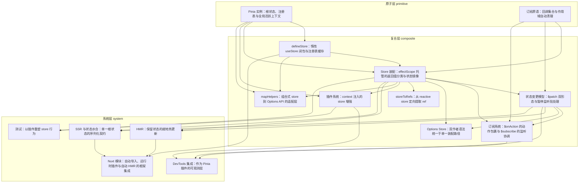

# 导读：Pinia 源码解读

## 这本书在讲什么：一句话主线

打开 Pinia 的源码，最先撞见的"魔法"是这一行：`useUserStore()`。不传参、不分场合，任何地方一调，就拿到那个唯一的用户 store。这本书整本都在拆这个魔法，而拆到最后你会发现——它**没有重造一套状态库的内脏**，而是把状态库要面对的四件难事，逐个"借力"交给四个支点：

> **一句话主线**：Pinia 把响应式的生灭托付给一个 `detached effectScope`、把全局定位托付给一根活跃指针、把状态真相收束进单一根对象、把所有扩展能力汇入同一条装配流水线——这四个支点彼此咬合，撑起了从状态托管到 SSR、HMR、测试的整个生态。

四个支点分别对应：

- **第一支点 · effectScope 托管**（第 1/2/4/9 章）：所有 store 的 state、getter、订阅，乃至插件注入的响应式，都住在一棵可以一键喊停的作用域树里——组件卸载误伤不了它，测试结束一句 `stop()` 全部清空。
- **第二支点 · 全局活跃指针**（第 1/3/14 章）：一根模块级变量换来了"免传参"的人体工学，代价是服务端并发请求会串态——靠"注入优先"和"渲染完清指针"两剂解药压住。
- **第三支点 · 单一根状态**（第 1/4/5/13/14 章）：状态真相只有一处（`pinia.state.value`），序列化、订阅、DevTools、SSR 全盯它，不用满项目收集。
- **第四支点 · 统一装配路径**（第 4/7/9/11/12/15 章）：options 语法、插件、DevTools、热更新替身、测试重塑，全是这条流水线上的工位——没有第二条路，所以"换种写法行为就分叉"的担心从根上不存在。

这四个支点不是孤立的，它们互相兑现承诺：第 1 章埋下的 detached 作用域和根状态盒子，要到第 4 章装配时才长出子作用域和状态镜像，要到第 13 章 SSR 时才兑现"序列化这一个对象就够"的承诺。这本书的乐趣，就是看这些伏笔如何一环扣一环地兑现。

---

## 怎么读这本书：两条阅读路线

### 一、线性路线（按拓扑顺序）

下面这条线按全书的依赖顺序从头读到尾，每章一句话点出它"承接了什么、打开了什么"。

1. **Pinia 实例**（`pinia-instance-active-context`）：全书地基——detached 作用域托管根状态、注册表缓存实例、全局活跃指针解析免传参。一切都从这里长出来。
2. **订阅原语**（`subscription-primitive`）：打第二块地基——一个最小的回调集合 + 借作用域自动清理。后面所有监听能力的零件。
   > ⚠️ **跳轨点**：第 1、2 章是两块平行的地基。若你暂时不关心"订阅怎么清理"，可以跳过第 2 章直奔第 3 章；想专门看监听，则从第 2 章直通第 6 章。
3. **defineStore**（`define-store-hook`）：承接注册表和活跃指针，打开"store 本质是个可组合 hook"——返回函数而非实例，把创建推迟到首次调用。
4. **Store 装配**（`store-assembly`）：承接 1+2+3，打开**全书枢纽**——子作用域跑 setup、返回值三分类、state 镜像进根树、先占位注册防互引死循环。后面几乎所有章都建在这条装配路径上。
5. **状态变更模型**（`state-patch-model`）：承接装配，打开"暂停监听 → 批 → 手动触发一次"的协调模式。第 6/11/12 章都会复用它。
6. **订阅系统**（`action-state-subscriptions`）：承接 2+4+5，把订阅零件搭成 `$onAction`（调用期临时钩子）和 `$subscribe`（深度 watcher + 两个监听开关），保证直接改和打补丁都只通知一次。
   > ⚠️ **跳轨点**：到本章为止，核心数据流（实例化 → 装配 → 变更 → 订阅）已经闭环。第 7 章起主题轴切换到"作者语法统一与周边工具"（7/8/9/10）。只想看 SSR 或热更新的读者，可从第 6 章直接跳到第 13 章或第 11 章。
7. **Options Store**（`options-store-unification`）：承接 4+5，把 options 语法翻译成 setup 函数、汇入同一条装配路径；`$reset` 的有无正是统一的代价。
8. **storeToRefs**（`store-to-refs`）：承接 4，正因为 store 被整体包成 reactive 一团，才需要绕到原始对象定向提取 state/getter、跳过 action。
9. **插件系统**（`plugin-system`）：承接 1+4，插件在 store 自己的作用域内跑，注入的响应式自动归位；DevTools 就此预装。
10. **mapHelpers**（`map-helpers-options-api`）：承接 1+3+4，组合式 store 到 Options API 的适配层——发"被读时才解析"的提货券，经 `this.$pinia` 取货。
    > ⚠️ **跳轨点**：本章结束 composite 主干。第 11 章起进入 system 层的边缘能力——这些都是**建在主干上**的能力，不引入新地基。
11. **HMR**（`hmr-hot-update`）：承接 4+5，替身跑新代码、就地把内容搬进旧对象，复用装配流程和暂停监听；身份不变、状态不丢。
12. **DevTools**（`devtools-plugin`）：承接 5+6+9，DevTools 即普通插件，蹲两个订阅频道偷听，再用 Proxy 把动作和状态变更缝成因果。
13. **SSR**（`ssr-hydration`）：承接 4+5，单一根状态就是全部序列化契约；option store 天然水合，setup store 逐 key 灌值。
14. **Nuxt 模块**（`nuxt-module`）：承接 3+11+13，框架集成 = 构建期变换 + Nuxt 钩子；自动导入、payload 接 SSR、编译期注入 HMR 样板。
15. **测试**（`testing-pinia`）：承接 4+9，预装一组插件在装配期重塑 action/state/getter，测试和生产走完全相同的路径。

### 二、按主题路线

针对常见阅读目标，各列一条精简的章节子序列：

- **想搞懂响应式生灭怎么托管的**：1 → 2 → 4 → 9（看 effectScope 如何从根作用域贯穿到子作用域再到插件作用域）
- **想搞懂"免传参"和全局定位**：1 → 3 → 14（活跃指针的定义 → useStore 按调用解析 → SSR 下渲染完清指针防串态）
- **想搞懂状态怎么改、订阅怎么不重复**：5 → 6（暂停监听批处理 → 两个开关如何与 Vue 微任务调度博弈）
- **只关心 SSR**：1 → 4 → 5 → 13 → 14（根状态盒子 → state 镜像进根树 → 序列化契约 → Nuxt payload 管道）
- **只关心插件/扩展机制**：9 → 12 → 15（插件系统 → DevTools 即插件 → 测试靠插件重塑）
- **只关心热更新**：4 → 5 → 11 → 14（装配流程 → 暂停监听 → 替身就地搬运 → 编译期自动注入样板）

---

## 贯穿全书的核心原理

下面这些是"换个化身在多章现身"的底层机制。认出它们，理解就能贯通。

1. **effectScope 托管响应式生灭**——Pinia 不自己管响应式的生死，而是整个托付给 Vue 的作用域。
   现身：第 1 章（detached 根作用域托管全部 store 响应式、一键销毁）、第 2 章（订阅默认绑作用域、卸载即自动回收）、第 4 章（每个 store 开子作用域跑 setup）、第 9 章（插件在 store 作用域内跑、注入的响应式随 store 一起回收）。从根到子到插件，一根藤。

2. **"暂停监听 → 做事 → 恢复"的协调模式**——想让一批改动只产生一次通知，就先把监听静音、做完再手动补一次。
   现身：第 5 章（`$patch` 关掉两个监听开关、改完手动触发一次）、第 6 章（`isListening`/`isSyncListening` 两个开关分别管同步/异步 watcher、恢复时机刻意不对称）、第 11 章（HMR 状态树整体切换的瞬间关监听，避免被订阅当成用户操作）、第 12 章（DevTools 编辑状态时关时间线录制防自激）。同一套"静音 → 动手 → 恢复"在四处化身。

3. **统一装配路径 / 复用而非另造**——全书最核心的设计哲学：不为每种新需求另起一套逻辑，而是把它接到已有流水线上。
   现身：第 4 章（所有 store 唯一的出生地）、第 7 章（options 语法翻译成 setup、走同一条路）、第 9 章（插件走装配通路、连 DevTools 都预装）、第 11 章（热更新替身复用装配流程）、第 12 章（DevTools 即普通插件、零特权）、第 15 章（测试不另造 store、靠插件在装配期重塑）。

4. **全局活跃指针的免传参与其代价**——一根模块级变量换免传参，代价在两端现身。
   现身：第 1 章（指针定义、注入优先全局兜底、点破 SSR 串态风险）、第 3 章（useStore 按调用解析、把结果推为活跃）、第 14 章（服务端渲染完 `setActivePinia(undefined)` 清掉指针，防跨请求串态）。

5. **单一可序列化根状态树**——状态真相只收在一处，宏观操作就只盯这一处。
   现身：第 1 章（根状态盒子 `ref({})`）、第 4 章（三分类时把 state 镜像进根树）、第 5 章（`$patch` 改的就是根树的节点）、第 13 章（序列化这一个根对象即全部 SSR 契约）、第 14 章（根状态挂进 Nuxt 的 payload 管道）。

6. **靠运行时"形状"识别 computed**——框架没给公开 API 判定一个值是不是 computed，就靠摸它身上的 `.effect` 字段。
   现身：第 4 章（`isRef(o) && o.effect` 把 computed 从普通 ref 里分出来）、第 8 章（storeToRefs 用同一判据三分流、跳过 action）、第 15 章（测试用同一判据认出 getter、替换成可写包装）。一条判据，三处复用。

---

## 全书脉络图

下图由 outline 的 `dependsOn` + `topoOrder` 程序化生成，与依赖图完全一致（箭头方向：前置 → 后继）。

