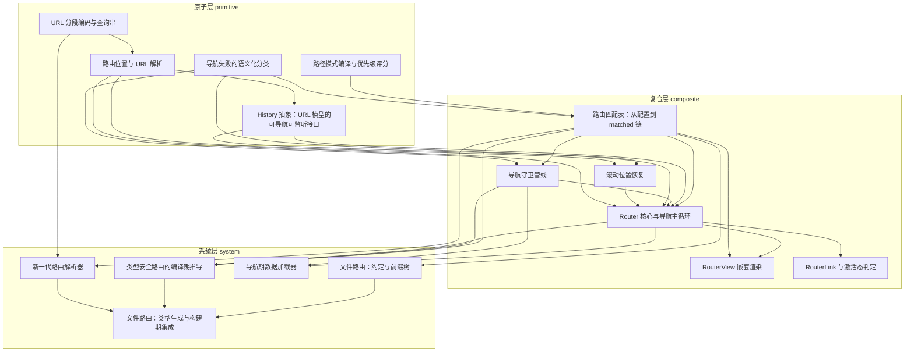

# 导读：vue-router 源码解读

## 这本书在讲什么：一句话主线

想象你刚翻开 vue-router 的源码，第一章竟然从 URL 编码讲起。你大概会嘀咕：URL 编码 `encodeURIComponent` 一行不就完了？翻到第二章，"两个位置是不是同一处" 不比字符串、改去比路由记录的引用；翻到第四章，"守卫拒绝" 被做成了一个带编号的值、不是 throw；翻到第五章，浏览器 `history.state` 上凭空多了一本 back/current/forward 账；翻到第九章，Promise 一旦发起就不可撤销，框架却靠一个 `pendingLocation` 变量实现了"随时可取消"……每章看上去都在绕远路，直到你把十几章拼到一起，才会发现它们干的是同一件事：**底层给的东西不够可靠，框架自己掏钱补一份**。

这就是全书的主线：**在每一个不可靠或不充分的底层 API 之上，叠一层"自己管自己的账本"，把语义可见性从底层手里抬到框架手里**。URL 不止一段，就为每段单独写编码函数（第 1 章）；URL 字符串不可信，就拿路由记录引用当同一性的证据（第 2 章）；浏览器历史 API 不透明，就自己记方向与栈位置（第 5 章）；Promise 不可撤销，就用闭包里的可变令牌加手动检查点（第 9 章）；组件挂载晚于导航，就用暂存→提交两阶段让数据可见性跟导航确认绑死（第 14 章）；浏览器原生滚动恢复在单页应用里失效，就用栈位置当 key 自建一份滚动档案（第 8 章）；编码期看不到运行时路由表，就用一个空接口当类型公告板做注入点（第 12 章）。同一套骨架在不同层反复现身，是这本书真正想让你带走的东西。

打个比方：浏览器就像一个只会喊"任务完成"的快递员——它不告诉你这次完成的是"用户主动点的"还是"被新事件顶掉的"、是"成功送达"还是"对方拒收"。框架只能自己另记一本账，把这些细节从"完成/未完成"的二值里捞回来。这本账在 URL 层叫"按段编码"、在位置层叫"路由记录引用相等"、在历史层叫"back/current/forward 状态条目"、在导航主循环叫"pendingLocation 令牌"、在数据加载层叫"staged 暂存区"——名字不同，是同一个东西。

## 怎么读这本书：两条阅读路线

### 一、线性路线（按目录顺序）

按 `topoOrder` 从头读到尾是最直接的读法。每章下面一句话点出它承接了什么、打开了什么。

- **01 url-encoding-query**（地基章）——把"URL 怎么安全编/解"一次讲透，后面每一章默认这件事已经搞定。
- **02 route-location-url**（前置 01）——把 URL 字符串拆成 path/query/hash 三段，并给出"两个位置是不是同一处"的判据，让重复导航能短路。
- **03 path-pattern-ranking**（地基章）——把路径模式编译成正则，并从模式自己派生具体性评分，消除"谁该匹配"的歧义。
- **04 navigation-failure-types**（地基章）——把"导航没走到底"做成带编号的值，从异常通道搬到返回通道，避免把"正常中止"误报成崩溃。
- **05 history-abstraction**（前置 02）——把浏览器历史 API 包成可导航、可监听的窄接口，让 html5/hash/memory 三实现透明可换。
- **06 route-matcher-table**（前置 03、04）——把配置树编译成一张按评分排序的扁平表，运行期一次正则命中即可沿父指针反推组件链。
- **07 navigation-guards**（前置 06、04）——把组件内/路由级/全局守卫按固定顺序串成 promise 链，并把"重定向"复用整套失败传递通道。
- **08 scroll-restoration**（前置 05、02）——用栈位置 + 地址当复合 key 自建滚动档案，让滚动可见性跟导航生命周期对齐。
- **09 router-core-navigation**（前置 06、05、07、04、08、02）——总装：用一个可变在途令牌 `pendingLocation` 加阶段间手动检查，把整套异步导航变成可取消状态机。
- **10 router-view-nesting**（前置 09、06）——凭 matched 数组 + inject 进来的 depth，让任意子组件模板写一个出口就自动对齐路由层级。
- **11 router-link-active**（前置 09）——激活态判定靠 matched 链 + 参数子集，而不是 URL 字符串前缀，别名与嵌套天然成立。

**【跳轨点】第 11 → 12 章主题轴从运行期切到编译期。** 零基础读者如果对编译期/构建期不感兴趣、只关心运行时怎么跑，可以读完 11 章直接跳到第 14 章看数据加载器；想继续读编译期的，第 12 章只要有 06 + 09 的概念就够。

- **12 typed-routes**（前置 06、07、09）——用一个空 `TypesConfig` 接口当类型公告板，外部一条 `declare module` 就能让所有路由名/参数从 `string` 收窄为精确字面量。
- **13 file-routing-conventions**（前置 06）——用前缀树承载父子拓扑，用按来源分桶 + 读时排序深合并让约定/文件/钩子各占一格。

**【跳轨点】第 13 → 14 章主题轴从编译期切回运行期数据流。** 只想搞懂数据加载器的读者，可以从 09 + 07 直接进 14，跳过 12、13。

- **14 data-loaders**（前置 09、07）——用 staged→commit 两阶段 + 身份校验，把数据可见性绑死到导航确认瞬间，刻意绕开 Suspense。

**【跳轨点】第 14 → 15 章主题轴又切回构建期匹配器设计。** 只关心新一代解析器的读者，可以从 06 + 02 直接进 15。

- **15 route-resolver**（前置 06、01）——把"不匹配"做成异常，参数校验失败即落选，匹配器从"挑记录"扩展为"挑并验证"，把动态性推到构建期。
- **16 file-routing-codegen**（前置 13、12、15）——总装构建期：把同一棵路由树投影成运行时数组、编辑器类型表、固定匹配器三份产物，用虚拟模块当契约边界。全书末章。

### 二、按主题路线

如果你带着一个具体问题来翻书，按主题路线读得更快。

- **主题 A：只想搞懂 URL 与位置怎么解析** —— 01（编码）→ 02（位置判等）→ 05（history 抽象）。这三章解决"URL 字符串与结构化位置之间如何无损互转"，跟匹配解耦。
- **主题 B：只想搞懂路由匹配** —— 03（评分）→ 06（匹配表）→ 15（新一代解析器）。看清楚"具体性从模式本身派生"如何取代声明顺序，以及"不匹配做成异常"如何把校验折叠进匹配。
- **主题 C：只想搞懂导航生命周期** —— 04（失败分类）→ 07（守卫管线）→ 09（主循环）→ 08（滚动）→ 14（数据加载器）。这是全书最厚的一条主题线，把"异步、可取消、可重定向"的导航状态机一路讲到底。
- **主题 D：只想搞懂视图与链接** —— 10（RouterView）→ 11（RouterLink）。需要先大致了解 09 的 `currentRoute`，其它前置可跳。
- **主题 E：只想搞懂编译期与构建期** —— 12（typed-routes）→ 13（文件路由约定）→ 15（新一代解析器）→ 16（类型生成）。把"运行时跑的路由"推到"构建期生成的路由"。
- **主题 F：只想看跨平台与 API 兼容** —— 05（html5/hash/memory 三实现 + SSR 同构）+ 07（新旧两套守卫 API 怎么无缝共存）。

## 贯穿全书的核心原理

下面这几条原理，在多章以不同化身反复现身。一旦你认出"这其实是同一个原理的第 N 次现身"，理解就会贯通。

### 原理一：在不可靠底层之上叠一层自管账本

底层 API 给的东西不够细、不够稳、不够快——框架不在底层身上死磕，而是自己在上面另记一份账。

- 第 5 章 history-abstraction：浏览器 `history.state` 是不透明的单值，框架把 back/current/forward/position/scroll 全塞进去，自己规定结构。
- 第 2 章 route-location-url：URL 字符串不可信（别名、重定向、参数形态各异），框架改用路由记录引用 + 序列化后的 query 当同一性证据。
- 第 9 章 router-core-navigation：Promise 不可撤销，框架用闭包里一个 `pendingLocation` 可变变量 + 阶段之间手动检查点实现"随时可取消"。
- 第 14 章 data-loaders：组件挂载晚于导航、各组件各自为政，框架用 staged→commit 两阶段把数据可见性绑到导航确认那一瞬。
- 第 8 章 scroll-restoration：浏览器原生滚动恢复在单页应用里失效，框架用"栈位置 + 地址"当复合 key 自建滚动档案。
- 第 7 章 navigation-guards：新旧两套守卫 API 共存，框架借 `Function.length` 这个语言自带的隐式信号做切换。

### 原理二：把"语义可见性"从底层抬到框架手里

"什么时候算发生了"、"什么时候算同一次"、"什么时候算失败了"——这些语义不该由底层决定，框架要自己说了算。

- 第 4 章 navigation-failure-types："导航没成功"分两类——故障（throw）和结局（return）。"被守卫拦下"、"被新导航取代"、"重复"是结局，不该走异常通道污染日志。
- 第 2 章 route-location-url："两个位置是不是同一处"不靠 URL 字符串前缀，靠路由记录引用相等。
- 第 8 章 scroll-restoration：滚动该恢复的时刻不是"数据到达"，是"导航确认 + 下一渲染周期 + 校验导航未被插队"三个条件同时成立。
- 第 14 章 data-loaders：数据该出现的时刻不是"组件挂载"，是"导航确认"。
- 第 11 章 router-link-active：链接激活态不靠 URL 字符串前缀，靠 matched 链上"目标是不是当前或祖先"。

### 原理三：扁平存储 + 指针/索引重建关系

树形数据要快读，就压扁成数组；要还原关系，就挂指针或靠下标。

- 第 6 章 route-matcher-table：配置树递归拍平进有序扁平数组，每个表项挂 `parent` 指针；运行期一次 `find` + 一次 `while (parent)` 就还原组件链。
- 第 10 章 router-view-nesting：出口们各凭 `depth` 这个隐式 inject 下去的整数，在 matched 数组里取自己那一级。
- 第 11 章 router-link-active：在 `currentRoute.matched` 里 `findIndex` 定位目标记录，靠下标判定"是不是当前或祖先"。
- 第 13 章 file-routing-conventions：前缀树按 `/` 切段逐层下沉，路径嵌套关系由树结构自动表达。
- 第 1 章 url-encoding-query：URL 不是"一个字符串"，是五段各有字符规则的复合体——按段拆开分别处理。

### 原理四：把"判断"折叠进"匹配"

不要在外层再叠一层校验，把校验本身做成匹配过程的一部分。

- 第 3 章 path-pattern-ranking：路由优先级不靠声明顺序，靠模式自己派生的具体性评分——评分计算就是匹配的一部分。
- 第 6 章 route-matcher-table：评分排序后，一次正则命中即得最具体赢家，无需回溯比较多个候选。
- 第 15 章 route-resolver：把"不匹配"做成专用异常，参数类型校验失败直接 `miss()`——匹配器从"挑记录"扩展成"挑并验证"。
- 第 12 章 typed-routes：路由名拼写错误、参数类型不对，全部在编译期通过类型系统报红，不在运行时报错。

### 原理五：空接口 / 契约边界当注入点

不知道用户配置长什么样的库，留一个空接口、一个虚拟模块名、一个窄抽象——让外部往里塞。

- 第 12 章 typed-routes：一个空 `TypesConfig` 接口 + 条件类型判断，库发布即开箱、用户一条 `declare module` 即精确。
- 第 5 章 history-abstraction：上层只看到 `push/replace/go/listen`，底下是 html5/hash/memory 完全不暴露。
- 第 16 章 file-routing-codegen：用户像 import 普通模块一样写 `import { routes } from 'vue-router/auto-routes'`，打包器在 load 钩子里现场生成。
- 第 13 章 file-routing-conventions：约定/`<route>` 块/`definePage`/`extendRoute` 钩子各占一桶、读时排序深合并——每个来源都有逃逸舱，不必 eject 整套方案。

### 原理六：把动态性从运行时推到构建期

路由表如果是构建期就知道的静态清单，运行时就不必为"可能增删"付出复杂度。

- 第 15 章 route-resolver：路由表构建期固定、无运行时增删，匹配器从评分排序树退化为顺序数组。
- 第 16 章 file-routing-codegen：同一棵路由树投影出三份产物（运行时数组 / 编辑器类型表 / 固定匹配器），三者天然永远一致。
- 第 12 章 typed-routes：拼写错误前移到 IDE 红波浪线，运行时再也撞不到。
- 第 13 章 file-routing-conventions：路由配置从手写数组变成文件系统扫描，零配置即生效。

## 全书脉络图

依赖图本身由编排层依据 `outline.json` 的 `dependsOn` 程序化生成，下面这段只做"图的导读"，不重复图里能直接看到的信息。

箭头方向读作"前置 → 后继"，也就是"后继踩在前置的肩膀上"——箭头尾部是被依赖的地基章，箭头头部是踩上来的消费者。

**最显眼的根节点**（被最多章依赖）：route-matcher-table 是全书最大的承重点，它把"配置树怎么变成可匹配结构"一次性讲透，后续 router-view-nesting / router-link-active / typed-routes / file-routing-conventions / route-resolver 全部建立在它之上。其次是 navigation-failure-types、route-location-url、url-encoding-query 三个 primitive 地基章，被 composite 层多处引用。

**最显眼的汇聚点**（依赖最多前置章）：router-core-navigation 是全书最厚的总装章——它一次性消费了 route-matcher-table、history-abstraction、navigation-guards、navigation-failure-types、scroll-restoration、route-location-url 六个前置章的产物。其次是 file-routing-codegen，依赖 file-routing-conventions + typed-routes + route-resolver 三章。

**跨 layer 的关键依赖边**（图里斜跨 primitive/composite/system 三层的边，最值得关注）：

- composite 层的 route-matcher-table 同时被 system 层的 typed-routes、file-routing-conventions、route-resolver 依赖——它把"运行时怎么匹配"打牢，system 层这三章分别从编译期、构建期、新一代设计三个角度重新审视它。
- composite 层的 router-core-navigation 被 system 层的 data-loaders 依赖——data-loaders 复用了导航主循环的守卫管线挂加载器，是"运行时机制被另一层机制借力"的代表。
- system 层的 file-routing-codegen 依赖另两个 system 层章（file-routing-conventions、typed-routes）外加 route-resolver，是构建期侧的总装——读这章之前最好把三个前置都过一遍，否则它的"三次投影"会显得无根。
- primitive 层的 url-encoding-query 被 system 层的 route-resolver 直接依赖——说明新一代解析器虽然重新设计了匹配器，但 URL 分段编码的根仍然没变。

读完这张图你应该能感受到：全书不是"16 章平铺"，而是 primitive 章作为地基被反复踩踏、composite 章作为骨架总装出可运行路由器、system 章作为后处理把运行时机制推到构建期——三层之间有几条很粗的"跨层依赖"边，正是这些边把全书绑成一个整体。

下图由 outline 的 `dependsOn` + `topoOrder` 程序化生成（箭头方向：前置 → 后继）：

