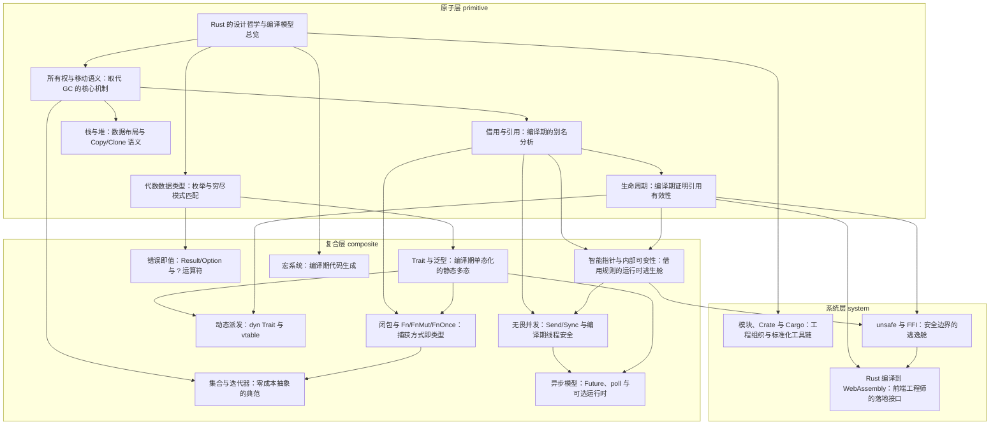

# 导读：Rust 源码解读（写给前端工程师）

## 这本书在讲什么：一句话主线

整本书可以浓缩成一句——**Rust 把别的语言甩给运行时和垃圾回收器的问题，几乎全部前移到编译期去证明，于是同一份代码既拿到了 C 的速度、又拿到了 GC 语言的安全；当编译期实在证不出来时，它再老老实实地逐级打开运行时检查和人工契约两道逃生舱，而每一次前移和每一次退让的代价，都明明白白写在类型签名里。**

这句话里藏着全书的三段骨架。第一段是「前移」：内存归谁、能借多久、状态有几种、操作会不会失败、多线程会不会打架——这些在 JavaScript 里由 GC、由运行时、由程序员自觉兜底的事，Rust 统统搬进编译期，让编译器替你证明「这一大类 bug 根本不会发生」。第二段是「兜底」：证明不是万能的，图里的环、运行时才触发的回调、调用看不见实现的 C 代码，编译器都证不了，于是 Rust 准备了 `RefCell`/`Mutex`（把检查挪到运行时）和 `unsafe`（把检查换成一份由人签字的契约）两道逃生舱。第三段是「代价可见」：move、`Copy`、`'a`、`Result`、`Send`、`FnOnce`……每一个抽象的代价都刻在类型上，你扫一眼签名就知道这一处花了什么钱、担了什么险。

这三段骨架分解到三层：最底下的几章把「前移」逐一做实——所有权、借用、生命周期管内存，枚举管状态分支，`Result`/`Option` 管错误；中间几章用单态化把这些证明变成零成本抽象，并在证明不了处开运行时逃生舱；最上面几章把人工契约逃生舱和工程组织铺开，最后落到前端工程师最熟悉的浏览器里——Rust 编译成 WebAssembly。

一句话：这本书不是在教你 Rust 的语法清单，而是在讲一个设计决定——**用编译期证明换运行时零开销**——如何长成一座覆盖内存、类型、并发、错误、工程、落地全链路的语言。

## 怎么读这本书：两条阅读路线

### 一、线性路线（按全书顺序从头读到尾）

全书 18 章是按依赖关系排好序的，每章都踩在前面某几章的肩膀上。下面每一句话都点出这一章「承接了什么、打开了什么」，遇到主题轴切换的地方我会显式标出「跳轨点」——零基础的读者卡在某章时，可以据此绕行到按主题路线的入口。

1. **设计哲学与编译模型总览**：立起「问题前移到编译期」这张总图，后面 17 章都是往图里填实例。
2. **所有权与移动语义**：总图的第一个实例，用「唯一主人 + 默认移动 + 离场释放」取代 GC。
3. **借用与引用**：不夺取所有权地临时访问数据，靠「共享与可变互斥」让编译器在编译期做完别名分析。
4. **生命周期**：把引用的有效区间写进函数签名，让借用检查能穿过函数边界拼成全局证明。
5. **栈与堆 / Copy / Clone**：回答「为什么有的值 move、有的值自动复制」——存哪、怎么复制是类型在编译期就钉死的属性。
   - ⚠️ **跳轨点（5→6）**：从这里开始，主题从「数据存哪、怎么复制」切到「数据能长成几种形状」。如果你只想搞懂内存安全，读完第 5 章已经拿到了主干，可以先跳到第 12 章看逃生舱；对类型与控制流感兴趣的继续往下。
6. **枚举与穷尽模式匹配**：把「漏处理一种状态」从运行时崩溃前移成编译期错误。
   - ⚠️ **跳轨点（6→7）**：第 6 章对付的是「一个值是什么」，第 7 章换成「几个类型能做什么」——这是从数据形状到能力抽象的正交切换，感觉突兀是正常的。
7. **Trait 与泛型**：把「能力」做成独立契约，泛型配单态化把多态变成零成本的直接调用。
8. **闭包与 Fn/FnMut/FnOnce**：把所有权的三种操作（共享借用/可变借用/移动）原样搬到闭包捕获上，回调的能力因此落进类型。
9. **动态派发（dyn Trait / vtable）**：当单态化办不到异构集合时，用一次间接调用换运行时多态——是第 7 章的镜像。
10. **错误即值（Result / Option / ?）**：失败不是隐形的控制流跳转，而是一个有类型、能传递、必须被处理的值。
11. **集合与迭代器**：惰性管道把「高阶表达」和「零中间分配」拆开，是零成本抽象的招牌。
12. **智能指针与内部可变性**：编译器证不了的共享与可变，用引用计数和运行时借用检查顶上——第一道逃生舱。
13. **宏系统**：类型系统表达不了的抽象，靠编译期在 token 层生成代码——和泛型各管一层的第三类工具。
14. **无畏并发（Send / Sync）**：用两个运行时不存在的 marker trait，把「能不能跨线程」做成编译期证明，借用规则从单线程推广到跨线程。
15. **异步模型（Future / poll / 可选运行时）**：`async fn` 编译成状态机，由外部可替换的运行时拉着走，运行时整个甩给生态。
   - ⚠️ **跳轨点（15→16）**：从这里开始，主题从「语言机制」切到「工程组织」，也就是从书的中段跨到末段。只想看语言原理的读者，到这里已基本读完全书主干；后面三章是工程与落地。
16. **模块 / Crate / Cargo**：把代码组织、编译单元、工程发布切成三层正交抽象，靠强约定换零配置体验。
17. **unsafe 与 FFI**：第二道逃生舱——当编译期证明和运行时检查都够不着时，把证明责任交还给人，再用私有性把危险封进一个对外安全的壳。
18. **Rust 编译到 WebAssembly**：全书主线落地——Rust 无 GC 加所有权，恰好严丝合缝地落在 wasm 那块自管线性内存上，hot path 用 Rust + wasm 换来无 GC 的可预测性能。

### 二、按主题路线（挑你最关心的目标，走一条最短章节序列）

- **「我只想搞懂 Rust 怎么不靠 GC 管内存」**：1 → 2 → 3 → 4 → 5（这五章是内存安全的主干，读完就能解释为什么 Rust 既不要 GC 又不会悬垂）。
- **「我只想看错误处理」**：6 → 10（枚举的穷尽匹配是 `Result`/`Option` 强制处理的前置，缺它理解不深）。
- **「我想理解 Rust 的多态与抽象有几条路」**：7 → 8 → 9 → 13（静态单态化 → 闭包 → 动态派发 → 宏，正好是抽象工具箱的四种武器）。
- **「我只关心并发和异步」**：12 → 14 → 15（内部可变性的并发半边 → Send/Sync → Future，这条线最吃第 3 章借用的底子，必要时回头补 3）。
- **「我想看 Rust 在前端怎么落地」**：4 → 17 → 18（生命周期是跨边界失效的武器，unsafe 讲清边界契约，wasm 是落地接口）。
- **「我只关心工程组织与工具链」**：1 → 16（第 1 章立的 crate/rustc 总图是第 16 章的前提）。
- **「我想完整理解逃生舱这套谱系」**：2 → 3 → 4 → 12 → 17（编译期证明 → 运行时检查 → 人工契约，三级退让一口气看完）。

## 贯穿全书的核心原理

下面这几条是「换一身衣服又出场」的底层机制。认出它们，各章就会融成一张网。

1. **问题前移到编译期证明**（全书总纲）。GC 语言是「运行时帮你擦屁股」，Rust 是「编译时就不让问题出生」。它在各章的化身：内存（第 2/3/4 章）、数据布局与复制策略（第 5 章）、状态分支的穷尽（第 6 章）、错误与缺失（第 10 章）、并发数据竞争（第 14 章）。一旦你意识到「这其实是同一条原理的第五次现身」，前面所有的别扭就都有了解释。

2. **把代价和意图写进类型签名**。Rust 的取向是「让非法状态不可表达」，手段是把一切代价刻在类型上：生命周期把引用有效性写进签名（第 4 章），`Copy` 把复制策略写成类型属性（第 5 章），枚举让「缺失/失败」进签名（第 6/10 章），`Result`/`Option` 把失败写进返回类型（第 10 章），`Fn`/`FnMut`/`FnOnce` 把回调能力写进 bound（第 8 章），`Send`/`Sync` 给类型盖线程安全的章（第 14 章）。扫一眼签名就知道这一处担了什么责，这是 Rust 代码「读起来啰嗦但信息量极大」的根源。

3. **单态化与编译期融合，换高层抽象零成本**。trait 配泛型在编译期为每个具体类型复制一份专属代码（第 7 章），闭包靠 `Fn` trait 单态化进调用点（第 8 章），迭代器链经编译器融合成等价的手写循环（第 11 章），`async fn` 生成的状态机同样是单态化的具名类型（第 15 章）。第 9 章（动态派发）是这条原理的镜像对照——当单态化办不到时，用一次间接调用换灵活性。

4. **三档兜底的逃生舱谱系**。当编译期证明力不够时，Rust 逐级退让，而且每一档都明码标价：编译期证明（第 2~4 章，零开销）→ 运行时检查（第 12 章 `RefCell`/`Mutex`，有运行时开销、失败变 panic）→ 人工契约（第 17 章 `unsafe`，无检查、失败是不可靠的未定义行为）。这条阶梯在第 12 章和第 17 章都被明确画出来，是理解 Rust 安全模型「诚实边界」的关键。

5. **「共享与可变互斥」这条排他规则的三次推广**。第 3 章在单线程内部确立「多个只读 或 一个可写，二选一」；第 8 章把它推广到闭包捕获（捕获方式决定闭包属于 `Fn`/`FnMut`/`FnOnce`）；第 14 章再把它推广到跨线程（`Send`/`Sync` 的本质就是借用规则跨线程生效）。同一条规则，三个尺度，认清这一点，并发章就不算新内容。

6. **move 在字节层面就是按位复制**。move 不是「把字节搬走、源变空」，而是抄一份栈表示、再把旧名字在编译期吊销（第 2 章）；`Copy` 与 move 的唯一差别，是编译器让不让旧名字继续露面（第 5 章）。这个点在第 2、5 两章反复点透，是消解新手对所有权恐惧的钥匙。

## 全书脉络图

下面这张依赖图由编排层依据各章的前置关系自动生成，箭头方向是「前置 → 后继」，也就是「后一章踩在前一章的肩膀上」。读图时盯住三处最要紧：最顶上的根节点是「设计哲学与编译模型总览」——它是全书唯一没有前置的一章，几乎所有章都直接或间接踩在它肩上，是整座大厦的地基；中部最忙的两个枢纽是「借用与引用」和「生命周期」，各有四章直接依赖它们，是从地基往上分叉的主干；最底下依赖链最深的汇聚点是「Rust 编译到 WebAssembly」——全书原理在它身上收束成前端工程师最直接的落地接口。

此外有几条跨层级的边值得留意：「枚举与穷尽匹配」（primitive）直接喂给「Trait 与泛型」（composite），是「数据形状」跨进「能力抽象」的那一步；「生命周期」同时被动态派发、智能指针、unsafe、wasm 四章引用，是全书被复用最广的一条机制；而「智能指针 → unsafe → wasm」这条边，正是「逃生舱谱系」从 composite 一路延伸到 system 层的实物连线。

下图由 outline 的 `dependsOn` + `topoOrder` 程序化生成（箭头方向：前置 → 后继）：

