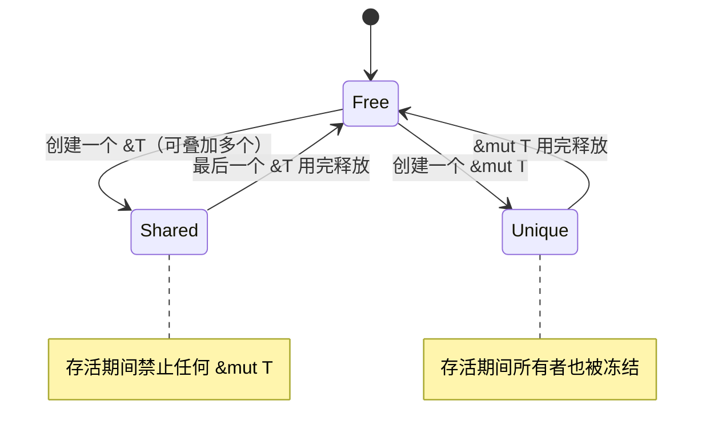

# 借用与引用：编译期的别名分析

> 本章属于 primitive 层。前置：所有权与移动语义：取代 GC 的核心机制。
> 学完你能：用一句话讲清「为什么 Rust 的引用是零开销的安全指针——靠『共享与可变互斥』这条排他规则，编译器在编译期就证明了此刻到底谁能动这块数据」。

## 1. 为什么需要它（设计动机）

上一章把「这块数据归谁」定下来了：值有唯一主人，访问默认是把主人换人（move），主人离场就析构。这套规则让 Rust 不靠 GC 也能可预测地回收内存，却留下一个尴尬的口子——我若只是想让一个函数「看一眼这块数据、用完还回来」，难道也得把所有权整个搬过去、用完再搬回来？数据成了烫手山芋，传一个参数都得签一次过户合同。

退回 JS 的直觉也不行。JS 里对象赋值就是共享同一份可变引用，谁都能随手改，省事是真省事，可坑也是真坑：循环里改了个数组，别处迭代器突然失效；两个函数拿同一个对象，一个改了字段，另一个读出半新半旧；多线程下更是数据竞争的重灾区。这些坑的共同特征是：错误都藏在运行时，编译器管不着。

借用要解决的，就是这两头不讨好的矛盾：**既不夺取所有权地临时访问或修改数据，又要让这种「共享」是零成本、且编译器能担保安全的事**。它复用上一章立好的「单一主人」前提，只是给数据加了一层「不搬家也能临时被访问」的通道。

## 2. 核心思想

借用的本质，不是「一根加了智能锁的指针」，而是**给编译器一条可静态判定的排他规则**。

这条规则一句话就说完了：同一块数据，任意时刻要么持有多个只读引用（`&T`），要么持有唯一一个可写引用（`&mut T`），二者不可并存。这就是所谓的「共享与可变互斥」（aliasing XOR mutability）。编译器只需顺着程序的控制流，给每块数据维护一个状态，就能在编译期证明「此刻到底谁能动这块数据」。

既然这个证明在编译期就做完了，运行时的引用就再不需要任何记账——它就是一根裸指针。换句话说，Rust 把 GC 语言里由运行时兜底的「别让共享数据被乱改」这件事，换成了编译期一条排他规则加一次状态推理。

## 3. 心智模型

把借用的运作想象成一间会议室的白板：

- 谁都不在用，白板归主人自由涂改（`Free`）；
- 来了一群人围观记录，他们只看不写，人数不限（多个 `&T`，状态为 `Shared`）；
- 来一个人要改白板，那他必须独占，其他人全得退出去，连主人也不能同时动手（唯一的 `&mut T`，状态为 `Unique`）。

围观（只读）可以共享，改动必须独占——这就是全部规则。具体到六步：

1. 数据有一个所有者（上一章）；想访问的人不夺取所有权，而是「借」。
2. 借有两种形态：不可变借用 `&T`（只读、可同时存在任意多个）、可变借用 `&mut T`（可写、必须独占）。
3. 每块被借的数据任意时刻处于三态之一：`Free` / `Shared(N)` / `Unique`。
4. 排他检查针对**同一时刻**：`Shared` 和 `Unique` 不能并存；可变借用存活时，连原所有者对这块数据的可变访问也被冻结。
5. 借用从「创建」活到「最后一次使用」，此后所有者解冻，重获完整访问权；引用本身在运行时就是一根指针，丢弃它什么也不做。
6. 函数签名用 `&T` / `&mut T` 声明「我只借不夺」，于是调用之间不必来回 move 所有权。

三态之间的转换规则如下图。注意 `Shared` 不能直接跳到 `Unique`，必须先全部退回 `Free`——这正是「共享与可变互斥」的几何体现。



## 4. 关键权衡

### 用「共享与可变互斥」当唯一的别名规则

Rust 没有给别名安全写一套复杂的运行时规则，而是把它压成一条排他规则：多个 `&T` 或一个 `&mut T`，二选一。

换来的是编译器能做**确定的别名分析**。每个 `&mut` 必唯一、每个 `&T` 必只读，规则简单到可以顺着控制流静态判定，不需要给数据加锁、加标记位、加引用计数。判定的结果非黑即白：要么能证明安全，要么直接拒绝。

代价是这条规则**连单线程下也禁止「多个可变别名」**，跟 JS、Python 里「随手共享一个可变对象」的直觉正面冲突。你没法再写 `let a = &mut x; let b = &mut x;` 这种 GC 语言里理所当然的代码。这正是初学者和借用检查器缠斗的主战场。

这里化解的本质矛盾，是「想灵活地到处持有可变别名」和「想让编译器静态证明没有别名冲突」之间的对立。Rust 选了后者，把灵活度限制在编译器能证明安全的范围内——能证明，就放行；证明不了，就不给。

### 检查全在编译期，引用运行时就是裸指针

别名检查被整体放在编译期。一旦编译通过，最终二进制里不存在任何「借用检查」代码；引用在机器码层面与 C 的指针没有任何区别，没有元数据，没有 tag bit，丢弃一个引用是空操作（no-op）。

换来的是**零运行时开销**。没有 GC 的停顿，没有引用计数的增减，也没有安全检查的指令——这一切都因为「该检查的编译期都检查完了」而变得多余。

代价是编译期的斗争变得激烈，而且编译器必须保守：它无法证明安全的代码就一律拒绝，哪怕你肉眼看上去明明没问题。这偶尔会逼你重构数据结构、拆分函数，或者临时上一个 `.clone()` 把数据复制一份来打破僵局。换句话说，证明「此刻谁能动这块数据」的责任，从运行时转移到了写代码的人身上。

这背后是「想要绝对的安全担保」和「想要运行时零记账」的矛盾。Rust 把担保前移到编译期，让两者兼得，代价是这层担保的证明成本要人来扛。

### 可变借用独占，期间连所有者都被冻结

一个 `&mut T` 一旦在手，不仅禁止其它借用，连原所有者对这块数据的可变访问也被临时禁止。这不是一条额外加的规矩，而是排他性的必然推论：既然可变借用要求「此刻只有我能改」，那主人自然也算在内。

换来的是一个额外的优化红利。因为 `&mut` 被「不别名」这条担保托底，编译器可以给它打上等价于 C 语言 `restrict`、LLVM `noalias` 的标记。后端据此就能放手做激进的优化：把内存值缓存在寄存器里、消除重复的读取、把循环不变量外提——它知道期间没人会从背后偷偷改这块内存。

代价是写代码时要时刻留意「借出去了就暂时不是我的」：`&mut` 借用存活期间，所有者也不能碰这块数据，得等借用结束才能解冻。这在实践中常常表现为一些看似奇怪的「为什么这里说我用了已被借走的值」。

这里摆平的是「想让编译期别名担保顺便喂给优化器」和「想让所有者随时能改自己的数据」的矛盾。冻结所有者是排他规则的代价，也是换 `noalias` 优化红利的前提，两者一体两面。

### 借用按「最后一次使用点」结束，而不是按大括号结束

早年的 Rust，借用是按词法作用域（大括号）结束的：一个引用只要还在所在的大括号里，就算你早就不用了，它也算「活着」，会把别人挡在外面。这误杀了大量本该合法的代码。

NLL（non-lexical lifetimes，非词法生命周期）改变了这一点：借用在控制流上**最后一次使用它**的地方就结束。这是 Rust 2018 edition 引入、并在 Rust 1.63 彻底取代旧检查器的关键改进——如今 Rust 只有这一套借用检查器。

换来的是大量过去被误杀的合法代码现在能编译通过，人和编译器的协作大幅变顺。很多过去需要刻意「重构绕过」的写法，现在直接就能跑。

代价是「借用到底何时结束」对初学者变得隐晦了。你不能再靠肉眼看大括号来判断，偶尔会遇到「明明感觉已经没在用了，编译器却还报借用冲突」的困惑——通常是因为某次使用的位置比你以为的更靠后。

这处理的是「想让借用尽早结束以放宽约束」和「想让结束点肉眼可判」的矛盾。NLL 用控制流分析换来了更宽松、更贴近直觉的判定，代价是结束点不再贴着大括号那么显眼。

## 5. 最小原理演示

下面这个玩具不模拟真指针，它模拟的是**编译器眼里的事情**：给每块被借的数据维护一个三态，对一段操作序列做静态推理，一旦违反「共享与可变互斥」就报错。每一行都对应上面某个原理点。

```ts
// 微型借用检查器：演透「编译期如何靠一个三态机证明此刻谁能动这块数据」
// 一块被借的数据，任意时刻只处于三态之一
type State =
  | { kind: "Free" }                       // 无人借用：所有者拥有完整访问权
  | { kind: "Shared"; readers: number }    // N 个不可变借用并存（只读、可共享）
  | { kind: "Unique" };                    // 唯一一个可变借用（可写、必须独占）

class Place {
  state: State = { kind: "Free" };
  constructor(public name: string) {}

  startShared() {                          // 对应一次 &T 借用
    if (this.state.kind === "Unique")
      throw `✗ 不能给 ${this.name} 创建 &：已有可变借用独占`;
    const readers = this.state.kind === "Shared" ? this.state.readers : 0;
    this.state = { kind: "Shared", readers: readers + 1 };
  }

  startMut() {                             // 对应一次 &mut T 借用
    if (this.state.kind !== "Free")
      throw `✗ 不能给 ${this.name} 创建 &mut：已有借用在用（可变借用必须独占）`;
    this.state = { kind: "Unique" };
  }

  endShared() {                            // NLL：最后一次使用之后才释放
    if (this.state.kind === "Shared") {
      this.state = this.state.readers === 1
        ? { kind: "Free" }                 // 最后一个读者退场，回到自由态
        : { kind: "Shared", readers: this.state.readers - 1 };
    }
  }

  endMut() {
    if (this.state.kind === "Unique") this.state = { kind: "Free" };
  }
}
```

读这段代码时盯住一点：`startShared` 只拦 `Unique`、`startMut` 只放行 `Free`。这两行判断加起来，就是「共享与可变互斥」的全部实现。`Shared → Unique` 没有直达路径，必须先 `endShared` 退回 `Free`——这正是心智模型里那张状态图没有 `Shared` 到 `Unique` 连线的原因。整个机制没有运行时锁、没有计数器增减，状态机本身只在编译期跑一遍。

## 6. 执行轨迹

拿一个具体操作序列走一遍状态机，看推理如何在第三步拦下违规：

```ts
const v = new Place("v");
v.startShared();   // Free      → Shared(1)：第一个 &T，合法
v.startShared();   // Shared(1) → Shared(2)：多个 &T 并存，合法
v.startMut();      // ✗ 抛错：当前是 Shared(2)，不是 Free，
                   //   可变借用必须独占——这就是「共享与可变互斥」在工作
```

检查器在第三步抛错，对应真实 Rust 里的报错信息大致是「不能可变借用 `v`：它已经被不可变借用」。注意它拦的不是「同一作用域」，而是「同一时刻」——只要时间上不重叠，先后借用是合法的。把上面序列改成「先释放再借」，就通了：

```ts
v.endShared();    // Shared(2) → Shared(1)
v.endShared();    // Shared(1) → Free：两个 &T 都在最后一次使用后释放（NLL）
v.startMut();     // Free → Unique：独占可变借用，合法
```

关键中间态是 `Shared(2) → [报错] →（释放）→ Free → Unique`。这条轨迹把本章核心思想演了个干净：借用检查器不需要真去跑指针，它只要顺着操作序列维护那个三态，就能在编译期把「此刻谁能动 `v`」判得一清二楚。运行时拿到手的那根引用，因此可以就是一根裸指针。

## 7. 教学简化说明

本章演示故意把借用检查器缩成了一台只认三态的状态机，省掉了不少真实存在的东西：跨函数、跨区域的精确生命周期推断（这是下一章的主角）；NLL 基于控制流图的完整算法；对已有可变引用再次借用（reborrow）的嵌套细节；`noalias` 在后端触发的实际优化路径；以及 `RefCell` 这类把借用检查推迟到运行时的逃生舱（留给后续「智能指针与内部可变性」一章）。这些简化不影响原理——它们处理的都是这台三态机没覆盖的边角。

## 8. 小结

借用的真身是编译期的一次状态推理，不是一根加了锁的指针。把「此刻谁能动这块数据」压成「共享与可变互斥」这条排他规则，编译器就能在编译期完成证明，于是运行时的引用可以就是一根零开销的裸指针——它换来的别名安全，代价是与「随手共享可变对象」的直觉作别，以及在编译期和检查器反复拉扯。

不过本章只回答了「同一时刻能存在哪些引用」，没回答另一个同样要命的问题：这根借来的引用，会不会比它指向的数据活得更久、变成一根悬垂指针？那就是紧邻下一章「生命周期：编译期证明引用有效性」要接手的事。