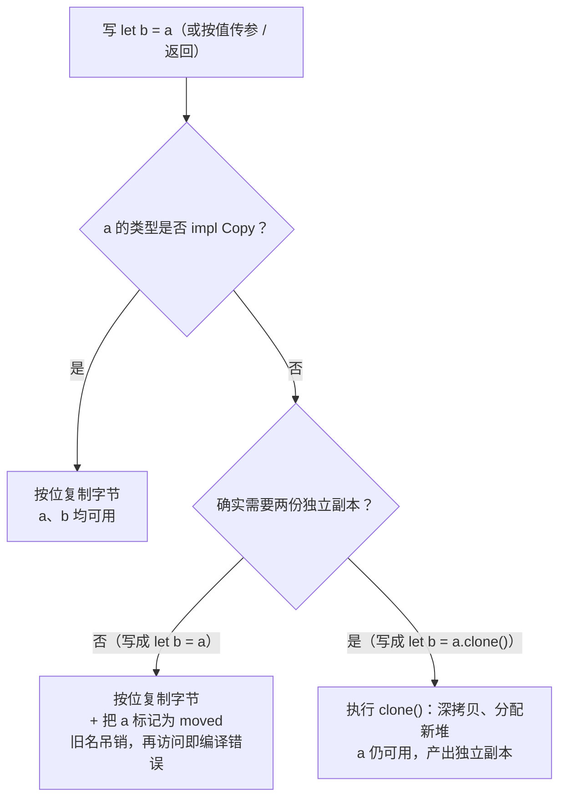

# 栈与堆：数据布局与 Copy/Clone 语义

> 本章属于 primitive 层。前置：所有权与移动语义。
> 学完你能：用一句话讲清「为什么有的值在 `let b = a` 之后还能用、有的就报 moved——这由数据布局和类型是否 Copy 在编译期就定死了，不是运行时再决定」。

## 1. 为什么需要它（设计动机）

上一章用生命周期标注，让编译器证明一条引用不会比它指向的数据活得更久。那套证明做得很漂亮，却始终把「一个值」当成不透明的黑盒——值到底存在内存的哪里，写一句 `let b = a` 时字节层面发生了什么，从头到尾没揭开。再往前一章，所有权模型给出了「默认 move、离场 drop」的规矩，也没回答一个更要命的问题：**为什么有的值 move、有的值却自动复制？**

想象你刚从 JS 过来，写下两行看起来一模一样的代码：

```rust
let n2 = n1;        // n1 是 i32，复制完 n1 还能用
let s2 = s1;        // s1 是 String，复制完 s1 立刻失效，再用就报 moved
```

同样的等号，截然相反的结果。更让人懵的是满屏的 `.clone()`：到底什么时候该 clone、什么时候不用？在 JS 里这些问题根本不存在——对象一律逃逸到堆，赋值一律共享同一个引用，你从不需要操心「数据存哪」「复制有多贵」，因为运行时把这两件事全藏起来了。

Rust 反其道而行：它把「这个值存在哪」和「复制它要付出多大代价」直接做成**类型的一部分**，由编译器在编译期就定死。所以你缺的不是语法，而是一个能预测 `let b = a` 会发生什么的心智模型。本章要建的就是这个模型，它回答了所有权章留下的那个「为什么有的 move、有的 copy」的口子。

## 2. 核心思想

Rust 让每个值的两件底层属性——**存哪（栈还是堆）**和**怎么复制（按位 Copy 还是显式 Clone）**——成为类型的静态属性，编译期就钉死，不由运行时讨价还价。

Copy 是一份契约：它向编译器承诺「这个类型只要按位复制字节，就能得到一个安全、独立的副本」；Clone 是这份契约管不到的地方的逃生口：它说「复制我可能很贵，所以你必须显式写 `.clone()`，由我自己决定怎么深拷贝」。

## 3. 心智模型

### 栈与堆：一个定长，一个变长

栈是一块后进先出的内存，分配和释放都只是挪一下栈顶指针，几乎没有开销，但代价是放进栈的值必须在**编译期就已知大小且固定不变**。堆则相反：分配器要在里面找一块空地、记下它的地址，访问时还得绕一次指针，慢于栈，但它能装**运行期才知道大小、或者大小会变**的数据。

在 Rust 里，值默认住在栈上。一旦数据是变长的（比如字符串、动态数组），你就得通过 `Box`、`Vec` 这类智能指针，在栈上留一个**固定大小的指针**，真正的数据放堆上。这就是为什么一个 `String` 在栈上其实是个「指针 + 长度 + 容量」的三件套，而字符内容躺在堆里。

### `let b = a` 到底发生了什么

写 `let b = a`（或按值传参、返回值）时，编译器只查一件事：`a` 的类型是否实现了 `Copy`。但这里有个关键岔路——**对非 Copy 类型，编译器先看你要不要两份，再决定走 move 还是 clone**。clone 和 move 是并列的两条出路，不是先 move 再 clone 的补救：



注意图中 clone 分支（F）发生在 `a` 被标记 moved **之前**——因为 `let b = a.clone()` 根本不会触发 move，它直接调 `clone()` 深拷贝出一个新副本，`a` 自始至终可用。`clone` 是 move 的替代选项，不是 move 之后的补救：一旦 `a` 真的 moved 了，再写 `a.clone()` 只会撞上「borrow of moved value」。

### 一个能消解九成困惑的事实

move 和 copy 在**字节层面其实是同一个操作——都是按位复制**。唯一的区别是编译器是否让旧名字继续可用。Copy 类型复制完，新旧两个名字都合法；非 Copy 类型复制完，旧名字被编译器吊销。

换句话说，move **不是**「把字节搬走、源变空」。字节照原样抄了一份，旧名字只是被吊销了执照——你再用它，编译器在编译期就拦下来。这一句点透，新手绝大多数的疑惑就散了。

### 一个容易卡住的边界

共享引用 `&T` 是 Copy（复制一个只读指针天然安全），但可变引用 `&mut T` 不是 Copy。它的深层原因正是前面借用章讲过的排他规则——可变引用必须保证唯一，若还能被复制就会出现两个可变别名，这里点到即可，不再展开。

## 4. 关键权衡

### 编译期定长换栈上零开销分配

Rust 把分配策略和数据绑死：编译期大小已知的值放栈，运行期才知大小或会变长的值必须显式装箱上堆。

换来的好处很实在——栈分配就是挪一下栈顶指针，不经过内存分配器、不会产生碎片，函数一返回栈帧自动弹出，释放是确定性的、零开销的。

代价是栈值必须编译期已知大小。任何动态数据都不能像 JS 那样「自动上堆、万物等价」，你得显式套一层定长指针把它送上堆，心智上多一步。

这条权衡化解的本质矛盾，是**编译器要生成静态的栈帧布局**（每个值在帧里的偏移在编译期就得定下来）与**程序要处理运行期才知道大小的数据**之间的冲突。Rust 选择把矛盾摆上台面：定长的免费放栈，变长的你得显式说「这个上堆」。

### 用 Copy 契约换按位复制的零成本自动拷贝

Rust 用一个标记 trait `Copy` 来声明「这个类型按位复制就能得到安全独立的副本」。编译器看到赋值或传参时，只要类型是 `Copy`，就自动按位复制，源依然可用。

换来的是 `let b = a` 对整数、布尔这类纯字节值的零成本自动复制——不用手写拷贝代码，没有任何运行时检查。

代价很硬：实现了 `Copy` 就**禁止拥有堆资源、禁止实现 `Drop`**。因为一旦你按位复制一个持有堆指针的值，就会得到两个指向同一块堆的指针，两边离场时各自跑析构，就是经典的 double-free。所以 `String`、`Vec` 永远不能 `Copy`，只能显式 `.clone()`，这逼你为每一个非 Copy 值主动决策「这里到底要不要复制、在哪复制」。

这里有个反直觉的边界值得点破：**Copy 不等于便宜**。`[u8; 1_000_000]` 是 Copy，但每次 `let b = a` 都按位复制 1MB，可能比让它直接 move 还贵。所以「要不要给一个结构体 derive Copy」是一个有性能语义的 API 设计决策——社区共识是默认不 derive，除非你确实需要它到处被自动复制。可见 Copy 省的不是「复制的成本」，而是「要不要复制、复制后源还能不能用」这套心智负担，但只对真正廉价的值才划算。

这条权衡化解的本质矛盾，是**想让廉价值随意复制**（图省事）与**按位复制堆指针会制造 double-free**（出大事）之间的对立。Copy 契约把两端切开：纯字节值随便复制，持有堆资源的值强制走 move 或显式 clone，泾渭分明。

### 把 Copy 的合法性交给编译器验证

`Copy` 不允许手写 `impl`，只能用 `#[derive(Copy, Clone)]` 让编译器生成；而且 derive 时编译器会逐字段检查——只要有一个字段不是 `Copy`，或者这个类型实现了 `Drop`，就一律拒绝。

换来的是一份硬保证：「按位复制 = 内存安全」这件事被编译器证明了，double-free 从源头消灭，不靠运行时检查，也不靠程序员的自觉。

代价是你不能凭自己的判断手动声明某个类型是 `Copy` 来绕过限制——哪怕你「心里清楚」它按位复制没问题，编译器不信。另一个隐性代价是向后兼容：今天给一个 `Copy` 结构体加一个非 `Copy` 字段，会悄悄让整个类型失去 `Copy`，下游所有依赖它自动复制的代码都会被波及。

化解的本质矛盾是**安全保证要机器可验证才信得过**与**程序员想凭个人判断声明「这个类型按位复制没问题」**之间的张力。Rust 一贯选择不信人、只信编译器——这条权衡正是它整个安全哲学的一个缩影。

## 5. 最小原理演示

下面的 TS 模型不模拟真实字节布局（TS 没有栈/堆概念），只用普通对象 + 一个 `moved` 哨兵，把「复制策略 + 失效语义」的逻辑演透。每一行都对应上面某条原理。

```ts
// 用普通对象模拟一个「Rust 值」：带 isCopy 标记（对应类型是否 impl Copy）
// 和 moved 哨兵（演「move 后旧名失效」，真实 Rust 是编译期报错，这里用运行期近似）
type Val = {
  data: unknown;
  isCopy: boolean;
  moved?: boolean;
};

// 演赋值 / 按值传参：let b = a —— 走 Copy 还是 move 由 isCopy 静态决定
function assign(a: Val): Val {
  // Copy 类型：按位复制即安全独立，源仍可用
  if (a.isCopy) {
    return { data: a.data, isCopy: true };
  }
  // 非 Copy 类型：字节照抄一份，旧名当场吊销
  // 真实 Rust 是编译期静态检查，这里用运行期置 moved 近似「旧名失效」
  a.moved = true;
  return { data: a.data, isCopy: false };
}

// 演显式深拷贝：.clone() —— 可能昂贵、必须手写，是非 Copy 类型的逃生口
// 注意：clone 是 move 的替代选项，所以先检查 a 是否已被 move 走
function clone(a: Val): Val {
  if (a.moved) throw Error("borrow of moved value");
  // Copy 类型的 clone 退化为按位复制；非 Copy 类型这里假装分配新堆做深拷贝
  return { data: a.data, isCopy: a.isCopy };
}

// 读访问：moved 后再用就报错，演「旧名失效」的编译期拦截
function use(a: Val, label: string) {
  if (a.moved) throw Error(`use of moved value: '${label}'`);
  return a.data;
}

// 对照：i32 (Copy) vs String (非 Copy)
const n1: Val = { data: 5, isCopy: true };       // i32 是 Copy
const n2 = assign(n1);                            // let n2 = n1
console.log(use(n1, "n1"), use(n2, "n2"));        // 5 5 —— 源仍可用

const s1: Val = { data: "hi", isCopy: false };    // String 非 Copy（持堆指针）
const s2 = assign(s1);                            // let s2 = s1 —— 走 move
console.log(use(s2, "s2"));                       // "hi"
// use(s1, "s1");                                 // 会抛错：use of moved value 's1'

const s3 = clone(s2);                             // let s3 = s2.clone() —— 显式深拷贝
console.log(use(s2, "s2"), use(s3, "s3"));        // "hi" "hi" —— 两份各自可用
```

跑一遍这段，Copy / move / clone 三种结果就肉眼可分：`n1` 复制后两边都能用、`s1` 复制后旧名失效、`s2.clone()` 让两份各自独立。

## 6. 执行轨迹

拿一组具体输入走一遍。起点是两条声明：

```rust
let n1 = 5;                  // i32，Copy
let s1 = String::from("hi"); // String，非 Copy
```

此刻栈帧里，`n1` 是 4 字节的 `i32`；`s1` 是「指针 + 长度 + 容量」的定长三件套，指针指向堆上某处的 `"hi"`。

接着 `let n2 = n1;`：编译器查 `i32` 实现了 `Copy`，于是按 4 字节复制一份给 `n2`。结果 `n2 = 5`，`n1` 依然是 `5`，两边都合法。

接着 `let s2 = s1;`：编译器查 `String` 不是 `Copy`，于是看岔路——你写的是 `s1` 还是 `s1.clone()`？是 `s1`，走 move。它把 `s1` 那份定长三件套原样按位复制给 `s2`，然后把 `s1` 标记为 moved。关键点：堆上的 `"hi"` 一个字节都没动，`s2` 的指针和从 `s1` 抄来的指针指向**同一块堆**。但只有 `s2` 这个名字合法，`s1` 已被吊销，所以不会有第二个析构去释放那块堆，double-free 被挡在门外。

这时再访问 `s1`，编译器直接报 `use of moved value: 's1'`。

最后 `let s3 = s2.clone();`：这回你明确写了 `.clone()`，不走 move。`clone()` 执行深拷贝——在堆上新申请一块内存、把 `"hi"` 抄过去、返回一个全新的定长三件套。`s3` 指向新堆，`s2` 仍指向原堆，两份完全独立。访问 `s2`、`s3` 都正常。

这条轨迹一次性演透了三种结果：Copy 是字节照抄、两边可用；move 是字节照抄、旧名吊销；clone 是显式深拷贝、两份独立。

## 7. 教学简化说明

本章演示故意省略了几样东西：真实栈/堆字节布局（TS 没这个概念，用对象模拟即可，别把演示对象当成真在操作内存地址）；`#[derive(Copy, Clone)]` 的宏展开细节；泛型单态化；以及与 `Drop` 互斥的**真实编译期检查**（演示只能用运行期抛错近似，真实 Rust 在编译期就拒绝）。`ManuallyDrop`、`MaybeUninit`、内存对齐 padding、`Box` 的两层结构、`Rc`/`Arc` 这种靠引用计数实现共享的中间地带，都不在本章展开。

## 8. 小结

数据存哪、怎么复制，在 Rust 里是类型在编译期就钉死的属性，不是运行时的暗箱。栈装定长值、堆装变长值，`Copy` 用一份「按位复制即安全」的契约换来了廉价值的零成本自动拷贝，而持堆资源的值只能 move 或显式 clone——三条路在字节层面都是按位复制，差别只在编译器让不让旧名字继续露面。

讲完了值的「存哪、怎么复制」，下一章换个维度看数据本身能长什么样：Rust 的 `enum` 让一个值成为几种不同形状之一，并用穷尽匹配逼你把每种形状都处理到。