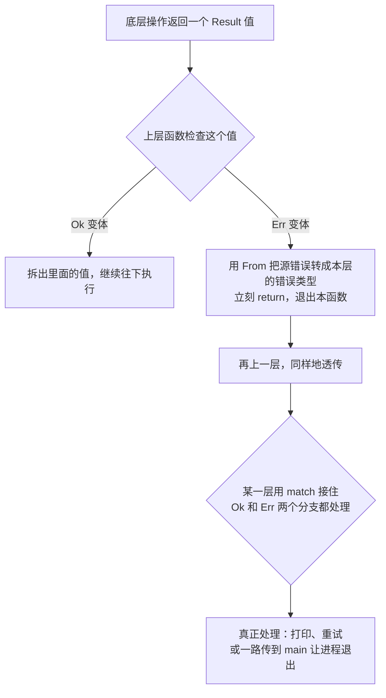

# 错误即值：Result/Option 与 ? 运算符

> 本章属于 composite 层。前置：代数数据类型：枚举与穷尽模式匹配。
> 学完你能：讲清为什么 Rust 把“失败”做成一个普通的值、为什么编译器非逼你处理它，以及 `?` 运算符怎样让这一切不啰嗦到让人想放弃。

## 1. 为什么需要它

上一章我们用 `dyn Trait` 把“运行时该调用哪个实现”也交给了类型系统去描述。走到这里，Rust 已经把内存归谁、能借多久、走静态还是动态派发这些事几乎全都搬进了编译期。但有一类运行时麻烦我们一直绕着走：**操作失败了怎么办？值不存在怎么办？**

写过 JS 的人对这两种炸法都不陌生。你调一个 `readFile(): string`，从签名完全看不出它会抛，直到某天生产环境炸了，顺藤摸瓜才发现第十层调用里藏着一个 `throw`。又或者你写 `user.address.city`，某个用户的 `address` 是 `null`，整页白屏。这两种 bug 的共同点是：**失败信号不在类型里、不在签名里，只在运行时跳出来吓你一跳**。你既没法在编译期知道“哪里可能出错”，也没法强迫接你代码的人“必须处理错误”。

主流语言用两套机制应付这两件事，恰好都有同一个病根：

- **异常（exception）** 的传播路径对类型系统不可见。一个函数签名不声明 `throws`，意味着它内部任何一行都可能炸穿调用栈，跳到你完全没准备的地方。
- **null** 把“没有”伪装成所有引用类型都合法的取值。于是每一次解引用都是一次潜在的空指针彩票。

Rust 的回应很直接：这两类“隐形的运行时炸弹”都不要。它用两个标准库枚举把失败和缺席重新拽回“普通返回值”的轨道，`Option<T>` 表达“可能有值也可能没有”，`Result<T, E>` 表达“可能成功也可能失败”。失败重新变成一个有类型、能传递、能转换的值，于是它必须出现在函数签名里，也必须被调用方当场处理或者显式地向上传。

## 2. 核心思想

**失败是一个普通的值，不是一条隐形的控制流跳转。**

正因为是个值，它就得遵守值的所有规矩，这恰恰是后面全部设计的源头：它有类型，所以进得了签名；它能被传递，所以能一层层往上交；它能被转换，所以不同抽象层之间可以换上对应的类型。这条性质一确立，“失败必须可见、必须被处理、必须能跨层流动”就全是顺理成章的推论，而不是三条互不相干的规定。

## 3. 心智模型

`Option` 和 `Result` 其实就是标准库替你预先写好的两个 enum，拆包用的还是前置章那套 `match` 穷尽检查。这里只看它专门用在“失败/缺席”这个语义上时，多了什么配套。

两个枚举的定义简单到一句话能说完：

```rust
enum Option<T> { Some(T), None }
enum Result<T, E> { Ok(T), Err(E) }
```

`Option` 把“无”从 null 那种“所有引用暗中都可取的值”，收窄成一个必须先 match 拆开才能拿到 `T` 的枚举变体。`Result` 把错误值也变成普通泛型参数 `E`，于是**错误类型会直接出现在函数签名里**，这正是“失败对类型系统可见”的源头。

一个操作可能失败，就把它的返回类型从 `T` 改成 `Result<T, E>`。调用方拿到这个值之后**必须拆开它**才能拿到里面的 `T`：要么 `match` 在原地处理，要么用 `?` 把它往上游透传，没有第三条路。编译器靠两道关卡盯着你：一是 `match` 的穷尽性（漏写分支直接编译失败，这套机制来自前置章），二是 `Result`/`Option` 自带 `#[must_use]` 标注，忽略它会产生警告。

错误就这么沿调用栈一层层 `?` 往上走，像异常的栈展开，但每一跳的类型转换都在编译期被检查过，直到某一层决定 `match` 真正接住它：



整张图里没有任何一处“偷偷抛出”。错误始终是一个返回值，沿着返回通道逐层换装向上，每一层的 `?` 在编译期就验过 `From` 转换成不成立。这等价于异常的栈展开，但传播路径对类型系统完全可见。

至于 `Option` 和 `Result` 的分工：`None` 表示“这里就是没有值”，**缺席不是错误**（比如 HashMap 查不到 key，很正常）；`Err` 表示“我做了件本该成功的事却失败了”，**失败需要解释和处理**。两者用 `.ok()` / `.ok_or()` 互转，把这两个语义混着用，API 就会变得含糊。

最后是 `panic!`。它**不是值**，是展开栈的控制流，表达“不变式被破坏、继续执行已经没有意义”。数组越界、除以零、逻辑上根本不可能发生的状态被打破，这些才轮到 `panic!`。它不该被当成可处理的错误，这条分界线下面专门讲。

## 4. 关键权衡

这一节是全章重头戏。Rust 错误处理的每个“麻烦”都不是白找的，下面四条逐个说清它在选什么、换来什么、又付了什么代价。

### 把失败写进签名，换“失败路径一眼可见”

第一个选择最根本：让可能失败的操作返回 `Result<T, E>`，而不是返回 `T` 然后偶尔 `throw`。

换来的是：失败的路径**直接写在函数签名上**，而且错误只能沿着返回值这一条显式通道流动。你扫一眼签名就知道它会不会失败、失败时返回什么类型的错误；调用栈里不存在“某个我没读过的函数突然炸穿上来”这种事。

代价是：每个可能失败的调用都得显式处理或显式传播，相比 JS 用一层 `try/catch` 把整段代码兜起来，确实啰嗦。这正是为什么 Rust 紧接着发明了 `?` 运算符来降低这层啰嗦（见最后一条权衡）。换句话说，啰嗦是“失败必须可见”这个选择的直接账单，`?` 是事后给的折扣，但账单本身抹不掉。

这条权衡化解的本质矛盾，是**“失败要被看见”和“代码要写得顺手”**之间的拉锯。几乎所有错误处理机制的设计都在这两个需求之间找平衡点，Rust 把砝码全压在了前一个。

### 用穷尽 match 强制处理，换“漏分支即编译失败”

光把失败写进签名还不够，还得保证调用方**真的处理了它**。手段是把前置章那套 enum + 穷尽 match 搬过来：要拿到 `Result` 里的 `T`，就必须 `match`（或 `?` 传播），而 match 必须覆盖所有变体。

换来的是：漏掉错误分支会直接编译失败，而不是上线后变成一个没人发现的空指针。你没办法“先忽略、以后再说”。

代价是确实没有那种轻飘飘的逃生口。想忽略一个 `Result`，你得主动声明意图：要么 `unwrap()`（失败就 panic，等于赌它不会错），要么 `let _ = ...`（显式丢弃，表明“我知道有错但故意不看”）。这两者都会留下白纸黑字的痕迹，偷懒因此变成一个**可见的、能被 code review 拦下**的决定，而不是悄无声息的疏忽。

顺带提一句边界的缝：`#[must_use]` 产生的是警告而非硬错误，而且对 trait 方法当前还不完全生效。Rust 在这里选了“提醒而非强制”，把最后一锤留给程序员。

### `?` 加 `From`，换“像异常一样顺滑但类型安全地冒泡”

如果只有前两条，写多层调用会非常痛苦，每一层都得 `match` 出错误再手动 `return`。`?` 运算符就是来解决这个的。它作用在 `Result<T, E>` 上时，行为可以精确描述成一句话：**是 Ok 就拆出值继续，是 Err 就立刻退出当前函数，退出前用 `From` 把源错误类型转成本函数声明的那种错误类型。**

换来的是：错误能像异常一样沿调用栈顺滑冒泡，但每一跳都类型安全、都在签名上可追踪。你不再需要手写“match 到 Err 就 return”的样板，一行 `?` 就够了。

代价是：不同抽象层往往有不同的错误类型（底层是 `ParseError`，业务层是 `ConfigError`），要让 `?` 顺畅工作，就得给这些错误类型之间写 `From` 实现（实战中多半用 `thiserror` 自动派生，或用 `anyhow` 直接装任意错误）。于是**“错误类型该怎么设计”本身成了一门要单独学的学问**：分多少层、每层暴露什么错误、层与层之间怎么转换，这些在 JS 里压根不是问题（因为大家都 `throw new Error()` 一把梭），在 Rust 里却是绕不开的设计决策。

这条化解的矛盾，是**“错误要在层与层之间转换以匹配抽象层次”和“转换代码不该淹没业务逻辑”**之间的张力。`?` 把转换压缩成一个字符，`From` 把转换规则集中到一处，两者合起来才让“逐层类型安全地冒泡”真正可写。

### panic 与 Result 二元划分，换“可恢复失败与不变式破坏分清”

最后一个选择是语言层面的：Rust 不像 Java 那样把所有失败都塞进异常体系，而是**在语言层就把“可恢复的预期失败”和“不可恢复的不变式破坏”劈成两半**。前者用 `Result`，后者用 `panic!`。

换来的是：你一眼能分清一个失败是该被调用方处理的（I/O、解析、用户输入），还是根本不该发生、发生了就该崩的逻辑错误（越界、除零、不变式被打破）。公开 API 的默认选择永远是 `Result`。

代价是初学者得学一套判断准则，而且偶尔会判断错（该用 `Result` 的地方图省事 `unwrap` 了，等于把可恢复错误降级成崩溃）。另外 `panic` 默认展开栈、能被 `catch_unwind` 捕获但不被鼓励，跨 FFI 边界或编译成 abort 模式时还捕不到，这是语言后来补的洞，也印证了“panic 不该当正常错误处理用”这条社区共识。

## 5. 最小原理演示

下面用 TS 的判别联合（discriminated union）从零搭一个 `Result`，把上面三件事演透：**失败被值化、调用方被迫处理、`?` 不过是“拆值或带转换地早返回”的语法糖**。每行都对应一个原理点。

```ts
// 用判别联合还原 Rust 的 Result<T, E>：一个带 tag 的“成功值 / 错误值”二选一
type Ok<T> = { tag: "ok"; value: T };
type Err<E> = { tag: "err"; error: E };
type Result<T, E> = Ok<T> | Err<E>;

// 失败不再是 throw，而是一个普通的返回值——错误类型 E 因此进得了签名
type ParseError = { reason: string };
function parseNumber(raw: string): Result<number, ParseError> {
  const n = Number(raw);
  if (Number.isNaN(n)) return { tag: "err", error: { reason: `无法解析: ${raw}` } };
  return { tag: "ok", value: n };
}

// 调用方必须拆开 Result 才能拿到里面的 number
function doubleIt(raw: string): number {
  const r = parseNumber(raw);
  switch (r.tag) {
    case "ok":  return r.value * 2;   // 只有窄化到 Ok 后，TS 才让你读 r.value
    case "err": return 0;             // 漏掉这行：TS 会因“并非所有路径都返回值”报错
  }                                  // 注意这是返回路径检查，还不到 Rust 那种真正的穷尽性
}
```

接下来看 `?` 到底干了什么。Rust 里 `let n = parse_number(p)?;` 这一行，大致展开成下面这段逻辑：成功就拆出值继续往下，失败就**立刻早返回**，返回前把错误类型换成本层的错误类型。

```ts
type ConfigError = ParseError | { kind: "other" };

function parseConfig(raw: string): Result<number[], ConfigError> {
  const parts = raw.split(",");
  const out: number[] = [];

  for (const p of parts) {
    const r = parseNumber(p);
    if (r.tag === "err") {
      // 这整段就是 `?` 的活：早返回，返回前把源错误换成本层错误类型
      // 这里 ParseError 恰好已是 ConfigError 的成员，直接透传；
      // 真要换类型时，这一步就是接缝所在
      return { tag: "err", error: r.error };
    }
    out.push(r.value);   // 走到这 TS 才确认 r 是 Ok，才放行 r.value
  }
  return { tag: "ok", value: out };
}
```

这里要把 TS 和 Rust 的对比说准，别冤枉了 TS。TS 的判别联合 narrowing 是真功夫：当 `r` 的类型是 `Ok | Err` 时，你不窄化直接写 `r.value`，TS 会报错（`Err` 上根本没有 `value` 这个字段），必须先 `switch` 或 `if` 把类型收窄。就“不拆包就拿不到内部值”这一点而言，TS 和 Rust 在类型层是一致的。

那道“缝”在别处。TS 的保障**只停在类型层**：编译出来的 JS 里这些 tag 检查照跑，可一旦上游传来的数据 tag 写错、或者边界处没标类型，运行时不会替你兜住，错误照样静悄悄溜过去。Rust 的 enum 是名义类型，变体只能由枚举定义本身产生，你想伪造一个错配的变体，根本过不了编译。更要命的是 TS 还留了后门：`as`、`any`、`@ts-ignore` 都能让你骗过编译器；Rust 在 safe 代码里没有“把一个值强转成某个枚举变体”这种操作，想“假装这里是 Ok”办不到。

所以同样是“和类型加穷尽拆包”，Rust 把这道保障从“类型层的、可绕过的约定”升成了“编译期硬挡”。这正是 Rust 觉得光有 TS 那套联合类型还不够、非把它做成 enum 的理由。

## 6. 执行轨迹

拿一个具体输入走一遍，看错误怎么作为一个值逐层向上、最后被接住。输入字符串 `"abc"`，喂给 `parse_number`：

1. `parse_number("abc")` 内部转换失败，返回 `Err(ParseError { reason: "无法解析: abc" })`。此刻没有 throw，没有任何控制流跳转，就是一个普通返回值。
2. 上层 `parse_config` 里写着 `let n = parse_number(part)?;`。`?` 检查到这是 `Err`，立刻执行早返回：调 `From::from` 把 `ParseError` 转成 `ConfigError`（这里它已是成员，直接透传），然后 `return Err(ConfigError)`。**这一行之后的代码全部跳过**，`out.push` 根本不会执行。
3. 错误以 `Err(ConfigError)` 的形态回到 `main`。`main` 里 `match parse_config(...)` 命中 `Err` 分支，打印错误信息。
4. 程序**正常继续往下走**，没有 `try/catch`、没有崩溃、没有栈展开。整条链路上，错误始终是个返回值，沿着返回通道从 `ParseError` 变成 `ConfigError`，最终被 match 接住。

把这条轨迹和异常对比一下就清楚差别在哪：异常是“跳”，从抛出点直接跳到某个远处的 catch，中间的函数全被栈展开掀翻；这里的错误是“走”，一格一格沿着返回值往上走，每走一格还换个对应的类型外衣。

## 7. 教学简化说明

本章演示故意省略了一堆东西：`thiserror`/`anyhow` 等生态库、`#[derive(Error)]`、`?` 作用于 `Option` 时的重载、`map`/`and_then`/`unwrap_or` 等组合子、`Box<dyn Error>` 这种“随便什么错误”的速写、`fn main() -> Result<(), E>` 的底层收口机制、panic 的 unwind 与 abort 配置、`catch_unwind`、`std::error::Error` 的 `source()` 错误链。这些是“用的时候查”，不是学原理的主线。本章只盯住“错误即值 + 强制处理 + 带转换的早返回”这三件事。

## 8. 小结

Rust 不要异常也不要 null，转手把失败和缺席都做成有类型的返回值，逼你在编译期就面对它们。`?` 运算符把“逐层处理”的啰嗦压成一个字符，`From` 让错误在不同抽象层之间顺滑转换，代价是你得认真设计错误类型，并且学会区分哪些失败该 `Result`、哪些才轮到 `panic`。

下一章我们去看 Rust 零成本抽象的另一个标杆：集合与迭代器。