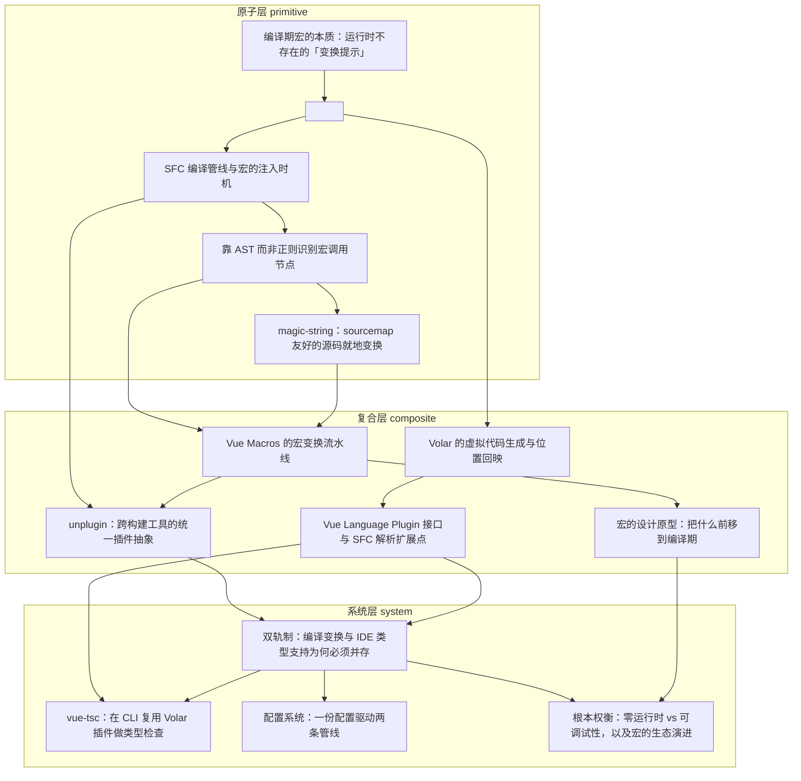

# 导读：Vue Macros 源码解读

## 这本书在讲什么：一句话主线

一句话：**一个宏注定要在两条管线里各跑一遍——构建轨真改代码、智能轨假装改写——对齐靠契约，不靠机制。这是「把运行期工作前移到编译期」这条总路线的根本代价，也是本书 14 章共同回答的问题。**

想象一下你写下 `const models = defineModels<{ foo: string }>()`，期待 Vue 帮你自动展开成等价的 props + emits + 代理 ref 三件套。这件事之所以成立，靠的是「宏是写给编译器看的伪函数」这一招——编译期识别、原地改写、运行时擦除。但这一招引出了全书最大的张力：**消费你源码的工具分成两类，看宏的方式正好相反**。打包器和浏览器只信运行时，必须有东西在构建期真的把宏擦掉、把运行时代码塞进去；编辑器和语言服务只信磁盘上的字面源码，必须有东西在它眼皮底下「假装」宏是合法函数、给出类型签名。两条管线都不能省——缺构建轨运行时崩，缺智能轨编辑器满屏红线。

这条裂缝的两侧各长出了一套工程：构建轨这边是「AST 识别 + magic-string 改写 + 固定顺序插件链 + unplugin 跨打包器分发」（第 3~6、8 章），智能轨这边是「虚拟代码 + 双向位置映射 + 可插拔语言插件」（第 9~10 章）。两条轨在 system 层正面相遇：双轨制为何不能合并（第 11 章）、vue-tsc 如何把智能轨搬进 CI 兜底（第 12 章）、一份配置如何门控两条管线（第 13 章）。最后第 14 章收尾，把宏定义为「编译器能力的临时扩张」——它替官方背着尚未采纳的语法糖，要么被官方收敛、要么被废弃，生命周期有限。

如果你只读完一段，请记住这句：**全书所有具体机制（AST、sourcemap、unplugin、Volar、双轨、配置、生命周期）都是从「编译期前移」这一原理骨架派生出来的**，不是 Vue Macros 凭空发明的能力。

## 怎么读这本书：两条阅读路线

### 一、线性路线（按 topoOrder，每章一句话）

| # | 章节 | 承接什么、打开什么 |
|---|---|---|
| 1 | 编译期宏的本质 | 全书地基章。钉死「源码里有宏名、产物里没有宏名」这条判据 |
| 2 | `<script setup>` 与内置宏 | 把第 1 章的抽象本质落到 Vue 内置宏；点出「用户不可扩展」——Vue Macros 存在的理由 |
| 3 | SFC 编译管线与注入时机 | 把宏的去糖钉死在 `compileScript` 内部的 AST 遍历子阶段 |
| 4 | 靠 AST 而非正则识别 | 在那个子阶段内部，进一步钉死「必须用结构化 AST，不能用正则」 |
| 5 | magic-string 与 sourcemap | 改写时为什么不能用 `.replace()`，必须用 offset 账本 |
| 6 | 宏变换流水线 | 把第 4、5 章的单兵动作编队成「插件链 + 顺序接力」 |
| 7 | 宏的设计原型 | **跳轨点**：从「机制层」跳到「设计反思层」，归纳三类原型 |
| 8 | unplugin 抽象 | 把构建轨这条管线分发到 Vite/webpack/Rollup/esbuild |
| 9 | Volar 虚拟代码 | **跳轨点**：跨到智能轨一侧，讲映射机制本身 |
| 10 | Vue Language Plugin | 把映射规则做成可插拔接口，自定义宏才能进 IDE |
| 11 | 双轨制为何并存 | 两条轨为什么必须分开实现、为什么对齐只能靠契约 |
| 12 | vue-tsc 类型检查 | **跳轨点**：从「思想」跳到「工具应用」，给契约配 CI 执行者 |
| 13 | 配置系统 | 一份配置门控两条管线，靠构造期静态对齐 |
| 14 | 根本权衡与生态演进 | 把散落的单点代价提升为「宏的完整生命周期」 |

**两个跳轨点提示**——零基础读者如果撞上难度台阶，可以绕行按主题路线：
- **第 6→7 章**：从「流水线怎么跑」跳到「该不该做成宏」。机制细节啃不动时，可直接跳到第 7 章看设计哲学，再回头补机制。
- **第 8→9 章**：从「编译轨」整体切换到「智能轨」，是全书最大的轴切换。如果只关心一边，可以选一条轨读完再读另一条；第 11 章是两条轨的交汇点。

### 二、按主题路线（按常见阅读目标选章节子序列）

- **只想搞懂「宏到底是什么」**：第 1 → 2 → 14 章。三章节构成「公理 → 落地 → 生命周期」的完整闭环，不读机制也能讲清。
- **只关心构建期变换原理**（怎么从源码改写到打包器能吃下的 JS）：第 1 → 3 → 4 → 5 → 6 → 8 章。一条 primitive→composite 的主干线，全程在「编译轨」一侧。
- **只关心 IDE/类型支持是怎么实现的**：第 2 → 9 → 10 → 11 → 12 章。从「为什么 TS 不认 `.vue`」到「vue-tsc 在 CI 里复用同一套虚拟代码」。
- **只关心宏的设计哲学**（什么该做成宏、什么不该）：第 1 → 2 → 7 → 14 章。这一路几乎不碰工程细节，全是「为什么」的反思。
- **只关心双轨对齐与配置系统**（已经懂机制，想看 system 层）：第 11 → 12 → 13 章。三章连起来回答「契约如何被技术兜住」。

## 贯穿全书的核心原理

下面五条原理在多章以不同化身反复现身。读者一旦认出「这其实是同一个原理的第 N 次现身」，理解就会贯通。

### 1. 编译期前移、运行时擦除
宏的本质是给编译器看的「变换提示」——编译期识别、原地改写、运行时彻底消失。
现身于：第 1 章奠基；第 2 章的「去糖」是它的具体化身；第 6 章的插件链每个 visitor 都在做这件事；第 7 章三类原型都基于它；第 14 章正面展开它的代价。

### 2. offset 坐标系是真理之源
所有改写都必须钉在「原始源码的字符偏移量」上，位置信息一旦丢失就再也回不来。
现身于：第 4 章 AST 交出每个节点的 `start/end`；第 5 章 magic-string 用它做编辑账本、生成 sourcemap；第 9 章 Volar 虚拟代码用它做双向位置映射；第 10 章 `parseSFC2` 伪装接入 `.setup.tsx` 时还要手动减前缀保 offset。

### 3. 结构匹配三要素
识别一个东西是不是宏调用，靠「节点类型 + callee 类型 + 名字属于宏名单」三个条件用「且」连接——不靠文本描字。
现身于：第 4 章建立判据；第 6 章流水线里每个特性的 `walkAST` 都用它；第 10 章脚本层寄生注入（在官方骨架锚点 splice）是同一种结构化思路。

### 4. 双轨对齐靠契约，不靠机制
一个宏必须在两条消费者完全不同的管线里各实现一遍，输出格式相反（一个擦除宏、一个假装宏合法）；语义对齐只能靠人维护，编译器查不出来。
现身于：第 1 章末段伏笔（「编译器认识、工具链不认识」这一割裂）；第 8 章和第 10 章各自长出一条独立管线；第 11 章正面展开为何不能合并；第 12 章给契约配 CI 执行者；第 13 章用配置 schema 在构造期静态对齐。

### 5. 临时扩张的生命周期
宏是编译器能力的「临时补丁」——它替官方背着尚未采纳的语法糖，要么被官方收敛（进核心）、要么被废弃。激进语法糖的短期收益与长期迁移成本永恒拉扯。
现身于：第 2 章末段「用户不可扩展」是这条原理的反面（官方收得紧）；第 7 章三类原型按是否会被官方吸收划分（原型一/二会、原型三不会）；第 13 章「版本感知默认」是它落到配置层的具体形态；第 14 章用 Reactivity Transform 被废弃的判例正面收尾。

## 全书脉络图

下面这张依赖图由编排层依据 `outline.json` 的 `dependsOn` 自动生成——箭头方向是「前置 → 后继」，即箭尾踩在箭头肩膀上。读图时盯住三个最有信息量的位置：

- **最显眼的汇聚点：第 11 章「双轨制」**。它同时依赖第 8 章（unplugin，编译轨）和第 10 章（Vue Language Plugin，智能轨），是全书两条主轴的物理交汇——这种「双入度」结构在图里独此一处，也是它被后续 12、13、14 三章连续依赖、成为全书画面的几何中心的原因。
- **两条独立主干**：图左下一支是「1 → 2 → 3 → 4 → 5 → 6」这条编译轨长链，图右上另一支是「9 → 10」这条智能轨短链。两条主干在第 11 章正面碰头——这正是双轨制成立的拓扑证据。
- **跨 layer 的关键边**：第 9 章（composite）回头依赖第 2 章（primitive）——Volar 虚拟代码与 `<script setup>` 去糖共享「编译期变换」这一原理，于是 composite 层伸回 primitive 层取根；第 14 章（system）跨层依赖第 7 章（composite）——根本权衡要回到设计原型才能解释清楚，于是收尾章绕过中间所有 system 章直接抓住 composite 的反思。这两条跨层边最值得读者注意，它们标记了「原理复现」而非「机制递进」的关系。

如果你是第一次读，建议先扫一遍图找到 1 和 11 这两个端点，对照上面线性路线逐步推进即可。

下图由 outline 的 `dependsOn` + `topoOrder` 程序化生成（箭头方向：前置 → 后继）：

