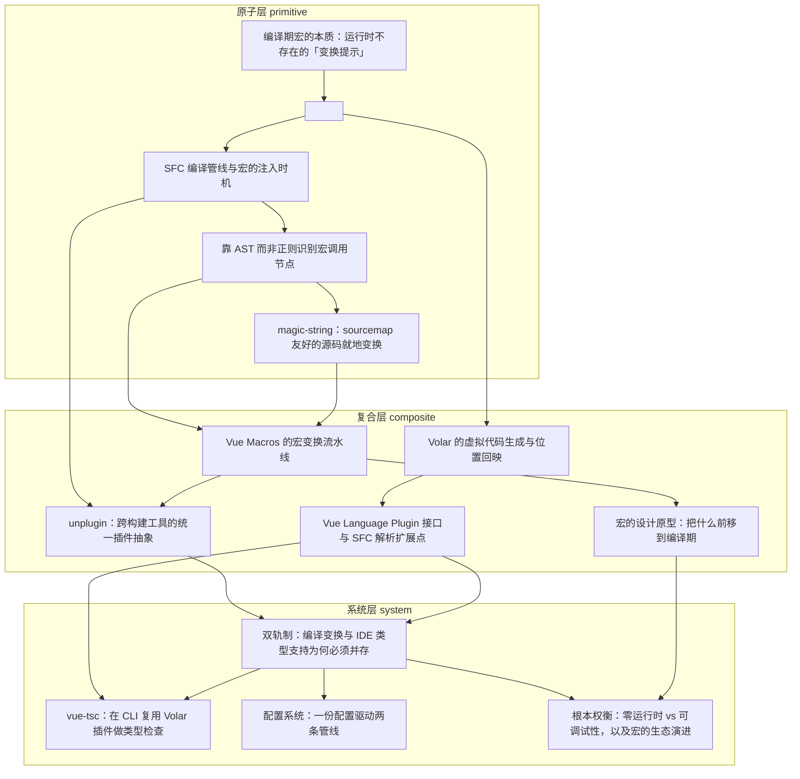

# 导读：Vue Macros 源码解读

## 这本书在讲什么：一句话主线

想象你头一回在 `<script setup>` 里写下 `const props = defineProps(['msg'])`，随手一跑就好了——没 import、没声明，运行时也找不到这个函数，可 props 就到手了。这份"不用解释的顺手"背后，藏着一整本这本书要拆的东西。

把 14 章压成一句话：**Vue Macros 的全部复杂性，都源于"宏是运行时根本不存在的伪函数"这一条性质。** 这条性质像一颗石头丢进水里，激起的每一圈涟漪都是一章。

这句话怎么分解到全书？这一条性质同时逼出两件硬要求。第一，既然宏运行时不存在，就必须有东西在编译期把它真擦掉、换成能跑的等价代码——于是有了第 1 到第 5 章的地基（怎么认出它、在哪一步改、怎么改了还能让 sourcemap 追回源码），以及第 6 到第 8 章的规模化（把单个改写串成流水线、判断什么够格当宏、一份逻辑跨遍 Vite/webpack/esbuild）。第二，同样因为宏运行时不存在，那些只读你磁盘文件、不会去跑构建的编辑器和语言服务，会把它当成"未定义的标识符"满屏报红——于是必须有另一套东西在编辑器眼皮底下假装它合法、配上类型，这就是第 9、10 章的虚拟代码与语言插件。

而这两套东西服务的消费者恰好相反——打包器只信运行时、编辑器只信源码字面——谁也替不了谁，只能并存，这就是第 11 到 13 章的"双轨制"（两条独立管线靠人工契约对齐、vue-tsc 把编辑器能力搬进 CI、一份配置同时驱动两侧）。最后第 14 章算总账：这套把工作从运行时搬到编译期的整套机制，换来的是零运行时开销和声明式语法，让出去的是可调试性，外加一条"宏只是编译器能力的临时补丁、迟早随官方演进而退场"的长期义务。

## 怎么读这本书：两条阅读路线

### 一、线性路线（从地基读到终局）

全书按 `topoOrder` 排成一条由浅入深的链，每章都承接上一章留下的口子、打开下一个问题：

1. **编译期宏的本质** — 立住全书地基："运行时根本不存在的伪函数"到底意味着什么。
2. **`<script setup>` 与内置宏** — 接住"宏是什么"，打开"它去糖成什么形状"，并埋下"官方宏硬编码、不能扩展"这个 Vue Macros 的存在理由。
3. **SFC 编译管线** — 钉死宏去糖发生的精确时机：`compileScript` 内部、拿到 AST 之后的那次遍历。
4. **靠 AST 识别宏调用** — 拆开"为什么必须用 AST 结构匹配、正则会误伤"。
5. **magic-string** — 解决"改了代码怎么还能让 sourcemap 追回源码"。

> **跳轨点①**：到这儿，"一个宏变换的内部机制"已经完备。接下来主题从"单个变换怎么做"切到"怎么把一堆变换组织起来、铺到工程里"。如果你只关心编辑器为什么报红、补全怎么来，对编译细节没兴趣，可以直接跳到第 9 章。

6. **宏变换流水线** — 把单个变换串成一条可插拔、固定顺序的接力链。
7. **宏的设计原型** — 归纳哪些东西够格当宏（补全能力 / 运行期约定编译期化 / 全新 DSL），给出一句话判据。
8. **unplugin** — 一份变换逻辑怎么同时长出 Vite、webpack、esbuild 的原生插件。

> **跳轨点②**：构建期这条轨到这儿讲完。主题从"构建期怎么真改代码"切到"编辑器怎么假装改代码"。只关心打包/构建的读者可以在此收尾；想搞懂 IDE 红线和补全的读者，从这里进入另一条轨。

9. **Volar 虚拟代码** — 把多语言的 `.vue` 翻译成单语言虚拟文件喂给 tsserver，再把诊断位置双向回映。
10. **Volar 语言插件** — 把"怎么翻译 `.vue`"开放成可挂载的钩子，`@vue-macros/volar` 正是借此让自定义宏被 TS 理解。
11. **双轨制** — 把构建轨和智能轨并到一起，讲清它们为什么必须并存、又为什么这么容易对不齐。
12. **vue-tsc** — 把智能轨那套类型能力搬进命令行，给 CI 当门禁。
13. **配置系统** — 一份配置怎么同时喂给构建和 IDE 两条管线。
14. **根本权衡** — 终局算账：零运行时 vs 可调试性，以及宏为什么注定退场。

### 二、按主题路线（带着具体问题切入）

- **只想搞懂"宏到底是个什么东西"**：读 1 → 2 → 3。三章立住地基（伪函数、去糖、注入时机）；想顺带看 sourcemap 怎么善后，加第 5 章。
- **只关心构建期怎么改代码（打包器侧）**：读 3 → 4 → 5 → 6 → 8。从注入时机、AST 识别、magic-string 改写，到流水线和跨工具分发。
- **只关心 IDE 的红线和补全怎么来的**：读 9 → 10 → 11 → 12。前置只需第 1、2 章的概念。这条线解释你日常遇到的"为什么能跑却报红"。
- **想追"一个宏从设计到落地"的完整链路**：读 7（判据）→ 6（流水线）→ 8（构建分发）→ 10（IDE 支持）→ 13（配置串两侧）。
- **只看架构取舍和生态演进、跳过实现细节**：读 2（扩展性痛点）→ 11（双轨制）→ 13（配置契约）→ 14（终局取舍）。
- **专门搞懂"构建能跑但 IDE 报红 / 能提示但一构建就崩"**：以第 11 章为核心，配合 9–10（智能轨）和 6–8（构建轨）两头对照。

## 贯穿全书的核心原理

下面几条原理，会在不同章节里换一副面孔反复出现。认出它们，各章就读通了。

**1. "能在编译期被静态找到"，是一切变换的前提。** 宏必须能在编译期被一眼定位到，所以它不能藏进条件分支或回调（否则就要等运行时才能确定它在哪）。这条约束决定了宏的写法、也决定了识别必须靠 AST 结构而不是正则。现身于：第 1 章（权衡一）、第 3 章（注入时机）、第 4 章（AST 精确匹配）。

**2. "原始 offset"是改写和回溯共用的唯一坐标。** 不管是构建期改代码，还是 IDE 把诊断位置翻回源码，所有动作都钉在"原始源码的字符偏移量"上——原始串不动，改动记成账本，最后再翻译。现身于：第 4 章（节点 start/end）、第 5 章（magic-string 的 offset 账本）、第 9 章（Volar 逐字符对齐映射）、第 10 章（解析层伪装要手工扣掉前缀长度）。

**3. "不重写强大的现成工具，就给它喂一份伪装输入 + 一层翻译"——全书最高频的通解骨架。** 这个套路在全书换了四五副面孔：第三方宏把自己降级成官方本来就认识的写法（第 6 章）；同一份 transform 借适配器翻译进各个打包器（第 8 章）；`.vue` 被伪装成虚拟 `.ts` 喂给 tsserver（第 9 章）；非 `.vue` 文件被包进 SFC 壳喂给官方解析器（第 10 章）；vue-tsc 掉包 tsc 的 `readFile`、把虚拟代码塞进去（第 12 章）。每次都是同一个念头："不想重写那个强大的东西，就骗它吃一份它认得的输入。"

**4. "双轨制：真改 vs 假改，两条消费者相反的路线靠人工契约对齐"。** 宏运行时不存在，让打包器（信运行时）和编辑器（信源码字面）看待它的方式完全相反，逼出两条独立管线：构建轨真擦除真改写，智能轨假装改写、只生成类型声明。现身于：第 1 章（埋下伏笔）、第 10 章（类型层虚拟代码必须和构建期对齐）、第 11 章（双轨本体）、第 12 章（vue-tsc 复用智能轨）、第 13 章（一份配置驱动两条管线）。

**5. "宏是编译器能力的临时补丁，注定随官方收敛而退场"。** 宏填的是官方迟早会填的缺口：越温和（只补样板）越容易被官方吸收进核心，越激进（发明新写法）越得自己长期背着。现身于：第 2 章（硬编码锁死扩展性，反倒催生 Vue Macros）、第 7 章（三类原型的不同归宿）、第 13 章（版本感知默认值让宏自动让位）、第 14 章（采纳或废弃的终局）。

## 全书脉络图

下面的依赖图由编排层依据各章的 `dependsOn` 自动生成，箭头方向是"前置 → 后继"，也就是"后一章踩在前一章的肩膀上"。你顺着箭头逆推，就能找到任何一章的预备知识。

读这张图，有三处值得多看一眼。**起点**是最左边没有任何箭头指进来的第 1 章（编译期宏的本质）——它是全书唯一没有前置的地基，所有章最终都能顺着箭头追回到它。**汇聚点**是靠右的第 11 章（双轨制）——它被第 12、13、14 三章同时依赖，是 system 层的枢纽，把分别从第 8 章（构建轨）和第 10 章（智能轨）流过来的两条支流收束成"两条管线怎么共存"这个全书核心命题。**最早的分叉**发生在第 2 章：它一方面往下接第 3 章继续挖构建管线（3→4→5→6…），另一方面直接分叉出第 9 章进入 IDE 侧（9→10）——这条分叉其实就是"双轨制"在依赖图上的第一次显形，比第 11 章正式提出它早了整整八章。另外有两条跨层回指边也别放过：第 9 章回指第 2 章（IDE 侧借的正是"去糖"这个概念），第 14 章同时回指第 11 章和第 7 章（终局账要同时算双轨的代价和设计原型的激进程度）。

下图由 outline 的 `dependsOn` + `topoOrder` 程序化生成（箭头方向：前置 → 后继）：

