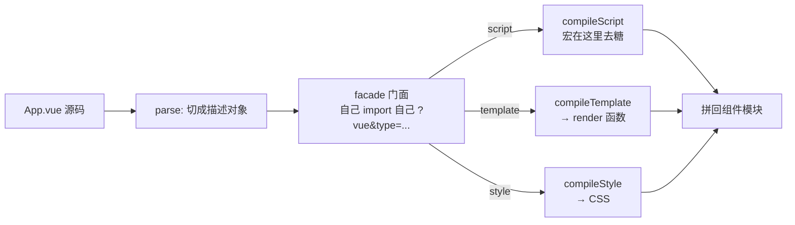

# SFC 编译管线与宏的注入时机：魔法发生在「拿到 AST 之后的那次遍历」

> 本章属于 primitive 层。前置：「`<script setup>` 与内置宏的设计动机」。
> 学完你能：用一句话讲清「为什么宏的去糖只能挂在 script 块编译内部、拿到 AST 之后的那次节点遍历上，而不能更早或更晚」，以及这条管线为此付出了哪些代价。

## 1. 为什么需要它

上一章我们看清了内置宏的真身：它们是编译期去糖，运行时根本不存在，语义被编译器硬编码。但有个问题被有意搁置了——这个去糖，到底发生在编译的哪一秒？为什么不能在你写下 `defineProps` 的那一刻，用一个简单的字符串替换就把它办掉？

要回答它，得先看 `.vue` 文件长什么样。一个 `.vue` 里塞着三种完全不同的东西：`<template>` 是 HTML 风味的模板、`<script setup>` 是 JavaScript（或 TypeScript）、`<style>` 是 CSS。它们各自需要的处理工具毫不相干——JS 要走 Babel 解析，模板要变成 render 函数，CSS 要走 scoped 和 postcss。

假设你想用一个正则、一次遍历把整份 `.vue` 啃下来，会两头不讨好：要么误伤（把注释或字符串里碰巧叫 `defineProps` 的也替换了），要么每种语言的能力都用不全（你没法靠正则去借 Babel 的类型分析）。

更麻烦的是那个「凭空变成 props」的魔法。你在 `<script setup>` 里写 `const props = defineProps({ count: Number })`，期待运行时 `props.count` 能拿到值。可 `defineProps` 不是真的函数，运行时根本没有它。那它是在编译过程的哪一步消失、又变成了什么？这正是本章要钉死的问题：**注入时机**。

## 2. 核心思想

SFC 编译是一条分阶段流水线——先把整份 `.vue` 解析成一个描述对象，再让每块走自己最合适的编译器，最后用一个 facade（门面）模块把各块拼回成一个组件模块。而宏的去糖，只能挂在「script 块编译」内部、拿到 AST 之后的那次节点遍历上。

这条流水线同时回应两个层面的需求：对外，让三种异构语言块各走各的最优工具链，又能被同一套打包器（Vite/webpack）用统一方式编排；对内，回答「编译期魔法究竟发生在哪一秒」。

## 3. 心智模型

一个 `.vue` 从源码到组件模块，要走六步：

1. **解析成描述对象**。第一步不是编译，是切分。`parse` 把整份 `.vue` 源码切成一个对象，分别记录 `template`、`script`、`scriptSetup`、`styles` 各块的原文内容、语言、属性，以及每块在源文件里的起止位置（这个位置后面还原报错要用）。

2. **生成 facade 门面模块**。打包器为这个 `.vue` 生成一个中间模块，它用「自己请求自己 + 查询参数」的方式，把 `.vue` 拆成几个虚拟子请求——形如 `App.vue?vue&type=script`、`App.vue?vue&type=template`、`App.vue?vue&type=style`。每个查询参数对应一块，每块成为一次独立的编译单元。

3. **script 子请求走 `compileScript`**。这是宏去糖发生的地方。内部先用 Babel 把 script 源码解析成 AST，再遍历节点，命中 `defineProps` 这类宏调用后，用一个「能按字符位置改写」的工具擦除并注入等价代码。**宏的去糖只发生在这一刻。**

4. **template 子请求走 `compileTemplate`**，由模板编译器把模板编译成 render 函数；**style 子请求走 `compileStyle`**，处理 scoped 和预处理器。这两块各走各的，互不干扰。

5. **阶段顺序是硬约束**。`compileScript` 虽然只产 script，但它要接收**整个描述对象**，不能只喂 script 块——因为 `<script setup>` 的顶层变量要暴露给模板，而怎么暴露（直接用、要不要解包 `.value`）取决于 script 怎么声明、也取决于模板怎么用。script 和 template 的编译在这里是耦合的。

6. **第三方宏抢在第 3 步之前**。Vue Macros 改不了 `compileScript` 内部，于是在第 3 步之前、构建工具的文件变换层，先插入自己的一套「解析 → 遍历 AST → 就地改写」，把自定义宏去糖，再把产物交给官方 `compileScript`。变换挂在哪一阶段，它就只能感知那一阶段及之前可得的上下文。

把这六步画出来，是一条「先合后分再合」的流：



## 4. 关键权衡

这条流水线不是随便设计的，每一处选择都换来了一种能力、也付了一种代价。讲三条最关键的。

**权衡一：分块编译 + facade 自引用，而不是单遍整体编译。**

最直觉的做法是一遍把 `.vue` 全编译完。但 Vue 选了另一条路：先用 `parse` 把整份源码切成描述对象，再用「同一个 `.vue` 通过查询参数反复请求自己」的 facade，把每块隔离成独立的编译子请求。

- **换来**：每块走最合适的工具链（script 走 Babel、template 走模板编译器、style 走 CSS 处理器）；块级缓存和细粒度 HMR（只改了 template 就只重渲染、组件状态保留）；compiler-sfc 与打包器彻底解耦。
- **代价**：引入了 facade 自引用这层间接性——新人第一次看到 `import xxx from './App.vue?vue&type=script'` 会懵，因为它「自己请求自己」。更要命的是，**跨块的信息流动变得困难**：script 的编译和 template 的编译在这里耦合（顶层 binding 怎么暴露要两边一起看），导致 `compileScript` 要的参数是整个描述对象，没法只喂 script 块。
- **本质矛盾**：这是「**让每块自由选工具**」和「**块与块之间要共享上下文**」在打架。分块给了自由，却切断了块间天然的信息流，只能靠「把整份描述对象到处传」硬接回去。

**权衡二：宏变换挂在 `compileScript` 的「AST 遍历」子阶段，而不是字符串/正则阶段。**（这是本章灵魂）

回到开头那个问题：为什么不能在解析字符串时就替换掉 `defineProps`？因为宏的去糖被刻意挂在了 `compileScript` 内部一个很具体的子阶段——Babel 解析出 AST 之后、遍历节点的那一遍。做法是：遍历时精确匹配 `defineProps`/`defineEmits` 这类宏调用节点，再用一个基于原始字符位置（offset）的就地改写工具擦除它、注入等价代码。

- **换来**：健壮——不会误匹配注释或字符串里碰巧同名的标识符（AST 早就标好了哪个是注释、哪个是字符串字面量、哪个是真正的调用）；能拿到宏的调用参数和作用域上下文；改写位置精确到字符 offset。
- **代价**：每个 SFC 都要付一次完整的 Babel 解析成本；源码的格式敏感性丢了（缩进、换行、注释位置这些「表面信息」在 AST 里被抽象掉），一旦编译产物报错，报错位置需要 sourcemap 才能还原回你写的样子。
- **本质矛盾**：这是「**要知道一个标识符到底是不是宏调用**」和「**只看字符串根本判别不出**」在打架。字符串层面，`defineProps` 和你随手写的某个同名变量长得一模一样，只有进入语义层（AST）才能区分。所以这个变换只能推迟到「拿到 AST 之后」。至于「为什么 AST 比正则健壮」的逐案例论证，下一章会专门拆。

**权衡三：第三方宏从构建工具 transform 层「前置」挂载，而不是侵入或 fork 官方编译器。**

上一章埋了个伏笔：内置宏的语义被编译器硬编码，可扩展性受限。Vue Macros 正是来填这个坑的。但它没去改 `compiler-sfc` 的源码，而是在 `compileScript` 之前、构建工具的文件变换层，插入自己的一套「parse → 遍历 AST → 就地改写」，先把自定义宏去糖，再把产物交给官方 `compileScript`。

- **换来**：和官方编译器解耦，能跟着官方升级走；同一份变换逻辑借 unplugin 跨 Vite/Rollup/webpack 复用。
- **代价**：这一前置阶段**拿不到 `compileScript` 内部对 template binding 的分析结果**，所以自定义宏的上下文感知能力天然弱于内置宏；而且必须保证「去糖后的产物仍能被官方 `compileScript` 正确接受」，否则两层管线会冲突——这也是为什么 Vue Macros 在变换时刻意避免产生多个 script 块。
- **本质矛盾**：这是「**想扩展编译器能力**」和「**不想 fork、想跟着官方走**」在打架。前置挂载换来了零侵入和可跟随升级，代价是你永远只能感知到「官方编译器之前的那个世界」，拿不到它内部的分析。

把三条权衡并排看：

| 权衡 | 选择 | 换来 | 代价 |
|---|---|---|---|
| 编译粒度 | 分块 + facade 自引用 | 块级自由选工具、细粒度 HMR | 跨块信息流断裂，需传整份描述对象 |
| 宏挂载点 | AST 遍历子阶段 | 精确、健壮、能拿参数 | Babel 解析成本 + 报错需 sourcemap |
| 第三方接入 | transform 层前置 | 零侵入、跨工具复用 | 上下文感知弱、产物须兼容官方 |

## 5. 最小原理演示

下面这段代码只演透两件事：(a) 分阶段——`parse` 切出描述对象、对 script 块单独编译、最后拼回 facade；(b) 宏挂载点——在 script 块编译内部，先解析 AST、再遍历命中宏、再用 offset 改写，而不是在原始字符串上动手。每一行都对齐上面某个原理点。

```ts
import { parse } from '@vue/compiler-sfc'
import { parse as babelParse } from '@babel/parser'
import MagicString from 'magic-string'

// 内置宏名字（编译器硬编码的几个）
const BUILTIN = new Set(['defineProps', 'defineEmits', 'defineModel'])

// ① 解析阶段：把整份 .vue 切成描述对象（template/script/style 各占一块）
function parseSFC(source: string, filename: string) {
  return parse(source, { filename }).descriptor
  // 返回 { template, scriptSetup, styles, ... }，每块都带原文 + 起止 offset
}

// ③ script 块编译：宏的去糖只发生在这一步内部，且只能在「拿到 AST 之后」
function compileScriptBlock(scriptSrc: string): string {
  const ast = babelParse(scriptSrc, {        // (b) 先解析出 AST，绝不直接碰字符串
    sourceType: 'module',
    plugins: ['typescript'],
  })
  const s = new MagicString(scriptSrc)       // 可在原始 offset 上记录改写

  for (const stmt of ast.program.body) {     // (b) 遍历节点，命中宏调用
    if (stmt.type !== 'VariableDeclaration') continue
    for (const decl of stmt.declarations) {
      const init = decl.init
      if (init?.type !== 'CallExpression') continue
      if (init.callee.type !== 'Identifier') continue
      if (!BUILTIN.has(init.callee.name)) continue  // 不是宏就跳过

      const argNode = init.arguments[0]                       // 取参数节点 { count: Number }
      const argText = scriptSrc.slice(argNode.start!, argNode.end!)
      s.overwrite(init.start!, init.end!, '__props')          // 擦除宏调用 → __props
      s.prepend(`const __props = ${argText}\n`)               // 顶注入等价声明
    }
  }
  return s.toString()                         // 产物里宏调用已消失
}

// ④ facade 拼回：同一个 .vue 用查询参数「请求自己」，把各块拼成组件模块
function genFacade(filename: string) {
  const base = filename.replace(/\.vue$/, '')
  return [
    `import script from './${base}.vue?vue&type=script&lang.ts'`,
    `import { render } from './${base}.vue?vue&type=template'`,
    `import './${base}.vue?vue&type=style&index=0'`,
    `script.render = render`,
    `export default script`,
  ].join('\n')
}

// 串成一条管线（template/style 子请求此处略）
const src = `<script setup>const props = defineProps({ count: Number })</script>`
const descriptor = parseSFC(src, 'App.vue')                            // ①
const compiled = compileScriptBlock(descriptor.scriptSetup!.content)   // ③
console.log(compiled)
// → const __props = { count: Number }
//   const props = __props            ← defineProps(...) 已被擦除
console.log(genFacade('App.vue'))                                      // ④
```

注意第 ③ 步里的顺序：`babelParse` 在前，`for...of` 遍历在中，`s.overwrite` 用 offset 改写在后。这个顺序就是「注入时机」的全部——宏只能在「拿到 AST 之后的那次遍历」里被识别和改写，早一秒（字符串阶段）拿不到语义，晚一秒（产物拼回后）就改不动了。

## 6. 执行轨迹

拿那个 `defineProps` 的例子逐步走一遍，看宏到底在哪一秒消失：

输入：`<script setup>const props = defineProps({ count: Number })</script>`

1. **① parse**：产出描述对象 `{ scriptSetup: { content: 'const props = defineProps({ count: Number })' }, template: {...} }`。此刻宏调用还原封不动地躺在字符串里。
2. **③ compileScript**：Babel 把这段 script 解析成 AST，遍历时遇到一个 `CallExpression`，它的 `callee` 名为 `defineProps`——命中。读取它的参数节点 `{ count: Number }`。
3. **改写**：在这个节点的 offset 上，把 `defineProps({ count: Number })` 替换成 `__props`（真实编译器会替换成指向 setup 入参 `__props` 的引用），并在块顶注入 `const __props = { count: Number }`。
4. **④ 输出**：编译后的 script 里，宏调用已经从源码里**消失**，变成了等价的普通 JS。template 子请求另走一条独立编译，互不知晓对方内部。

这条轨迹演透一句话：宏只在第 ③ 步、只在拿到 AST 之后的那次遍历里发生。它不是字符串预处理，也不是运行时函数。

## 7. 教学简化说明

这段演示故意省略了几样东西，它们都是后续章节的主角：template 编译成 render 函数的内部细节；magic-string 如何在 offset 上记录操作并最终还原 sourcemap；正则 vs AST 的健壮性逐案例论证；facade 自引用查询参数在 webpack 与 Vite 里的不同实现；`compileScript` 与 template 的 binding 耦合（bindingMetadata 的生成与消费）细节。另外，演示把宏去糖简化成「顶注入一句等价声明」，真实编译器是把参数注入到组件的 props 选项里——原理一致，工程实现更绕。

## 8. 小结

现在你应该能用一句话复述本章了：宏的去糖只能挂在 script 块编译内部、拿到 AST 之后的那次节点遍历上，早一秒拿不到语义、晚一秒改不动产物；这条分阶段管线换来的是每块自由选工具，代价是跨块信息流要靠整份描述对象硬接、报错要靠 sourcemap 还原。

但这里埋了个还没回答的点：我们一直说「AST 遍历比正则健壮」，到底健壮在哪？为什么正则会误伤、AST 不会？下一章「靠 AST 而非正则识别宏调用节点」就接着把这个论证拆开。