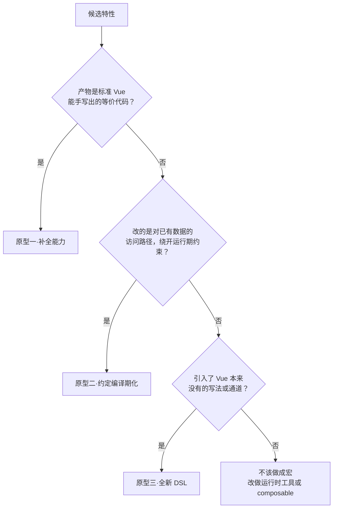

# 宏的设计原型：把什么前移到编译期

> 本章属于 composite 层。前置：Vue Macros 的宏变换流水线。
> 学完你能：拿到任何一个候选特性，用一句话判据判断它「该不该做成宏、属于哪类原型」，以及它的激进程度会换来什么代价。

## 1. 为什么要把这条判据讲清楚

上一章把流水线本身讲透了：注册宏、遍历 AST、命中调用节点、用 magic-string 注入变换，多个宏抢着改同一个节点时，由统一的 walk 来排队调度。流水线是一条一视同仁的运输带，它不关心上面跑的是什么。

可跑在上面的「变换内容」，形状其实只有寥寥几类。有的宏只是替你把样板抄一遍，有的宏偷偷改了你访问数据的方式，还有的宏干脆给你开了一条 Vue 原本没有的新路。这几类之间的分界，决定了哪些特性够格进宏目录、哪些只能老老实实做成运行时的 composable。这一章要回答的就是这条分界。

没有这套宏之前，Vue 开发者每天在手写三类本该自动生成的东西：写一个组件 `v-model`，要手动凑齐「一个 prop、一个 emit、一个带 get/set 的 computed」三件套；props 一解构就丢响应性，于是满文件不敢写 `const { foo } = props`，只能老老实实 `props.foo`；想用 JSX 或 render 函数，就得整体退出 `<script setup>`，退回老式的 `setup()` 函数。这些难点不在逻辑，逻辑谁都会写；难在样板要手写、约定要靠人记。

Vue Macros 追问的其实只有一句：这些手写样板里，哪些是编译器能**确定性地**替你推导出来的？能推导出来的，就不该再让人写。这也是它在生态里的位置——把「编译器能做、但官方还没做」的那部分能力，收进一组可选的语法糖。

## 2. 核心思想

判断一个特性该不该做成宏，只有一条判据：**它能不能被一段确定性的编译期变换，从用户写的简写形式，唯一地还原成等价的标准 Vue 代码**。能，就是宏；需要运行期才知道的信息、或依赖外部状态的，就不是。

关键词是「唯一地还原」。宏像一个会自动展开的速记符号：简写 `e.g.` 展开成 `for example`，只有一种正确写法，展开后的句子任何人都能手写出来。但凡展开结果要取决于「现在几点」「用户点了什么」这类运行期才能知道的事，它就没法当宏，只能做成运行时函数。全章会反复回到这一句。

## 3. 心智模型：三类原型

判据里的「还原」落到具体特性上，宏到底做了什么动作，只有三类：

- **原型一·补全能力**：还原后产物是一段标准 Vue 本来就能手写出来的等价代码，宏只是替你把样板抄了一遍。`defineModels` 是典型——你写一句，它给你生成 prop、emit、computed 三件套，这三件套你完全手写得出来。
- **原型二·运行期约定编译期化**：还原不改语义，改的是你访问数据的路径，从而绕开一个纯运行期的约束。响应式 Props 解构是典型——`const { count } = props` 之后，编译期把所有对 `count` 的裸读重写成 `props.count`，响应性在解构语法下活了下来，而你写代码时完全当它没丢过。
- **原型三·全新 DSL**：还原时引入了一种 Vue 本来根本没有的写法或通道。`defineRender` 让你在 `<script setup>` 里直接 `defineRender(() => <div/>)` 就完成渲染，`setupSFC` 把整个 SFC 变成一段纯 script，这些出口标准 SFC 里压根不存在。

判断一个候选特性落在哪类，是一道依次收紧的是非题：



注意这棵决策树找的是「主原型」。真实的特性可能横跨两类：当年的 Reactivity Transform（`$ref`、`$()` 那套）既在编译期改写 `.value` 的访问路径（原型二的成分），又引入了 `$` 开头的一套全新语法（原型三的成分），两股劲拉在一起，正是它最后只被部分保留下来的原因。

还有一条收尾的否决项：三个判据都不命中，那它压根不该做成宏，该老老实实写成运行时的 composable 或工具函数。这条否决线画出了宏的能力边界。

## 4. 关键权衡

下面四条权衡，前三条讲「能不能做、该做多激进」，第四条讲「做了之后留什么后账」。每条背后都是两个对立的需求在打架。

### 4.1 「确定性可还原」当门槛：要表达力，还是要语义安全

做宏的第一道闸，是只收编那些能被编译期**唯一**还原成标准代码的特性。

这道闸换来的是宏的语义安全：生成出来的代码等价于用户自己手写，没有任何藏起来的运行期副作用，读产物的人不必怀疑「这段是不是还偷偷干了别的」。代价也很硬——凡是产物要依赖运行期才能确定的信息的特性，根本没法做成纯编译期宏。比如「根据接口返回的数据形状，动态决定渲染几个槽位」，这要等请求回来才知道，编译期两眼一抹黑，它就只能做运行时组件，做不成宏。

这里打架的两个需求是：**想给编译器更大的表达力**，对上**想保证生成代码永远不出意外**。判据站在后者一边，只有能被静态完全消解的东西，才给「绝不意外」的承诺。

### 4.2 激进程度 ↔ 心智模型偏离：写给写的人，还是写给读的人

三类原型排成一条递进的梯度，越往后越激进，也越偏离标准 Vue 的心智模型。

原型一最温和：它只省样板，产物仍是标准 Vue 代码，迁移和理解成本接近零，哪天不用这个宏了，把展开后的代码贴回去就行，谁都能看懂。原型三最激进：`setupSFC` 改的是「组件到底该怎么写」这件事本身，一个没接触过这套糖的新人打开产物会完全摸不着头脑，IDE 和类型工具也得额外配套才能理解它。

换来的好处是越往后越极致的简洁和表达力，原型三能让你用完全不同的姿势写组件。代价是偏离标准心智越远，可读性、工具支持、团队迁移成本就越高，而且越容易和官方的演进正面撞车。

这里打架的是：**写给写代码的人看（追求简短顺手）**，对上**写给读代码的人和工具看（追求可还原、可理解）**。原型梯度就是这两个需求此消彼长的标尺。

### 4.3 「补全」还是「发明」：宏是编译器能力的临时扩张

原型一和原型二有个有意思的归宿：它们往往最终被官方上游吸收。`defineModels` 进了官方成了 `defineModel`，响应式 Props 解构也进了官方。这不是巧合，恰恰**证明**了它们填的是「官方迟早会填的缺口」——产物既然是标准代码，官方哪天把这套样板生成内置，顺理成章。原型三几乎不会被吸收，因为它改的是偏好、不是缺口，官方未必认可「组件该这么写」。

这给宏作者定下了一条生命周期：**宏本质是编译器能力的临时扩张**。填缺口的那类，要做好「被官方收编后就退场」的准备，这其实是成功，说明你赌对了缺口；发明偏好的那类，则要长期自己背着维护和工具支持。

这里打架的是：**填平台迟早会填的缺口**，对上**表达平台不会背书的偏好**。两种宏的命运因此完全不同。

### 4.4 语法糖的单向可逆性：写入时的省事，留下调试时的后账

编译期变换是单向的：源码 → 产物，走过去容易，走回来难。

用了原型三那种激进 DSL（比如 `setupSFC` 把整个 SFC 压成一段纯 script），产物很难再反向还原成你当初的简写。换来了写法上的极致简洁，代价是调试和报错都指向产物而不是你的源码（这正是更前面的第 5 章非要 magic-string 配 sourcemap 不可的原因），而且哪天你想脱离这个宏，往往得整段重写，没法机械地「去糖」。

这里打架的是：**写入时的省事**，对上**调试和迁移时的可追溯**。糖越激进，这两个时刻的体验差得越远。

## 5. 最小原理演示

下面是一个玩具级的「三类原型还原器」。重点不在工程精度，在让你看清三类还原**动的东西不同**：原型一往外吐标准样板，原型二原地改访问路径，原型三凭空开一条新通道。三段共用同一个骨架——输入简写、输出标准代码字符串。

```ts
// 原型一·补全：一句 defineModels，唯一展开成标准 Vue 的「prop + emit + 可读写 ref」三件套
type ModelSpec = { name: string; type: string }
function reduceDefineModels(specs: ModelSpec[]): string {
  // 全是用户本就能手写的标准代码——宏只是替你抄了一遍
  const props = `defineProps<{ ${specs.map(s => `${s.name}: ${s.type}`).join('; ')} }>()`
  const emits = `defineEmits<{ ${specs.map(s => `'update:${s.name}': [v: ${s.type}]`).join(', ')} }>()`
  const backing = specs.map(s =>
    `const ${s.name} = computed({ get: () => props.${s.name}, set: v => emit('update:${s.name}', v) })`
  ).join('\n')
  return `const props = ${props}\nconst emit = ${emits}\n${backing}`
}

// 原型二·约定编译期化：不改语义，只把解构后的「裸读」重写成属性访问，让响应性在解构语法下活下来
function reduceReactiveDestructure(ids: string[], body: string): string {
  let out = body
  for (const id of ids) {
    out = out.replaceAll(new RegExp(`\\b${id}\\b`, 'g'), `props.${id}`)  // count → props.count
  }
  return out  // 解构语句本身随后被擦除：它要保的响应性，已由重写兑现
}

// 原型三·全新 DSL：把一次普通调用，变成「把 setup 的返回值设成这个 render」——标准 SFC 里没有这条通道
function reduceDefineRender(jsx: string): string {
  return ['function setup() {', `  return ${jsx}`, '}'].join('\n')
  // 用户写的 JSX，在这里才第一次获得「作为 setup 出口」的合法身份
}
```

把三类原型收敛回同一条判据，就是这个骨架：

```ts
// 三类原型共用同一个判据：能被唯一还原成标准代码的，才够格当宏
type Reducer<S> = (shorthand: S) => string   // 简写 → 标准代码，结果必须确定且唯一
function qualifiesAsMacro<S>(shorthand: S, reducer: Reducer<S>): boolean {
  try { reducer(shorthand); return true }    // 还原得出 → 宏的候选
  catch { return false }                       // 还原不出（缺运行期信息）→ 不是宏，改做 composable
}
```

三段还原函数长得完全不一样，但都在回答同一个问题：这段简写，能不能确定性地、唯一地变成标准代码。

## 6. 执行轨迹：三类原型同台

拿一个同时用了三类原型的 SFC 当输入，看它们各自被还原、互不干扰：

```ts
const { count = 0 } = defineProps<{ count?: number }>()   // 原型二·约定编译期化
const models = defineModels<{ open: boolean }>()          // 原型一·补全能力
defineRender(() => <div>{count}{models.open.value}</div>) // 原型三·全新 DSL
```

三个宏各管各的节点，谁也不抢谁的：

- **原型一先动手**，命中 `defineModels<{ open: boolean }>()`：吐出 `defineProps`/`defineEmits` 声明和一个 `const open = computed({ get, set })`，顺手把后续对 `models.open` 的引用改写成裸 `open`。
- **原型二接着动手**，命中解构 `{ count }`：把渲染体里所有裸 `count` 重写成 `props.count`，于是 JSX 里的 `{count}` 变成 `{props.count}`，响应性保住了。解构语句本身随后被擦除。
- **原型三最后动手**，命中 `defineRender(...)`：这次调用消失，里面的 JSX 被提为 `setup` 的返回值。

合到一起，最终产物是一段纯粹的标准 Vue：`defineProps`、`defineEmits`、`computed`，外加一个返回 render 函数的 `setup`。三个宏的名字一个都不剩。它们之所以不打架，是因为每一段还原落地后都只剩标准标识符，标准标识符之间天然能拼到一起——这也正是原型梯度里「越温和越容易被官方吸收」的根因：温和原型的产物，本来就是官方代码。

## 7. 教学简化说明

上面的还原器是纯字符串和正则的玩具，故意省掉了真实的 Babel AST 解析与遍历、magic-string 的 sourcemap、unplugin 的构建接入、Volar 的类型层，以及 Vue 2.7 与 3 之间的兼容分支和每个宏的完整选项。这些要么是前面几章讲过的管线机制，要么是后面几章的内容。这里只演「确定性还原」这一条判据本身。

## 8. 小结

一句话收束：一个特性够不够格当宏，看它能不能被编译期唯一还原成标准 Vue 代码；而还原时它动了什么，把它归进补全、约定编译期化、全新 DSL 三类原型之一。越靠后的原型越激进、越偏离标准心智、越难被官方吸收、留下的调试后账也越多。

这些原型要真正跑进用户的构建里，光有 AST 变换还不够——它们得同时挂上 Vite、webpack、Rollup 这些打包器。下一章就讲 Vue Macros 怎么用 unplugin，一份变换逻辑接上所有打包器。