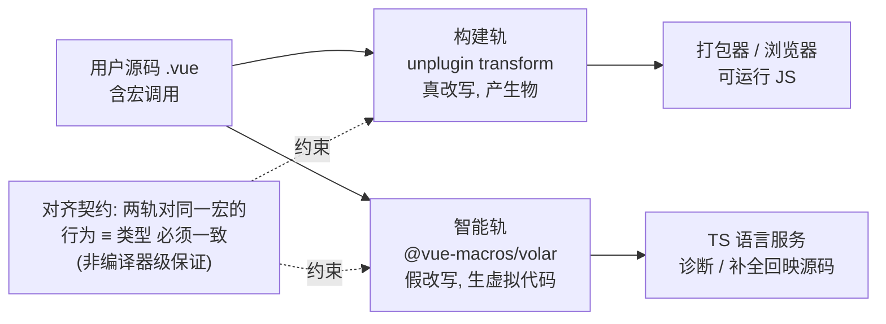

# 双轨制：编译变换与 IDE 类型支持为何必须并存

> 本章属于 system 层。前置：unplugin（跨构建工具的统一插件抽象）、Vue Language Plugin（SFC 解析扩展点）。
> 学完你能：用一句话讲清"为什么 Vue Macros 的每个宏都得维护两条管线、它们为什么合并不成一条、以及这个并存要付出什么对齐代价"。

## 1. 为什么需要它

上一章讲了智能轨：`@vue-macros/volar` 在虚拟代码生成管线里挂扩展点，让 TS 把自定义宏认成合法符号。再往前，unplugin 那章讲了构建轨怎么用工厂函数把同一份 transform 接到 Vite/Rollup/webpack 上。这两章各自把"一条轨"讲透了。可一旦你真的在项目里用上某个宏，多半会撞上这么件怪事。

你在 `.vue` 里写了 `defineModels<{ foo: string }>()`，`vite build` 跑得顺顺当当、上线也没问题。可一回到编辑器，那行被红线波浪线标成"未定义的函数"，`v-model:foo` 的补全也出不来。反过来同样真实：IDE 给你完美的类型提示，你信心满满地一构建，浏览器里直接抛 `defineModels is not defined`。同一个特性、两套工具链，认知对不上。

裂痕的根子在宏本身：它是"运行时不存在的编译期伪函数"（这个本质前置章已讲透）。单这一条性质，就让消费源码的两类工具看待它的方式**完全相反**：

- 浏览器和打包器**只信运行时**。源码里那个宏调用，对它们就是个不存在的符号。必须有东西在构建期**真**把它擦掉、把运行时代码塞进去，否则到了浏览器就是 `undefined`。
- 编辑器和语言服务**只信源码字面**。它直接读你磁盘上的文件（宏调用还原封不动在里面），却不会去跑构建变换。于是对原生 TS 而言，宏是"未声明的标识符"。必须有东西在它眼皮底下**假装**这些宏合法、给它们配上类型签名。

两条轨谁也替不了谁：缺构建轨，运行时崩；缺智能轨，编辑器全红。这就是双轨**必须并存**的动机。

## 2. 核心思想

一个宏必须在两个**执行时机不同、消费者也不同**的管线里各实现一遍：构建轨**真的改写代码**产出可运行产物，智能轨**假装改写**在内存里生成虚拟代码骗过语言服务。两条轨各自独立、互不调用，但语义必须对齐。

## 3. 心智模型

用户写下含宏调用的源码后，这份源码会**分叉**进入两条互不调用的管线，最后由一份"对齐契约"兜在一起：



走一遍这条流：

1. 源码（含宏调用）同时进入两条管线。
2. **构建轨**：unplugin 的 transform 命中宏调用节点，真实擦除宏、注入运行时代码，产出可运行 JS（带 sourcemap），交给打包器或浏览器。这里不重复 unplugin 怎么适配各打包器（第 8 章讲过了），只看它在本章的新角色：**构建轨的执行体，产出的是"能跑的代码"**。
3. **智能轨**：`@vue-macros/volar` 插件识别同一个宏调用，在内存里生成一段"虚拟代码"，假装该宏合法并附上类型签名，交给 TS 语言服务。这里也不重复虚拟代码管线怎么挂扩展点（上一章讲过了），只看它在本章的新角色：**智能轨的执行体，产出的是"给语言服务看的声明"，不落盘、不产生物**。
4. 语言服务基于虚拟代码产出诊断和补全，再按双向位置映射回映到用户源码的位置上显示。
5. **契约**：同一个宏在两轨的行为与类型语义必须对齐，即构建轨注入的运行时行为 ≡ 智能轨声明的类型。

打个比方（只用这一次）：这就像同一份菜谱要同时交给后厨和美食杂志。后厨要的是"能照着炒出来的步骤"（构建轨的可执行产物），杂志编辑要的是"每道菜标好营养和难度、还贴着原菜谱行号的批注版"（智能轨的虚拟声明）。你没法把同一份东西塞给两边，只能各出一份，但两份必须讲同一道菜。

## 4. 关键权衡（本章重头戏）

### 权衡一：分成两条独立管线，而不是一条

Vue Macros 没有把"让宏可用"做成一条统一管线，而是显式拆成两条各自独立的实现。

换来的是，每条轨都能按自己消费者的最优方式输出：构建轨输出可运行 JS + sourcemap，自然串进打包流；智能轨输出带双向位置映射的虚拟代码，供语言服务查类型。两边都不用为迁就对方而委屈自己的输出格式。代价是，同一个宏的语义要在两处各实现一次，而且必须人工保持对齐，任一侧更新滞后，割裂就出现了。

这条权衡化解的本质矛盾是"同一份输入要服务两类消费者、而两类消费者对输出的要求互斥"。它给出的通解骨架是：当两个消费者的输出契约不可调和时，与其强行合并输出把两边都拖累，不如各跑各的，把对齐负担独立出来正面承担。

### 权衡二：智能轨"假装改写"，而不是直接把编译产物喂给语言服务

智能轨没有偷懒地复用构建轨产出的那份变换后代码，而是另起一套虚拟代码生成，"假装"宏被改写过。

换来的是，诊断位置能精确回映到用户源码：补全、跳转、红波浪线都对得上你光标所在的位置，而不是变换后产物的位置。这件事的深度（双向 offset 映射怎么实现）属前置章范围，本章只点它对双轨的影响。代价是，要额外维护一整套虚拟代码生成与位置映射；映射一旦失真，IDE 提示本身就不可信，而这份失真构建轨完全察觉不到、也帮不上忙。

这条权衡化解的本质矛盾是"语言服务需要加工后的语义、但位置必须锚定在原始输入上"。通解骨架：当下游要的是"加工结果"却必须把位置标回"原始文本"时，不能直接给加工产物（位置已乱），只能在原文旁边悄悄塞一份"假装加工过"的声明。这也正是智能轨不能被构建轨替代的根本理由。

### 权衡三：共享底座只沉到"识别层"，不到"输出层"

两条轨共享 `@vue-macros/common` 这个底层包，承载 AST 辅助、类型解析、宏定义等公共逻辑。

换来的是，语义对齐有了部分机制化保障：改一处宏定义或识别规则，两条轨都能感知，降低了"手抄漂移"。代价是，对齐仍然不是编译器级保证。共享的只是"识别与定义"这一层；两轨各自的**输出变换**（一个产 JS、一个产虚拟代码）根本没法共享，残留的语义漂移只能靠作者纪律加 CI 门禁兜底。

这条权衡化解的本质矛盾是"想用代码复用保证对齐、可两轨输出格式本质上发散"。通解骨架：当多个实现有共同的"输入识别"却发散的"输出生成"时，复用只能下沉到识别层，输出层各自演化，对齐只能从"机制"降级为"契约"。

### 权衡四：把对齐当"契约"，而不是"自动结果"

Vue Macros 接受"两轨语义一致"是一份需要人维护的契约，没有、也没法做成编译器自动保证的结果。

换来的是，两条轨可以独立演进、独立优化、独立发布：智能轨不必等构建轨，构建轨也可以单独为性能做调整。代价落到用户头上，就是可能撞上三种割裂，危险度递增。其一是"能跑但红线"（构建轨新、智能轨旧）；其二是"能提示但报错"（智能轨新、构建轨旧）；最隐蔽的其三是"不红也能跑、但类型与行为暗中不符"（两轨都"认识"宏，可理解不一致），它没有任何报错信号提醒你，所以最危险。

这条权衡化解的本质矛盾是"两轨独立演化的灵活性"与"两轨必须对外一致的刚性"之间的拉扯。通解骨架：当多个独立组件必须对外呈现一致语义、却没有编译器级强制时，把一致性降级为人工契约加外部门禁（CI），换取各自演化的自由。这道门禁怎么搭，正是下一章的入口。

## 5. 最小原理演示

下面用一个假宏 `__sayHi(name)` 把"双轨并存"的思想演透。它是编译期伪函数，运行时不存在；用户写 `__sayHi("world")`，期望运行时打印 `hi world`。为聚焦思想，这里用最简字符串匹配代替真正的 AST 解析。

```ts
// ───── 构建轨：真改写代码，产出可运行 JS（消费者 = 打包器/浏览器）─────
function transform(source: string): string {
  return source.replace(
    /__sayHi\((".*?")\)/g,
    'console.log("hi " + $1)' // 原理点：擦除宏 + 注入运行时逻辑
  );
}
transform('__sayHi("world")');
// → 'console.log("hi " + "world")'   ← 能直接跑

// ───── 智能轨：假装改写，不碰源码、不产文件，只给语言服务一份"宏合法"的声明 ─────
function getVirtualCode(declaredType: 'string' | 'number'): string {
  // 原理点：不改源码一个字，只在虚拟空间插入类型声明
  return `declare function __sayHi(name: ${declaredType}): void;`;
}
// 把这份虚拟声明拼在用户源码前面喂给 TS，TS 就不再标红了
```

`transform` 演的是轨道 A「真改写、产生物」；`getVirtualCode` 演的是轨道 B「假改写、不产文件」。两条轨各干各的，谁也不调谁。

光有两条轨还不够，关键看它们**对不对得上**。下面这张四格矩阵把"两轨开关 × 语义是否一致"的所有状态跑一遍（构建轨恒按 `string` 产出，所以对齐基准就是 `string`）：

```ts
function scenario(buildOn: boolean, ideOn: boolean, ideType: 'string' | 'number') {
  const runtime = buildOn
    ? '可运行（宏已擦除并注入 console.log）'
    : '运行时崩：__sayHi is not defined';
  const editor = ideOn
    ? '无红线（虚拟声明让 TS 认得这个宏）'
    : 'IDE 标红：未定义符号 __sayHi';
  const aligned = !ideOn || ideType === 'string'; // 构建按 string，智能轨也得是 string 才算对齐
  return { runtime, editor, aligned };
}

// ① 只开构建轨：跑得起来，编辑器却满江红
scenario(true, false, 'string');
// → { editor: 'IDE 标红…', aligned: true }

// ② 只开智能轨：编辑器岁月静好，一构建就崩
scenario(false, true, 'string');
// → { runtime: '运行时崩…', aligned: true }

// ③ 两轨都开、语义一致：唯一的好状态
scenario(true, true, 'string');
// → { runtime: '可运行…', editor: '无红线…', aligned: true }

// ④ 两轨都开、语义不一致（构建按 string，智能轨声明成 number）
//   不红也能跑，但用户拿到的类型提示是错的——最危险，因为没有任何报错信号
scenario(true, true, 'number');
// → { runtime: '可运行…', editor: '无红线…', aligned: false }
```

①② 演的是"缺一轨"的两种割裂；③ 是对齐态；而 ③ 和 ④ 的对照，恰好把全章最反直觉的一点挑明了：**对齐是契约，不是自动结果**。在 ④ 里，两轨都"认识"这个宏，运行时不崩、编辑器也不红，系统不会给你任何警告，可用户拿到的类型是错的。没有任何机制能替你发现它。

## 6. 执行轨迹

拿一个真实宏 `defineModels<{ foo: string }>()` 走一遍两条轨：

- **构建轨**：transform 命中该调用，擦除它，注入等价的 `props.foo` 定义与 `emit('update:foo', …)`。产出的 JS 在运行时支持 `v-model:foo` 的双向绑定。
- **智能轨**：插件识别同一个调用，在虚拟代码里声明一个 `foo: string` 的 model 类型。IDE 据此给 `v-model:foo` 补全、让类型检查放行。
- **对照**：若只配构建轨，IDE 把 `defineModels` 标成未定义符号；若只配智能轨，`vite build` 时这个宏没被任何东西擦除，运行时直接抛 `defineModels is not defined`。

这也是为什么集成 Vue Macros 时，构建侧（配 unplugin）和 IDE 侧（配 `tsconfig` 的 `types` 与 `vueCompilerOptions.plugins`）要**分别**配置。它们就是两条轨，各配各的，没有任何一步能顺手把另一条也带上。

## 7. 教学简化说明

本章演示故意省略了：真正的 unplugin 工厂、真正的 Volar 语言插件协议、sourcemap、双向 offset 映射的实现（用字符串匹配代替 AST 精确解析，只为演"两轨并存"而非健壮性）、多打包器适配，以及 `defineModels` 完整的运行时产物细节。这些都在前置章或后续章各自有交代。

## 8. 小结

一个宏要在两条消费者完全相反的管线里各实现一遍：构建轨真改写代码让它能跑，智能轨假装改写让编辑器不报错，两条轨各自独立，靠一份人工契约保证语义对齐。这份契约没有编译器级的强制力，于是割裂会以"能跑但红线""能提示但报错"、甚至"不红也能跑但类型暗错"三种形态漏到用户那里。

既然对齐没法自动保证，自然的补救就是加一道外部门禁，把"智能轨"搬到命令行跑一遍类型检查，逼着两轨在 CI 里对账。这正是下一章 vue-tsc 要做的事。但要留个心眼：vue-tsc 复用的是**智能轨**（虚拟代码），不是构建轨（unplugin transform），所以"vue-tsc 通过"只证明 IDE 这条轨的类型自洽，并不等价于构建产物正确。构建轨若滞后，vue-tsc 是查不出来的。