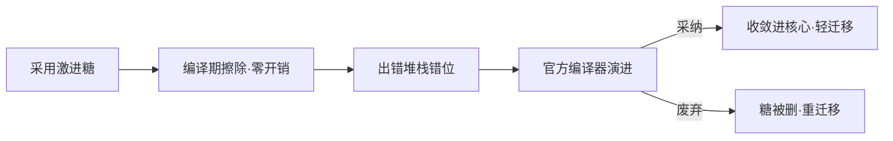

# 根本权衡：零运行时 vs 可调试性，以及宏的生态演进

> 本章属于 system 层。前置：双轨制（编译变换与 IDE 类型支持并存）、宏的设计原型。
> 这是全书最后一章。学完你能：用一句话讲清「编译期宏为什么宁可拿可调试性和长期维护成本去换零运行时开销，以及为什么越激进的糖越逃不掉随官方编译器收敛而退场的命运」。

## 1. 为什么需要它：贯穿全书的代价，终于要算一次账

上一章把「一份配置同时驱动编译管线和 IDE 管线」这件事办成了——配置成了两条管线的唯一真相源。到这里，全书已经从「一个宏在编译期到底干了什么」一路讲到了「一整套双轨工程怎么被一份配置串起来」。可有一个问题从头到尾被按下没表：**这套把工作前移到编译期的机制，到底付出了什么代价？**

想象一个用了响应式糖的开发者，他会接连撞上两面墙。

第一面墙在线上。某次发版后页面白屏，监控里一条堆栈的第一帧钉在一行 `count.value++` 上。可他翻遍自己写的组件，从来就没出现过 `.value`——他写的明明是 `count++`。那行代码是编译器替他生成的。就算 sourcemap 把行号对上了，断点停下来的那一刻，变量名和控制流已经被改写得面目全非，他还得在脑子里把 `count.value++` 反推回 `count++`，才能开始排查。

第二面墙在升级的时候。他用了两年的某条激进糖，官方一条公告说要把这条能力收敛进核心，或者干脆废弃。他全量代码都得迁移。

这两面墙不是 bug。它们是「把运行期工作前移到编译期」这条路线**主动换来的代价**。前面十三章都在讲宏换来了什么好处，这一章把账算清楚：换来了零运行时开销和更声明式的语法，让出去的是可调试性，外加一条「激进的糖迟早要退场」的长期义务。

## 2. 核心思想

宏是编译器能力的**临时扩张**：它用编译期的变换复杂度，换运行时的零开销与更贴近心智的语法；代价是可调试性让位，而且越激进的糖，越要随着官方编译器能力的收敛而逐步退场。

这句话的两个半句，正好对应本章的两条主线：前半句是「零运行时 vs 可调试性」的即时取舍，后半句是「宏作为临时补丁」的长期宿命。

## 3. 心智模型：一个糖从生到死的完整弧线

把宏放进时间轴看，它经历六个时刻：

1. **写糖**：用户写下声明式糖（如响应式变量糖、解构 props）。
2. **编译期擦除**：宏的 visitor 在 AST 上识别糖，就地改写成等价的运行时代码。
3. **运行时零开销**：糖已彻底消失，只剩等价的 `ref` / props 访问，没有任何额外开销。
4. **出错错位**：报错与堆栈指向改写后的产物，不是用户源码。
5. **sourcemap 部分回溯**：行号能映回源码，但变量名和控制流已被改写，逻辑仍要脑内反推。
6. **退场**：官方编译器演进，要么采纳这条糖（进核心），要么废弃（删特性），宏随之收敛或退场，用户迁移代码。

前四步是即时取舍，第六步是这条路线的终局。这条弧线有两个真实的端点：响应式解构糖（reactive props destructure）被收敛进 Vue 3.5 核心，是「采纳」那一端；Reactivity Transform 被废弃、此后只由 Vue Macros 承载，是「废弃」那一端。



## 4. 关键权衡（本章重头戏）

### 4.1 用编译期 AST 变换换运行时零开销

这是全书所有单点权衡的总纲，本章把它推到极限来看。

**选择**：把响应式接线工作整体前移到编译期，在 AST 上把糖擦除成等价的 `ref` / `.value` 代码。
**换来**：运行时没有任何额外开销（没有运行期包装、没有运行期查找），语法也更贴近「我想要一个会变的值」这种直白的心智。
**代价**：断点、堆栈、报错全都指向改写后的产物，不是你写的源码。sourcemap 只能回映行号，回映不了被改写的变量名和控制流，调试时还得在脑子里再反推一次。

**它化解的本质矛盾**：运行时性能与声明式表达 ↔ 可调试性与源码可对应性。这两个需求天然对立——你越是把工作藏进编译期让运行时干净，运行时就越是「说不出」自己当年是从哪行源码变来的。sourcemap 是个折中补丁，但它只能记位置，记不下「我把 `count++` 改成了 `count.value++`」这件事。

> 这条权衡里 sourcemap 那一面的根子，在于它的保真度完全取决于编译插件链每一步是否正确传递 sourcemap 段——任一环节丢失，下游全部错位。这点第 5 章（magic-string）已经讲透，这里不重演。

### 4.2 让宏承担官方编译器尚未提供的能力（临时扩张）

**选择**：不等官方，宏自己先实现一套激进糖，让用户先用上。
**换来**：在官方能力收敛之前就能用上新语法的先发优势。
**代价**：官方一旦收敛（采纳或废弃），宏要么被删、要么被废，用户面临全量迁移成本。Reactivity Transform 就是这条代价的判例：它从核心实验特性，到 Vue 3.3 标记 deprecated，再到 Vue 3.4 从核心移除。因为是「实验性」标签、从未承诺稳定 API，所以**不需要 major 版本号**就能直接删除；删完之后，它只能经 Vue Macros 这个第三方插件继续存活。

**它化解的本质矛盾**：先发可用性 ↔ 长期稳定性。你想早用，就得接受它还没被官方背书、随时可能被收回。宏在这条矛盾里扮演的角色是**脚手架**：官方编译器这栋楼还没盖到某层时，宏是临时搭上去让你能先上去干活的架子；楼盖到那层了，架子就该拆。

### 4.3 用双心智模型换语法糖的极致简洁

**选择**：让用户写 `count++` 这种纯 JS 语法，由编译器偷偷补上 `.value`，把响应式接线全藏起来。
**换来**：少写 `.value`、少写样板，代码读起来就像普通 JS。
**代价**：开发者必须同时持有两套语义——「标准 JS 里 `count++` 就是改一个变量」和「编译器增强语义里 `count++` 实际是 `count.value++`、会触发响应式」。当解构响应式对象丢响应性这类坑出现时，光懂 JS 解释不通，得切到编译器那一套语义才能想明白。这套认知负担最终被判定大于收益，这正是 Reactivity Transform 被废弃的核心论据。

**它化解的本质矛盾**：语法简洁性 ↔ 心智模型单一性。糖越甜，它和原生 JS 的语义鸿沟越大，开发者要在两套语义间反复横跳。

> 「语法糖越激进、与标准 Vue 心智模型偏离越大」这一点第 7 章（宏的设计原型）已经讲透，这里不重演偏离本身，只看它的长期后果：双心智模型把激进糖一路逼到被废弃。

### 4.4 把实验性激进特性放在第三方而非官方核心

**选择**：把激进糖放在 Vue Macros（第三方）里试水，而不是直接塞进 Vue 核心。
**换来**：官方核心保持精简稳定；实验失败的成本外部化给社区——特性被废弃时，维护负担落在 Vue Macros 而不是核心上。
**代价**：特性的成熟度与官方支持力度存在落差，用户得自担「随时可能被废弃」的风险；就算成熟了（如响应式解构糖），还得再走一遍收敛进核心的流程才能转正。Vue Macros 在生态里扮演的是官方核心的**实验性中转场**：激进特性先在这里试水，成熟的收敛进核心，有争议的废弃后仍由它承载。

**它化解的本质矛盾**：核心精简稳定 ↔ 满足新语法渴望。这是组织级的权衡——把试错风险隔离在核心之外，让核心只为被验证过的能力负责。

## 5. 最小原理演示：一段糖从擦除到报错到回溯

下面这段几十行的演示，要在一份代码里演透三件事，每件对应上面一个原理点：糖在编译期被擦除成运行时代码（对应 4.1 的「换来」）、报错堆栈钉在产物而非源码（对应 4.1 的「代价」）、sourcemap 只回溯位置回溯不了语义（对应 4.1 的折中）。

```ts
// ══════════ 用户源码（糖）══════════
const userSource = `
const count = $(ref(0))    // 糖：$(...) 表示"我想直接用值，别让我写 .value"
function inc() { count++ } // 用户手写的就这一行
`

// ══════════ 原理① 编译期擦除 → 零运行时开销 ══════════
// 真实宏在 AST 上命中 $() 节点就地改写；这里用字符串演"擦除"这件事本身
function compile(src: string): string {
  return src
    .replace(/\$\(([^)]+)\)/g, '$1')         // $(ref(0)) → ref(0)
    .replace(/\bcount\+\+/g, 'count.value++') // count++   → count.value++
}
const compiled = compile(userSource)
// 产物：
//   const count = ref(0)
//   function inc() { count.value++ }   ← 糖已彻底消失，运行时零开销

// ══════════ 原理② 堆栈错位 → 报错钉在产物而非源码 ══════════
const ref = (v: any) => ({ value: v })  // 正常时 ref(0) 返回 { value: 0 }
let count: any                          // 故意制造故障：忘了赋值，count 是 undefined
try {
  count.value++   // 这正是【产物】里 inc 的那行；用户源码里根本没有它
} catch (e: any) {
  console.error(e.constructor.name, e.message)
  // TypeError: Cannot read properties of undefined (reading 'value')
  //     at inc (compiled.js:2)   ← 第一帧钉在【产物】的 count.value++
  // 用户写的是 count++，看见 count.value++ 得先脑内"反推"回去才看得懂
}

// ══════════ 原理③ sourcemap → 行号能回映，语义回映不了 ══════════
// magic-string 在每个 overwrite 上记 offset，最后 generateMap 出一张位置映射表
const sourcemapLineTable = [
  ['compiled.js:2  →  count.value++', 'userSource:2  →  count++'], // 行号对上了
]
// 但这张表只能告诉你"产物第 2 行对应源码第 2 行"，
// 没法告诉你"count.value++ 就是你写的 count++"——
// 行号是位置，count.value++ 是被改写过的语义，逻辑还是要你自己反推
```

## 6. 执行轨迹：拿一个输入走完整条弧线

输入这一段糖：

```ts
const count = $(ref(0)); function inc(){ count++ }
```

- **编译期**：宏的 visitor 命中 `$()`，就地改写——把 `$(ref(0))` 变成 `ref(0)`，把函数体里 `count` 的读写改写成 `count.value`。产物是 `const count = ref(0); function inc(){ count.value++ }`。糖在这一步彻底消失。
- **运行时**：糖没了，只剩等价的 `ref` 访问，没有任何额外开销。一旦 `count` 是 `undefined`，执行到 `count.value++` 会先去读 `count.value`，于是抛出 `TypeError: Cannot read properties of undefined (reading 'value')`，堆栈第一帧钉在产物的 `count.value++`，而不是用户写的 `count++`。
- **sourcemap**：映射表把产物第 2 行映回源码第 2 行，行号对上了；但 `count.value++` 与 `count++` 之间的语义改写，sourcemap 表达不了，读者仍须自行反推。
- **退场（叙述层）**：若数年后官方在核心原生支持了这条能力，本宏被删除，用户用一个 codemod 把糖改回原生写法。这就是「宏作为临时扩张」的完整生命周期：先发收益 → 零开销 → 可调试性代价 → 官方收敛 → 退场迁移。

## 7. 教学简化说明

本章演示故意省略了：完整的宏注册流水线、双轨里 volar 那一侧的类型支持、多宏冲突的调度、真实打包器的 sourcemap 传递链，以及 Reactivity Transform 的完整语法表（只取「被废弃」这个历史事实）。这些前面章节已讲或有专门章节，本章只演示「代价」本身，不追求工程完整。

## 8. 小结

回到开头那两面墙。它们不是 bug，而是「用编译期复杂度换运行时零开销」这条路线的标价：堆栈错位、sourcemap 只回溯位置不回溯语义，是即时付的可调试性代价；某条激进糖某天被官方收敛或废弃、全量代码要迁移，是长期付的维护代价。而把激进糖放在第三方试水、让官方核心保持精简，是这套生态把这些代价分摊出去的组织安排。

合上全书，你应该能用一句话讲清这件事：**编译期宏是官方编译器能力的临时扩张，它用可调试性和长期维护成本换来了零运行时开销和更声明式的语法，而越激进的糖，越逃不掉随官方能力收敛而退场的命运。** 前面十三章分别讲了宏在编译期、在管线、在双轨工程里各自怎么运作；这一章把它们收束成一个完整的取舍判断——宏不是免费的能力，它是一笔有标价、有期限的借贷。