# 导读：vue-macros 源码解读

## 这本书在讲什么：一句话主线

打开这本书之前，先抛一个画面：你在 `.vue` 里写了一行 `const visible = defineModels<{ visible: boolean }>()`，按下保存。背后发生了一连串翻译——`defineModels` 这个 Vue 不认得的名字，被悄悄拆成 `defineProps` 加 `defineEmits`，再注入一根把 prop 和事件粘起来的 helper；类型注解也被求值成运行时校验对象；一个只在编译期存在的 import 把帮手代码运进打包流程；最后 Vue 编译器接管时，源码里已经没有任何 vue-macros 专属的痕迹。

vue-macros 可以概括成一句话——**所有宏都站在同一块「懒解析 + 偏移增量」的地基上，把开发者想写的顺手写法翻译成 Vue 运行时认得的标准形态，翻译所需的一切运行时支持靠「凭空虚构的虚拟模块」在编译期注入，全部宏按一张写死的数组串成管道、用 Vue 版本号决定开或关，让一份代码同时服务六套构建器、两套 IDE 服务、多个上层框架。**

这句话可以拆成四根支柱，每根支柱对应书里几章：

- **底层地基**（第 1–3 章）：怎么解析 `.vue`、怎么把改写登记成可叠加的增量、怎么让一份转换在六套构建器里跑、怎么把运行时帮手「凭空」塞进打包流程。
- **重写器与运行时桥**（第 4–7 章）：在编译期改写源码的几条主路——重命名/展开/代理、双向绑定的双向展开、类型降级到运行时、`.value` 的填写搬进编译期。
- **结构、渲染、模板的打开**（第 8–12 章）：撬开「一个 SFC 一个 script setup」的形状约束、把模板指令搬进 JSX、扩展渲染来源、给 setup 内语句归类、给老版本补语法糖。
- **跨宏的组织层**（第 13–16 章）：版本感知的配置体系、写死的管道顺序数组、给 IDE 写一份类型层镜像、把整套机制装进 Nuxt/Astro/DevTools。

读者合上这本书之后能复述的那张全景图，就是这四根支柱怎么搭起来。

## 怎么读这本书：两条阅读路线

### 一、线性路线（按 topoOrder）

下面这条顺序是依赖关系的拓扑排序——每章一句话点出它承接了什么、打开了什么。

**primitive 层（机制三连）**

1. **SFC 解析与增量 AST 编辑**：全书地基章，无前置。告诉你为什么所有宏都把「解析」和「改写」压成两层薄皮——懒解析换零无用开销，偏移增量换多宏叠加。
2. **一次编写、六套构建器适配的 unplugin 模式**：承接第 1 章的纯函数转换，问它怎么在 vite/rollup/webpack/esbuild/rspack/rolldown 里都跑起来。打开「转换与构建器解耦」这层抽象。
3. **编译期注入虚拟 helper 模块**：承接第 2 章的外壳，问转换器还想塞运行时帮手怎么办。打开「用虚构路径桥接编译期与运行时」的机制。

**composite 层（具体宏的实现）**——这里**主题轴第一次跳轨**：从「机制本身」切到「用机制写宏」。如果你对机制层不感兴趣、只想看具体宏怎么实现，可以从第 4 章开始读。

4. **props/emit 宏的编译期重写与类型转换**：第一组重写器——把 `$defineProps`、ShortEmits、defineProp、defineEmit 改写成 Vue 原生宏，运行时零新增。
5. **defineModels：从类型合成 props/emits 双向绑定**：复用第 4 章的重写器骨架，多出来「双向展开 + 运行时粘合」两层。
6. **better-define：把 TS 类型降级为运行时校验**：自实现一个迷你类型求值器，让类型成为运行时校验的唯一真相来源。
7. **响应式语法糖：赋值即 .value**：编译期记账、引用处补 `.value`，把「书写体验 vs 运行时透明」这对矛盾挪到编译期解决。
8. **突破单 script setup 的 SFC 结构扩展**：撬开「一个 SFC 一个 script setup」的约束，最重的 setup-component 用虚拟子模块 + 延迟闭包穿透 import 边界。
9. **在 JSX 里镜像 Vue 模板指令**：把 v-if/v-for 翻译成等价 JSX 表达式，靠「分桶 + 兄弟分组 + 借用 `in` 操作符」三件套。
10. **模板与渲染函数的重定向**：扩展渲染来源——define-render / export-render / define-slots / named-template 四个宏各落一处。
11. **静态提升与 export 语义重写**：把 setup 函数体当语义敏感区，静态搬到只跑一次的 script，export 翻译成 Vue 原生宏。
12. **为旧版本补齐与简化样板的语法垫片**：模板糖借用 Vue 编译器节点变换，脚本糖走独立字符串编辑——同章两类垫片走两条路。

**system 层（跨宏组织）**——这里**主题轴第二次跳轨，也是全书最大的一道坎**：从「一个宏怎么实现」切到「全部宏怎么编排、IDE 怎么镜像、框架怎么集成」。建议读到这里时慢一点，前面的具体宏都已经在脑里汇成一张图，这一层就是把图叠起来的关键。如果只想理解 spine，可以跳到第 14 章先看一遍再回头。

13. **统一配置体系与版本感知默认值**：默认开关不是常量，是 Vue 版本号的函数。承接第 12 章末尾的版本感知线索。
14. **主聚合插件与转换管道顺序编排**：所有宏按一张写死的数组串成管道——顺序即语义，位置编号就是隐式依赖图。这一章是全书汇聚点，读它能验证你对前面所有宏的理解。
15. **volar：编译期能力的 IDE 镜像**——这里**主题轴第三次跳轨**：从「构建期改写」切到「编辑期类型服务」。同一份源码有两个消费者（构建器与 IDE），所以同一个宏要写两份实现。
16. **Nuxt / Astro / DevTools 框架集成**：把整套机制装进更高层框架——拆-注模式回收而非重建官方 Vue 插件，集成层只做装配、转换内核一行不改。

### 二、按主题路线

如果你是为某个具体目标翻开这本书，下面是几条精简的章节子序列：

- **只想搞懂宏的内核改写机制（"编译期改写"这条主路）**：第 1 → 4 → 7 → 9 → 11 章。这条路演透「懒解析增量编辑 + 字符串抠拼 + 静态改写」的全套姿势。
- **只想搞懂虚拟模块如何凭空注入运行时代码**：第 3 → 5 → 8 → 10 章。第 3 章总论机制，后三章是同一机制在不同场景的化身（helper、虚拟 SFC、虚拟模板）。
- **只关心构建器与框架适配（"一次编写到处跑"）**：第 2 → 13 → 14 → 16 章。从单宏的分发讲到全套宏的编排，再讲到宿主框架集成。
- **只关心类型层的两条岔路（类型降级 + IDE 类型镜像）**：第 6 → 15 章。第 6 章把类型「下降」到运行时，第 15 章把类型「平行镜像」给 IDE——两条相反方向的类型工程。
- **只想理解整本书的主线 spine（四根支柱各取一章）**：第 1 → 3 → 14 → 16 章。读完这四章你能复述全书骨架。
- **关心 SFC 形状约束怎么被撬开（结构类宏）**：第 1 → 8 → 10 → 11 章。从文件级到 setup 体级到模板级的层层松动。
- **关心「一份类型能派多少用场」**：第 5 → 6 → 15 章。同一份类型在编译期展开成 prop + event、降级成运行时校验、镜像给 IDE。

## 贯穿全书的核心原理

下面这几条原理在多章以不同化身反复现身——一旦认出「这其实是同一个原理的第二次现身」，理解就会贯通。

1. **懒解析 + 偏移增量编辑 + 同一份编辑缓冲**
   - 本质：解析只在需要时触发、且只解析一次；改写登记成偏移增量，多宏叠在同一份缓冲上互不干扰，sourcemap 在收尾时一次性结算。
   - 现身章节：第 1 章总论这套底层；后面几乎所有 composite 宏（第 4–12 章）都直接复用它——只要看到某章说「用 magic-string-ast 按偏移改写」「walkAST 找调用点」，就是这条原理的化身。

2. **虚拟模块桥接编译期与运行时**
   - 本质：编译期往源码插一行指向「不存在的路径」的 import；运行时由构建器钩子（resolveId / load）拦截这条路径、当场交出实现代码。
   - 现身章节：第 3 章总论这套机制；第 5 章 defineModels（useVModel helper）；第 7 章 reactivity-transform（props 解构 polyfill）；第 8 章 setup-component（虚拟 `.vue` 子模块）；第 10 章 named-template（虚拟模板模块）；第 11 章 define-stylex。同一条机制在不同章化身为不同形态的「虚构模块」。

3. **编译期改写换零运行时开销**
   - 本质：把翻译、优化、糖展开全部搬到编译期；运行时拿到的代码跟没用宏时一模一样，没有新 helper、没有新代理层。
   - 现身章节：第 4 章重写器宏（运行时只认原生宏）；第 7 章响应式糖（运行时只跑原生 `ref().value`）；第 9 章 JSX 指令（产物永远合法 JSX）；第 11 章静态提升（借普通 script 模块级语义零新运行时）；第 12 章语法垫片（模板糖借 Vue 编译器节点变换）。

4. **分散收集 + 集中代理**
   - 本质：用户分散声明、各取所需；编译期把分散的声明收集起来，集中代理到宿主框架认得的一份原生 API 上。
   - 现身章节：第 4 章 defineProp / defineEmit（逐个声明代理到集中 defineProps / defineEmits）；第 5 章 defineModels（一份类型双向展开注入 props 与 emits 类型交集）；第 11 章 export-expose / export-props（export 翻译成 defineExpose / defineProps）。这条原理的近亲还有状态管理里的 atom + selector、ORM 里的 entity + unitOfWork。

5. **类型层的双向工程：降级与镜像**
   - 本质：TS 类型默认只在编辑器里活着、运行时一无所知。vue-macros 给类型做了两个相反方向的工程——把类型「下降」到运行时（求值成校验对象）、把类型「平行镜像」给 IDE（为被擦除的宏重新合成类型声明）。
   - 现身章节：第 6 章 better-define（类型 → 运行时对象，向下）；第 15 章 volar（类型 → IDE 虚拟代码，平行）。这两章合起来回答「一份类型能派多少用场」。

6. **顺序即语义**
   - 本质：宏之间的依赖关系不靠显式 DAG 声明，靠管道里位置编号隐式表达——位置就是依赖。
   - 现身章节：第 14 章总论这张静态数组的含义；但第 4 → 5 → 6 章的链式依赖（shortEmits 重写 → defineModels 注入 → betterDefine 降级）正是这条原理的最强实例——错位即语义错乱，且产物照样能跑、CI 不红。

7. **版本号即默认配置来源**
   - 本质：默认值不是常量，是「检测到的 Vue 版本号」的函数。同一份配置在新旧 Vue 下行为自适应。
   - 现身章节：第 13 章总论这套版本感知体系；第 12 章 syntax-shims 在单宏内部用版本号切换正则（`short-bind` 在 3.4 前后匹配不同前缀），是这条原理的局部实例。

8. **装配与内核分离**
   - 本质：转换内核一行不改，装配层负责把它适配到不同宿主——构建器、IDE、上层框架。
   - 现身章节：第 2 章 unplugin（构建器装配）；第 14 章 macros-pipeline（顺序装配）；第 15 章 volar（IDE 装配）；第 16 章框架集成（宿主框架装配）。这是全书最显眼的复用骨架——同一份宏内核，四个装配层各服务一个消费者。

## 全书脉络图

下面这张依赖图由编排层依据 `outline.json` 的 `dependsOn` 字段程序化生成，箭头方向是「前置 → 后继」，即「后继踩在前置的肩膀上」。

读这张图时关注四件事。第一，**最显眼的根节点是「SFC 解析与增量 AST 编辑」**——它被几乎所有 chapter 直接依赖（自身无前置），是真正的地基章；如果只读一章，就读它。第二，**primitive 层的另两块（unplugin-multi-bundler、virtual-helper-module）是中流汇聚点**，被多条 composite 分支引用——所有需要「构建器适配」的章都回到 unplugin，所有需要「运行时帮手」的章都回到 virtual-helper。第三，**最大的汇聚点是 system 层的「主聚合插件与转换管道顺序编排」**——它直接依赖前面 11 章，是全书组织层的总闸；读完它能验证对前面所有宏的理解。第四，**跨 layer 的关键边**有几条值得注意：`props-emit-macro-rewrite`（composite）同时被 `better-define`、`defineModels`、`volar`、`macros-pipeline` 跨层依赖；`virtual-helper-module`（primitive）一路跨到 system 层的 `macros-pipeline`；`sfc-parse-and-ast-edit` 几乎横跨全书——这些跨层边揭示了 primitive 层三章为何如此重要。整个 DAG 是单向的，没有任何 system 层回到 composite/primitive 的回边——这是设计上的不变量：每层只做装配、不改下层内核。

下图由 outline 的 `dependsOn` + `topoOrder` 程序化生成（箭头方向：前置 → 后继）：

```mermaid
graph TD
  subgraph 原子层 primitive
    sfc_parse_and_ast_edit["SFC 解析与增量 AST 编辑"]
    unplugin_multi_bundler["一次编写、六套构建器适配的 unplugin 模式"]
    virtual_helper_module["编译期注入虚拟 helper 模块"]
  end
  subgraph 复合层 composite
    props_emit_macro_rewrite["props/emit 宏的编译期重写与类型转换"]
    define_models_two_way_binding["defineModels：从类型合成 props/emits 双向绑定"]
    better_define_type_to_runtime["better-define：把 TS 类型降级为运行时校验"]
    reactivity_transform["响应式语法糖：赋值即 .value"]
    sfc_structure_extensions["突破单 script setup 的 SFC 结构扩展"]
    jsx_directives["在 JSX 里镜像 Vue 模板指令"]
    template_and_render_redirect["模板与渲染函数的重定向"]
    hoist_static_and_export_rewrite["静态提升与 export 语义重写"]
    syntax_shims["为旧版本补齐与简化样板的语法垫片"]
  end
  subgraph 系统层 system
    config_version_aware["统一配置体系与版本感知默认值"]
    macros_pipeline["主聚合插件与转换管道顺序编排"]
    volar_ide_mirror["volar：编译期能力的 IDE 镜像"]
    framework_integration["Nuxt / Astro / DevTools 框架集成"]
  end
  sfc_parse_and_ast_edit --> unplugin_multi_bundler
  unplugin_multi_bundler --> virtual_helper_module
  sfc_parse_and_ast_edit --> props_emit_macro_rewrite
  sfc_parse_and_ast_edit --> define_models_two_way_binding
  virtual_helper_module --> define_models_two_way_binding
  props_emit_macro_rewrite --> define_models_two_way_binding
  props_emit_macro_rewrite --> better_define_type_to_runtime
  sfc_parse_and_ast_edit --> reactivity_transform
  sfc_parse_and_ast_edit --> sfc_structure_extensions
  virtual_helper_module --> sfc_structure_extensions
  sfc_parse_and_ast_edit --> jsx_directives
  sfc_parse_and_ast_edit --> template_and_render_redirect
  virtual_helper_module --> template_and_render_redirect
  sfc_parse_and_ast_edit --> hoist_static_and_export_rewrite
  sfc_parse_and_ast_edit --> syntax_shims
  unplugin_multi_bundler --> config_version_aware
  virtual_helper_module --> macros_pipeline
  props_emit_macro_rewrite --> macros_pipeline
  define_models_two_way_binding --> macros_pipeline
  better_define_type_to_runtime --> macros_pipeline
  reactivity_transform --> macros_pipeline
  sfc_structure_extensions --> macros_pipeline
  jsx_directives --> macros_pipeline
  template_and_render_redirect --> macros_pipeline
  hoist_static_and_export_rewrite --> macros_pipeline
  syntax_shims --> macros_pipeline
  config_version_aware --> macros_pipeline
  props_emit_macro_rewrite --> volar_ide_mirror
  define_models_two_way_binding --> volar_ide_mirror
  better_define_type_to_runtime --> volar_ide_mirror
  sfc_structure_extensions --> volar_ide_mirror
  jsx_directives --> volar_ide_mirror
  hoist_static_and_export_rewrite --> volar_ide_mirror
  syntax_shims --> volar_ide_mirror
  macros_pipeline --> framework_integration
```

