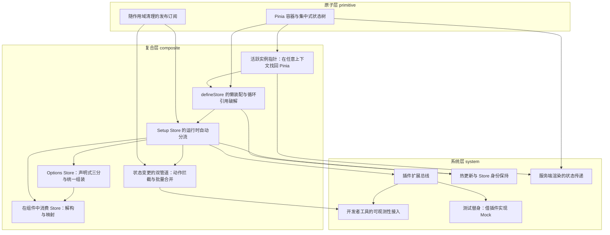

# 导读：vuejs-pinia 源码解读

## 这本书在讲什么：一句话主线

打开 Pinia 的源码，你会看到状态管理库该有的零件——状态、计算属性、动作、订阅、插件——但把它们拢起来的那根脊柱，其实只有三块基础设施加上一条总线：**一个脱离任何组件的作用域托管全部响应式副作用、一棵集中状态树聚合所有 store 的状态、一根全局指针让人在任意上下文零参数找回当前实例，再加一条在每个 store 诞生时按序通知的插件总线。** 撑起从 store 的懒创建、自动分流、状态变更、组件消费，一直到热更新、开发者工具、服务端渲染、测试替身的整个生态，靠的就是这四样东西的不同组合。

这句话怎么落到各层，可以这样拆：订阅原语、作用域加集中状态树，是头两章打下的地基；全局指针紧跟着补上"在任意上下文找回容器"这一刀，从此 `useStore()` 才能不传参就调用。中间一大段（composite 层）解决的全是同一个问题——在这个地基之上，一个 store 怎么从一段定义变成可用的对象、状态怎么被改、改了怎么通知、组件里又怎么把它拿出来用而不丢响应性。最后一段（system 层）看上去花样最多，其实每一项都是同一招的复用：挤进前面已经搭好的某条管道，不另起炉灶。

读者合上这本书，能复述的不该是"Pinia 有这些功能"，而该是上面那句话——三块基础设施加一条总线，及其各自换来什么、赔了什么。

## 怎么读这本书：两条阅读路线

### 一、线性路线（从头读到尾）

全书按拓扑顺序排过，前一章留下的口子正好是下一章的入口。下面每章一句话，点出它承接了什么、又打开了什么。两处主题轴切换的地方我标了出来，零基础读者撞上难度台阶时，可以照着旁边的提示绕行。

1. **随作用域清理的发布订阅**——从"订阅忘了注销就内存泄漏"这个老问题起手，立起全书第一块小积木：一个 `Set` 存回调、触发时遍历，注销自动挂在注册那一刻所在的作用域上。它打开的是后面所有"通知"机制的底座。
2. **Pinia 容器与集中式状态树**——把第 1 章那点"作用域管副作用"的直觉，一下子放大到整个应用：造一个中央容器，用一根独立作用域托管全部 store 的副作用、用一棵树聚合全部状态。全书最早落地的地基。
3. **活跃实例指针**——容器靠依赖注入只能被组件够到，组件外的动作、工具函数怎么办？补一根模块级全局指针，谁开始用就把自己的身份挂上去。打开的是"`useStore()` 可以无参调用"这件事。
4. **defineStore 的懒装配与循环引用破解**——store 到底在哪个瞬间被造出来？答案是工厂首次被调用时，而且先把半成品登记进注册表再慢慢装配，破解两个 store 互相引用时的死循环。
5. **Setup Store 的运行时自动分流**——setup 返回的那袋没贴标签的属性，框架靠响应式指纹（是不是 `ref`、带不带 `effect`、是不是函数）自动分成状态、计算属性、动作三类。
6. **Options Store：声明式三分与统一组装**——声明式写法翻译成等价的组合式返回值，复用第 5 章同一套组装引擎；因为状态形状预先已知，顺手把组合式放弃的 `$reset` 自动补回来。

> **跳轨点一（第 6 章到第 7 章）**：前六章讲的都是"store 怎么定义和装出来"，从第 7 章起切换到"状态怎么被改、改了怎么通知"。如果你此刻更关心"在组件里怎么用"，可以先绕去第 8 章再回来；如果只想理解变更机制，第 7 章本身可以独立读。

7. **状态变更的双管道**——改状态有两条互不干扰的路：动作管道在调用前后插桩观测生命周期，补丁管道 `$patch` 干脆关掉自动监听、自己把一整批改动揉成一次通知。
8. **在组件中消费 Store**——直接解构 store 会丢响应性，因为响应性是代理对象的群体属性。解构助手和映射助手的共同诀窍是：读值时绕回那个代理对象，永远不拷贝值。

> **跳轨点二（第 8 章到第 9 章，最大的一个）**：前八章是"核心数据流"——造 store、改状态、消费。从第 9 章起进入 system 层，全是搭在核心之上的横切能力（扩展、热更新、可观测、SSR、测试）。只想读核心原理的读者，读到这里已经可以收尾；想看 Pinia 生态怎么长出来的，第 9 章是新入口。任何一条 system 主题都可以单独挑着读。

9. **插件扩展总线**——把"每个 store 诞生完毕"这个时刻，变成一条按注册顺序逐个通知的回调列表，谁要挂能力就往里登记一个插件。devtools、持久化、测试替身全靠它。
10. **热更新与 Store 身份保持**——开发期改了源码，怎么不换掉 store 对象、只换它身上的字段？答案是用注册表里的旧实例认人，建一个影子把新零件嫁接过去，引用从头到尾不变。
11. **开发者工具的可观测性接入**——复用第 7 章那两条变更管道当事件源，再用一个 `Proxy` 在动作执行期间反复刷写"当前动作"指针，让零散的状态变更自动归回引发它的那个动作。
12. **服务端渲染的状态传递**——把那棵集中状态树塞进宿主框架本就要下发的传输数据里整棵端走，再给不愿过境的字段焊一个隐式标记；渲染一完立刻清空全局指针，防跨请求串味。
13. **测试替身：借插件实现 Mock**——`createTestingPinia` 一行核心都不改，只是挤进第 9 章那条插件总线、把自己排到最后一个位置，于是能盖掉前面所有人装上的动作，把它换成哑炮。

### 二、按主题路线

带着具体问题来的读者，可以照下面这几条子序列挑着读，不必从头：

- **"状态到底存在哪、改了怎么通知"**：第 2 章（容器与集中树）→ 第 7 章（双管道）→ 第 1 章（订阅原语）。读完你能说清状态的事实源、变更的两种节奏、通知的回收。
- **"store 怎么从一段定义变成可用对象"**：第 4 章（懒装配）→ 第 5 章（运行时分流）→ 第 6 章（声明式翻译）。这条线讲透两种写法为什么共用一套引擎。
- **"在组件里怎么用 store 不丢响应性"**：第 8 章；前置扫一眼第 5 章的分流手法即可。
- **"扩展和插件生态怎么搭起来"**：第 9 章（总线）→ 第 11 章（devtools）→ 第 13 章（testing）。看清同一条总线如何长出三项完全不同的能力。
- **"只关心服务端渲染"**：第 2 章（为什么状态能整树端走）→ 第 3 章（为什么指针用完要清空）→ 第 12 章（实际搬运）。SSR 几乎不依赖中间任何 composite 层，只靠这两块地基。
- **"想追全书最隐蔽的那条暗线"**：第 3 章（`activePinia` 指针）→ 第 7 章（`activeListener` 令牌与监听开关）→ 第 11 章（`activeAction` 归组指针）。同一副"模块级变量记住当前活跃者"的骨架，换了三个名字出场三次。

## 贯穿全书的核心原理

下面这几条，是在多章以不同化身反复现身的底层机制。认出它们，前后文就贯通了。

**1. 集中聚合——把散落的东西收进一个中央点。** 状态聚成一棵树、副作用聚进一个作用域、插件聚成一条总线、store 聚进一张名册。"聚"这个动作换来的是整体可操作：整树能一次序列化、一个作用域能一键销毁全部副作用、一条总线能给所有 store 统一挂能力。现身于第 2 章（容器把状态、副作用、名册三件套收进一处）、第 4 章（注册表聚住所有实例）、第 9 章（插件总线聚住所有扩展）。

**2. 隐式上下文指针——一根模块级变量记住"当前活跃者"。** 谁开始干活就把自己的身份挂上一根全局变量，别人抬头就能看到该找谁。这套"最近挂牌者"语义既是它好用的原因，也是它危险的来源——服务端多请求共享同一根变量，所以每渲染完必须落一次闸。这是全书最值得追的一条暗线，同一副骨架换了三张脸：第 3 章的 `activePinia`（找回当前容器）、第 7 章的 `activeListener` 令牌配监听开关（管补丁合并的通知节奏）、第 11 章的 `activeAction`（给变更事件归组到引发它的动作）。

**3. 运行时特征探测分流——靠值自带的可观测特征分类，不靠用户贴标签。** 一个 `ref`、一个带 `effect` 的 `computed`、一个函数，落到内存里长得就不一样，遍历一遍看指纹就能分进各自的堆。代价是类型层面没法预先约束、`$reset` 也因此无法自动实现。现身两次，互为镜像：第 5 章在建立侧跑一遍（把 setup 返回值分成状态、计算属性、动作），第 8 章在消费侧再跑同一套探测（决定哪些成员能被解构、哪些该丢弃）。

**4. 作用域绑定的资源回收——注册时挂靠作用域，销毁时统一结清。** 把"这东西该活多久"从调用方手里的样板代码，挪到注册那一刻所在的作用域身上；作用域一销毁，挂在它名下的订阅、监听、计算一起清掉；`detached` 开口给少数需要独立存活的资源留一条生路。这是第 1 章的灵魂，之后被一再放大复用：第 2 章把它从单个订阅的尺度直接放大到整个应用（一个 `detached` 的 `effectScope` 托管全部 store 的副作用，一句 `stop()` 拆光），第 9 章让每个插件跑在 store 自己的子作用域里，store 销毁即扩展清理。

**5. 复用既有管道搭便车——到了扩展层，不另起炉灶。** system 层的每一项横切能力，几乎都是"挤进前面已经造好的某条管道"，而不是新造一条。这条原理的根基是第 9 章的插件总线；之后第 10 章热更新复用建店流水线（造一个影子再嫁接，不重写分类逻辑）、第 11 章 devtools 复用 `$subscribe` 与 `$onAction` 两条变更管道当事件源、第 12 章 SSR 搭宿主框架传输数据的便车不自建通道、第 13 章 testing 挤进总线排到最后一个位置完成劫持。抓住这一条，后半本书就读通了一半。

## 全书脉络图

下面这张依赖图由编排依据各章的前置关系程序化生成，我只替你做向导。**读法**：箭头从前置指向后继，意思是"后继踩在前置的肩膀上"——箭头的尾巴是地基，箭头的头是盖在上面的楼。

进图先认两个最显眼的点。**最厚实的根**，是第 2 章「Pinia 容器与集中式状态树」：它本身无前置，却被三根箭头直接顶着（活跃指针、defineStore 懒装配、SSR），是全书最早落地、也最不能动摇的地基。**最繁忙的十字路口**，是第 5 章「Setup Store 的运行时自动分流」：它被足足五章依赖（Options Store 翻译、状态变更双管道、组件消费、插件总线、热更新），几乎所有后继能力都要先经过"store 被组装出来"这一关。

再留意两条跨层的特殊边。第 12 章 SSR 从 system 层一路绕过中间全部 composite，直接落回第 2 章（容器与集中树）和第 3 章（活跃指针）这两块地基——这告诉你 SSR 根本不靠 store 怎么装、怎么改，它只靠"状态树能整棵端走"和"指针用完要清空"这两件最底层的事。另一头，第 13 章测试替身是全图最轻的叶子，只挂在第 9 章插件总线一个点上，却完成了看起来"理应给核心开后门"的 mock——这条孤零零的边，本身就是"插件总线设计得够通用"的最好注脚。

下图由 outline 的 `dependsOn` + `topoOrder` 程序化生成（箭头方向：前置 → 后继）：

