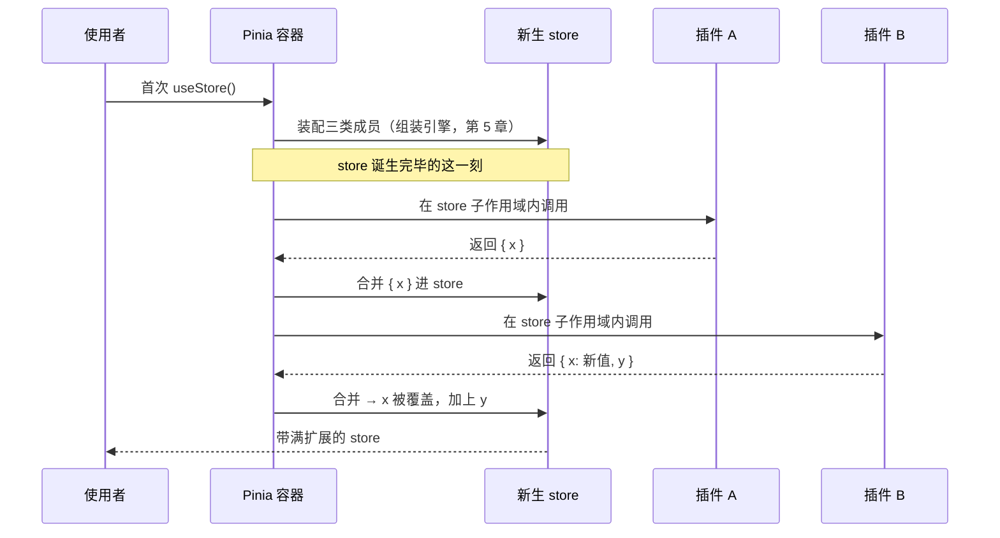

# 插件扩展总线

> 本章属于 system 层。前置：Setup Store 的运行时自动分流。
> 学完你能：讲清 Pinia 为什么用一个「按注册顺序逐个通知的回调列表」来扩展每一个新生的 store，以及这套设计在「顺序敏感」和「副作用回收」上付出的代价。

## 1. 为什么需要它

上一章我们站在组件一侧，看一个已经组装好的 store 怎么被解构、映射进模板。但组件拿到的那个 store，除了你自己声明的状态、计算属性、动作，往往还凭空多出一些能力：调试面板能认出它、测试时它的动作能被替身拦截、页面刷新后状态还能读回来。这些能力没有一个是写在 store 定义里的。

这正是状态管理库会撞上的矛盾：核心想保持精简，可一旦落到真实部署，调试、测试替身、持久化、日志、权限这些横切能力又缺一不可。全塞进核心，核心会臃肿到没人维护得动；不提供入口，使用者就只剩下 fork 源码这一条路。

使用者真正想说的其实是一句话：在每个 store 诞生完毕的那一刻，让我有机会再往它身上挂自己的东西。Pinia 把这个愿望标准化了，也就是本章的主题。

## 2. 核心思想

把「每个 store 诞生完毕」这个时刻，变成一条按注册顺序逐个通知的回调列表，让回调往新生的 store 上添东西。

换句话说，Pinia 不去预测你需要哪些部署期能力，而是交出一个固定的扩展点：谁有能力要挂，就往这条列表里登记一个回调；store 一拼好，按登记顺序挨个叫醒这些回调，把它们的返回值合并到 store 身上。这就是一条围绕 store 诞生时刻的有序扩展总线。

## 3. 心智模型

这条总线的运转分两头：一头是「收集插件」，一头是「store 诞生时按序通知」。

收集这边，容器手里同时攥着两张表：一张放已经就位的插件，一张放还在排队、等应用挂载后再转正的插件。你调用 `pinia.use(plugin)` 时，容器看一眼应用挂没挂：没挂，插件先进排队表；挂了，直接进就位表。这时插件只是被存起来，函数体并不会跑。等到应用真正挂载容器的那一刻，排队表里的插件按原来顺序整批搬进就位表。这么安排是为了让插件能在任意时刻注册，连容器自带的调试插件（它在容器构造完就注册了，那时应用显然还没挂）也能被正确收进来，并自然排在队伍最前面。

通知这边，发生在某个 store 第一次被使用、组装引擎把它装配完毕的那个尾部。组装引擎先把你声明的状态、计算属性、动作三类成员装进 store（这件事第 5 章已展开，这里只看它做完之后留下来的口子），然后按顺序遍历就位插件表，把 `{ store, 应用, 容器, 定义选项 }` 交给每个插件。每个插件都在这个 store 自己的副作用作用域里运行，它返回的对象被合并进 store，扩展当场生效。

下面这张时序图把这个「诞生即通知」的时刻放慢了看：



还有一个收尾动作：store 销毁时，它自己的那个副作用作用域随之停止，插件当初在这个作用域里建立的所有副作用（监听、订阅、计算）一并被回收。挂得多干净，拆得就多干净。

## 4. 关键权衡

### 后注册者覆盖先注册者的同名属性

总线按注册顺序串行调用，每一轮把插件返回值合并进 store。这意味着两件事：一是后跑的插件拿到的 `store` 里，已经带着先跑插件加的属性，它看得见；二是它的返回值里若有同名 key，会直接盖掉前一个。换来的是一套可预测的叠加语义——你想让一个插件在另一个插件的基础上再加工，只要排在它后面注册就行。

代价是插件顺序敏感。同一组插件，注册顺序不同，store 上的最终扩展就不同。最典型的例子是测试替身插件：它要把动作换成 spy，就必须排在整条插件链的最后，否则它盖上去的动作会被后面真正注册的插件再盖回来，替身就失效了。

这里化解的本质矛盾，是任何链式扩展系统都逃不掉的那一对：**你想要扩展可组合、能层层叠加，可叠加本身就必然带出谁先谁后、谁能覆盖谁的顺序语义**。Express 的中间件、axios 的拦截器、构建工具的 loader 链，面对的都是同一个骨架——只要扩展是排成一队依次作用于同一个对象，顺序就成了语义的一部分，躲不掉。

### 插件副作用绑在 store 自己的子作用域上

每个插件运行时，并不是挂在容器的总作用域里，而是挂在为这个 store 专门新建的子作用域里。作用域自动回收这件事第 1 章已经展开，这里只看它的派生结论：插件在这个子作用域里建的监听、订阅、计算，全都记在这个 store 名下。换来的是 store 销毁即扩展清理，不留泄漏，你不用在每个插件里手写一套销毁逻辑。

代价是插件副作用的生命周期被绑死在单个 store 上。一个插件若想做跨 store 的全局副作用，比如一个统一的心跳、一个汇总所有 store 变化的日志，它不能指望容器替它回收，得自己另开一个独立的作用域来托管。

这条权衡背后的本质矛盾，是资源生命周期管理里反复出现的那一对：**扩展建立的资源应当随宿主一起回收，可扩展自己又不该被迫去操心清理**。把它绑到 store 的子作用域上，是用「跟宿主同生共死」一次性消解了「谁负责清理」这个问题。你在 React 的 `useEffect` cleanup、任何带作用域的资源管理里，都能认出同一个解法。

## 5. 最小原理演示

下面这几十行把上面两头演一遍：两阶段收集（排队表转正）、诞生即按序通知、返回值合并、同名覆盖、副作用随作用域回收。为了只盯住总线本身，这里用一个极简的 `Scope` 对象模拟副作用作用域（持有一串清理钩子，`stop()` 时逐个调用），不引入真正的响应式系统。

```ts
// 极简副作用作用域：收集清理钩子，stop 时逐个调用
class Scope {
  private cleanups: Array<() => void> = []
  active = true

  run<T>(fn: () => T): T {
    const prev = currentScope
    currentScope = this // 让 run 期间登记的钩子落进当前作用域
    try {
      return fn()
    } finally {
      currentScope = prev
    }
  }

  stop() {
    this.active = false
    this.cleanups.forEach((c) => c())
    this.cleanups = []
  }
}

let currentScope: Scope | null = null
function onScopeDispose(cleanup: () => void) {
  if (currentScope) currentScope.cleanups.push(cleanup)
}

// 扩展总线本体
type Plugin = (ctx: { store: Record<string, unknown> }) => Record<string, unknown> | void

class MiniPinia {
  private ready: Plugin[] = [] // 就位插件表
  private pending: Plugin[] = [] // 排队表：应用挂载前注册的先放这
  private app: object | null = null // 应用引用，null 表示尚未挂载
  private scopes: Scope[] = []

  use(plugin: Plugin): this {
    if (!this.app) this.pending.push(plugin) // 没挂载进排队表
    else this.ready.push(plugin)
    return this
  }

  install(app: object) {
    this.app = app
    this.ready.push(...this.pending) // 挂载时整批转正，保留原顺序
    this.pending = []
  }

  // 模拟「一个 store 组装完毕」的那一刻
  createStore(): Record<string, unknown> {
    const store: Record<string, unknown> = {}
    const scope = new Scope() // 给这个 store 配一个专属子作用域
    this.scopes.push(scope)

    // 按注册顺序逐个通知，每个插件都在 store 自己的作用域内运行
    for (const extender of this.ready) {
      const extensions = scope.run(() => extender({ store }))
      Object.assign(store, extensions) // 后注册者同名 key 覆盖前者
    }

    store.$dispose = () => scope.stop() // 停作用域 = 回收插件副作用
    return store
  }
}
```

用法：

```ts
const pinia = new MiniPinia()

// 容器自带调试插件：构造时就注册，此刻应用未挂载 → 进排队表
pinia.use(({ store }) => {
  console.log('[debug] 一个 store 诞生了')
})

// 插件 A：登记一个副作用，返回 x
pinia.use(({ store }) => {
  onScopeDispose(() => console.log('A 的副作用被回收'))
  return { x: 'from-A' }
})

const app = {}
pinia.install(app) // 挂载：排队表整批转正，就位表 = [调试, A]

// 插件 B：挂载后才注册，直接进就位表；同名 x 会覆盖 A
pinia.use(({ store }) => {
  onScopeDispose(() => console.log('B 的副作用被回收'))
  return { x: 'from-B', y: 'from-B' }
})

const store = pinia.createStore()
console.log(store.x) // 'from-B' —— B 覆盖了 A
console.log(store.y) // 'from-B'

;(store.$dispose as () => void)() // 销毁 store
// 控制台：A 的副作用被回收 / B 的副作用被回收
```

## 6. 执行轨迹

把上面那段代码的运行过程放慢，一步步看总线内部的状态怎么变。

调用 `new MiniPinia()` 时，`ready = []`、`pending = []`、`app = null`。

注册调试插件：`app` 还是 `null`，它进排队表，`pending = [调试]`。注册插件 A：同样进排队表，`pending = [调试, A]`。注意这时 A 的函数体并没有执行，只是把 A 这个函数存了起来，插件要等到 store 诞生那一刻才被调用。

调用 `pinia.install(app)`：`app` 被赋值，排队表整批搬进就位表，`ready = [调试, A]`，`pending` 清空。

注册插件 B：`app` 已非空，直接进就位表，`ready = [调试, A, B]`。

关键时刻 `pinia.createStore()`：新建空 `store` 和一个专属 `scope`，然后按 `ready` 的顺序挨个跑。调试插件先跑，打一行日志，没有返回值，合并是个空操作。轮到 A：在 `scope.run(...)` 里执行，A 调 `onScopeDispose` 把「A 的副作用被回收」登记进这个 `scope`，返回 `{ x: 'from-A' }`，`Object.assign` 后 `store = { x: 'from-A' }`。轮到 B：同样在 `scope.run(...)` 里执行，登记自己的清理钩子，返回 `{ x: 'from-B', y: 'from-B' }`，`Object.assign` 后 `x` 被覆盖、`y` 加进来，`store = { x: 'from-B', y: 'from-B' }`。

最后给 store 挂上 `$dispose`。于是 `store.x` 是 `'from-B'`，`store.y` 也是 `'from-B'`。

调用 `store.$dispose()` 触发 `scope.stop()`：作用域把登记表里的两个钩子逐个调用，控制台依次打出「A 的副作用被回收」「B 的副作用被回收」。A、B 挂上 store 的能力源自这两个插件，它们建的副作用也跟着这个 store 一起消失了。

## 7. 教学简化说明

本章演示故意省略了几样东西：真正的响应式系统（用普通对象就够演顺序与合并）、开发模式下对「返回了非响应式对象」的诊断警告、把扩展属性登记进自定义属性集合以供开发者工具识别的逻辑、热更新与 SSR 分支，以及完整的类型系统。演示里传给插件的上下文也只保留了 `store`，省略了真实总线还会给的 `app`、`pinia`、`options`。这些都是工程完整性的部分，不是这条总线的原理主干。

## 8. 小结

Pinia 没有把调试、测试、持久化这些能力写进核心，而是把「store 诞生完毕」这个时刻让了出来，变成一条谁都能登记、按注册顺序逐个通知的总线；能力由插件挂上去，也由插件自己负责。这条总线能成立，靠的是两件事吃得住：顺序叠加换来可预测的定制力，副作用绑在 store 子作用域换来随 store 一起干净的回收。

它还隐含一个前提：store 一旦诞生，它身上的扩展就都系在这个对象身上。下一章热更新要处理的就是这个前提带来的麻烦——代码变了，怎么在不换掉这个对象的前提下，把新的成员迁移过来。