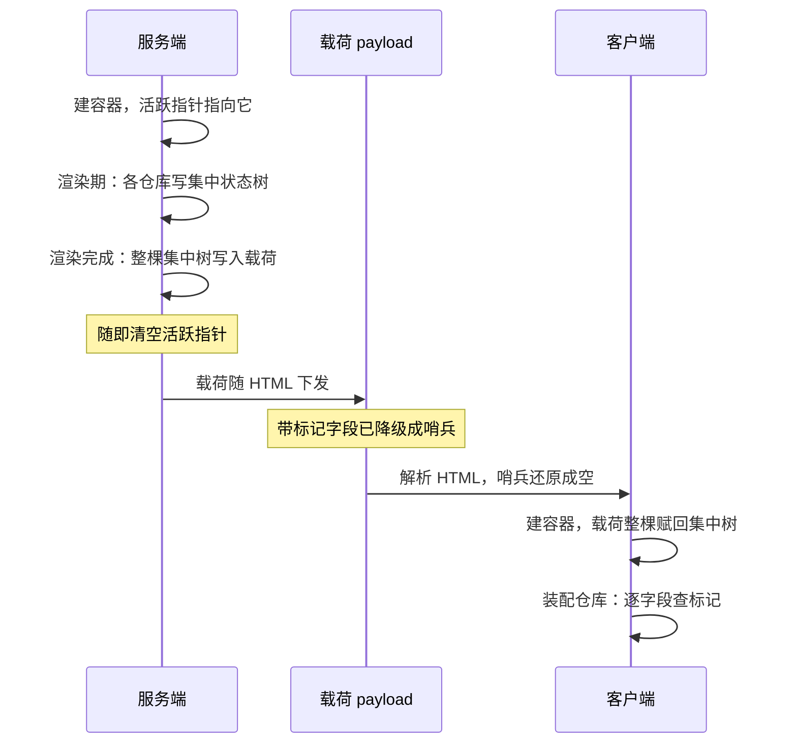

# 服务端渲染的状态传递

> 本章属于 system 层。前置：Pinia 容器与集中式状态树、活跃实例指针。
> 学完你能：用一句话讲清服务端渲染下状态靠「搭宿主载荷的便车整树往返，再用隐式标记给不该传的字段开逃逸口」来传递，以及这三处设计选择各自换了什么、赔了什么。

## 1. 为什么需要它

上一章讲的是开发期怎么把每次状态变更推成时间线事件，交给开发者工具去回放。那套机制只活在开发构建里，一旦应用上线、跑进服务端渲染模式，状态要面对的是一个更硬的约束：服务端把页面算好交给浏览器时，状态本身怎么跟着过去。本章就接这个。

服务端渲染的好处是首屏直接是成品：登录态、购物车、首屏数据，都在服务器上算好了再发出 HTML。可浏览器拿到 HTML 后，JavaScript 一启动，组件又会从头建一遍仓库、重新请求数据。这一来一回，既慢，又会让用户先看到一帧"未登录"的空状态、再"啪"地跳成"已登录"。这种闪烁不是体验瑕疵，是状态在两个运行时之间没有对齐。

使用者真正想要的是：服务端算好的那棵状态树，原封不动地交到浏览器手里接着用。但这里藏着一个不那么显眼的矛盾——**不能无差别全传**。有些东西在两端天然不该是同一份：浏览器端要自己新建的路由实例、第三方有状态对象，如果被服务端的旧值盖掉，反而出问题；而且这些体积不小的对象塞进 HTML 白白增大传输量，也没有意义。

换句话说，机制要同时满足两件拧着来的事：状态要能**整棵**跨过去，但其中**个别字段**得能被摘出来不传。本章讲的就是这个机制怎么设计。

## 2. 核心思想

把整棵集中状态树塞进宿主框架自带的传输载荷里，随网页一起下发，客户端再整棵倒回去；不愿下发的字段，提前在对象上打一个隐式标记，序列化时见到标记就自动摘掉。

说得更透一点：状态传递复用了一条本来就要走的管道——网页从服务端到浏览器，本身就要带一坨初始化数据（这坨数据通常叫 payload）。状态树只是搭了这趟便车，而不是另修一条专门的传输通道。逃逸口也不是另设开关，而是把"别传我"这个意图直接焊在对象身上，让它跟着对象走。

## 3. 心智模型

这里有两个前置设计被本章直接拿来用，各用一句话带过：状态之所以能"整棵端走"，是因为容器早就把所有仓库的状态聚成了一棵集中树（第 2 章已讲透这棵树为什么天然可整树序列化）；状态之所以能定位"属于当前这次请求"，靠的是那个全局活跃指针（第 3 章已讲透它的跨请求污染风险，本章只看它在渲染结束后被主动置空这一步）。

整个流程七步，分服务端、传输、客户端三段：

1. **构建期**：集成模块向宿主注册两个运行时插件，一个负责"建容器 + 跨端搬运状态"，一个负责"序列化时摘掉免水合字段"。
2. **服务端启动**：第一个插件建好容器、装进应用、把全局活跃指针指向它。
3. **服务端渲染期间**：各仓库正常读写，所有状态都落在那棵集中树上。
4. **渲染完成钩子**：把整棵集中树写进传输载荷；紧接着把全局活跃指针置空，断开对这份状态的引用（这是第 3 章欠下的债，本章在这里兑现）。
5. **载荷随 HTML 下发**：其中打了免水合标记的字段，已在序列化时降级成一个占位哨兵，真实数据并没有传输。
6. **客户端启动**：同一个插件再跑一遍，发现载荷里已有状态树，就整棵赋回新建容器的集中树。
7. **客户端装配各仓库**：逐字段查免水合标记——没标记的灌入服务端值，有标记的保留客户端自己新建的对象。

这里有两道关卡，都用同一个判定函数，但查的东西不同，容易混：

- **第一道（序列化侧）**：写载荷时，宿主遍历载荷，对每个对象查标记，带标记的降级成哨兵——查的是"服务端 setup 里产出的、已被用户声明免水合的对象"。
- **第二道（装配侧）**：客户端建仓库时，逐字段查标记决定是否灌服务端值——查的是"客户端 setup 里新建的对象"。

setup 函数在服务端和客户端**各跑一次**，用户写的那个"把对象包一下"的声明，两端各打一次标记。正是因为两端都打了，两道关卡才能各自在自己的那一端查到标记并生效。



## 4. 关键权衡

### 搭宿主载荷的便车，不自建传输通道

状态从服务端到客户端，本来要解决"怎么序列化、怎么塞进 HTML、浏览器怎么解析回对象"这一整条链路。这套机制没有自己造这条路，而是直接借宿主框架已有的载荷管道搭车：写状态就是往载荷对象上赋值，读状态就是从载荷对象上取，序列化与反序列化的脏活全由宿主干。

换来的是**完全不必自建一套传输通道**——不用自己写 `<script>` 标签注入、不用自己管编码与解析、不用自己处理循环引用与日期这类特殊类型。代价是**与宿主的序列化协议强耦合**：免水合字段要按宿主"类型化序列化"的扩展点，成对注册降级函数与还原函数，换一个宿主框架，这部分得重写。

这条权衡化解的本质矛盾，是「复用宿主成熟的基础设施」与「不被宿主的协议绑架」之间的拉扯。它选了前者。这个骨架到处都是——借平台现成的网络层、序列化器、ORM，换来开箱即用，赔上对协议的依附。一旦你认出"我在搭谁的便车"，换框架时要重写哪块就心里有数。

### 整棵状态树一次性端走

序列化和回填都只对那一棵集中树动手：服务端写载荷，就是把这棵树整个读出来；客户端回填，就是把这棵树整个赋回去。不必逐仓库搬运、不必逐字段对齐。

换来的是**两端各一行就把状态搬完**，开发上极其省事。代价是**必须配一个细粒度的逃逸口**，否则会撞上两个极端：要么把不该跨端的庞大有状态对象也序列化出去（体积膨胀、客户端水合冲突），要么无差别整树覆盖，把客户端新建的对象砸掉。

这条权衡化解的本质矛盾，是「粗粒度整体搬运的开发效率」与「细粒度控制不可省略」之间的对立。它选了"默认整树 + 留逃生舱"。这是个通解骨架：数据库批量导入默认全量、留 where 过滤；ORM 默认整对象映射、留 `@Transient` 字段。凡是"默认全量"的设计，都逃不开要给个别条目留一道侧门，本章的逃逸口就是下一要讲的那个标记。

### 隐式标记：序列化与装配各查一次

"这个字段别传"这件事，如果让使用者去维护一张"免传字段清单"，既啰嗦又容易和真实数据脱节。这套机制换了个做法：提供一个函数，把不想被水合的对象**包一下**，它就在对象身上埋一个不可枚举的 Symbol 标记；标记跟着对象走，不改变数据的形状。两道关卡各自调用同一个判定函数查这个标记。

换来的是**使用者一行声明就完成意图，且声明紧贴被声明的对象本身**——不用维护额外清单，对象走到哪标记跟到哪。代价有二：一是标记是**运行时隐式**的，控制台里看不见，排查"为什么这个字段没传过去"时容易摸不着头脑；二是**两道关卡缺一不可**——序列化时要用它把对象降级成哨兵，装配时要用它决定是否灌入服务端值，少一道都会出问题（只摘不跳，客户端字段被空值覆盖；只跳不摘，庞大对象还是被序列化进 HTML）。

这条权衡化解的本质矛盾，是「声明要足够方便」与「控制要足够显式」之间的取舍。它选了方便、赔了显式。这和序列化库里用注解标记忽略字段、ORM 用注解标记非持久化字段，是同一个矛盾的不同化身：都用一行紧贴数据的元信息声明，去表达一个横切在"数据本身"和"如何搬运/持久化它"之间的关注点。

## 5. 最小原理演示

下面这段只演核心思想：一棵集中树怎么被拍照塞进载荷、载荷怎么被还原、装配时怎么靠标记逐字段过滤。响应式原语用最小占位实现，只为演示状态字段如何被识别，不是真实的 Vue。

```ts
// 免水合标记：一个不可见的 Symbol，打在对象上、跟着对象走
const MARK = Symbol('skipHydrate')
function skipHydrate(obj) {
  Object.defineProperty(obj, MARK, {})   // 不可枚举，控制台里看不见
  return obj
}
function shouldHydrate(obj) {
  // 带标记的对象不放行；ref、普通对象都放行
  return !obj || typeof obj !== 'object' || !Object.hasOwn(obj, MARK)
}

// 宿主的「类型化载荷」：成对注册降级（写）与还原（读）
const SKIP = Symbol('哨兵:免水合')        // 占位哨兵，真实对象不进入传输
function serialize(node) {
  if (node && typeof node === 'object') {
    if (!shouldHydrate(node)) return SKIP         // 带标记对象降级成哨兵
    const out = Array.isArray(node) ? [] : {}
    for (const k in node) out[k] = serialize(node[k])   // 宿主深遍历载荷
    return out
  }
  return node                                      // 标量原样
}
function revive(node) {
  if (node === SKIP) return undefined              // 哨兵还原成空，让字段走客户端默认值
  if (node && typeof node === 'object') {
    const out = Array.isArray(node) ? [] : {}
    for (const k in node) out[k] = revive(node[k])
    return out
  }
  return node
}

// 最小响应式原语（演示用，非真实 Vue）
function ref(v) { return { value: v } }
function reactive(obj) {
  Object.defineProperty(obj, '_isReactive', { value: true })
  return obj
}
function isReactive(o) { return !!o && typeof o === 'object' && Object.hasOwn(o, '_isReactive') }
function isRef(o) { return !!o && typeof o === 'object' && 'value' in o && !isReactive(o) }

// 装配引擎：跑 setup，逐字段查标记决定是否灌入服务端初值
function assembleStore(setup, initialState) {
  const store = setup()                            // 用户在 setup 里新建 ref / 建对象
  for (const key in store) {
    const prop = store[key]
    if (!(isRef(prop) || isReactive(prop))) continue   // 动作、计算属性不进状态分支
    // 第二道关：带标记的跳过、保留客户端新建对象；无标记的灌入服务端值
    if (initialState && shouldHydrate(prop)) {
      if (isRef(prop)) prop.value = initialState[key]
      else Object.assign(prop, initialState[key])
    }
  }
  return store
}

// 把仓库状态收进集中树（ref 解包存标量，对齐真源里 reactive 自动解包的语义）
function syncToCentral(tree, id, store) {
  const branch = {}
  for (const key in store) {
    const prop = store[key]
    if (isRef(prop)) branch[key] = prop.value          // 解包：集中树只存标量
    else if (isReactive(prop)) branch[key] = prop      // reactive 对象存引用
  }
  tree[id] = branch
}

// ===== 服务端：渲染完成，给集中树拍张照塞进载荷 =====
const central = {}
const serverStore = assembleStore(() => ({
  visits: ref(5),
  router: skipHydrate(reactive({ path: '/home' })),    // 路由实例声明免水合
}), undefined)                                          // 服务端首次创建，无初值
syncToCentral(central, 'user', serverStore)
// central.user = { visits: 5, router: <带标记的 reactive 对象> }

const payload = serialize(central)
// payload.user = { visits: 5, router: SKIP }   ← 路由真实数据未进入传输

let activePinia = 'server-pinia'           // 模拟全局活跃指针
activePinia = undefined                      // 渲染结束立刻清空，防跨请求串状态

// ===== 客户端：拆包，整树回填，装配时逐字段过滤 =====
const centralClient = revive(payload)
// centralClient.user = { visits: 5, router: undefined }   ← 哨兵还原成空

const clientRouter = reactive({ path: '/home' })        // 客户端自己新建路由
const clientStore = assembleStore(() => ({
  visits: ref(0),                                        // 客户端默认初值
  router: skipHydrate(clientRouter),                     // 两端同构：客户端同样打标记
}), centralClient.user)

console.log(clientStore.visits.value)        // 5        ← 无标记，灌入服务端值，跨端一致
console.log(clientStore.router.path)         // '/home'  ← 有标记，跳过，保留客户端新建
console.log(clientStore.router === clientRouter) // true
```

## 6. 执行轨迹

拿演示里的两个字段，像放慢动作一样走一遍状态怎么变。

服务端渲染时，setup 跑第一遍，产出 `{ visits: ref(5), router: <带标记的路由对象> }`。`syncToCentral` 把它们收进集中树：`visits` 是 ref，**解包**后存成标量 `5`；`router` 是带标记的 reactive 对象，整引用存进去。此刻集中树的 `user` 分支是 `{ visits: 5, router: <对象> }`。

渲染完成钩子触发，`serialize` 深遍历这棵树拍照：遇到 `visits` 的 `5` 是标量，原样进载荷；遇到 `router` 那个对象，`shouldHydrate` 查到它带标记，降级成哨兵 `SKIP`，**真实路由对象没有进入传输**。载荷里 `user` 分支变成 `{ visits: 5, router: SKIP }`。紧接着 `activePinia` 被置空，服务端不再持有这份状态。载荷随 HTML 下发。

浏览器侧 `revive` 把载荷还原：哨兵 `SKIP` 变回 `undefined`，于是客户端的集中树 `user` 分支是 `{ visits: 5, router: undefined }`。这一步只是把载荷整棵赋回集中树，还没碰任何仓库。

接着 setup 在客户端跑第二遍，产出一份全新的 `{ visits: ref(0), router: skipHydrate(clientRouter) }`——注意 `router` 在客户端**同样被 `skipHydrate` 包了一下**，标记两端都在。装配引擎逐字段处理：

- `visits` 是 ref、且没打标记，`shouldHydrate` 放行 → `prop.value = initialState.visits`，即 `ref(0)` 的值被服务端的 `5` 覆盖。`visits.value` 现在是 `5`，跨端一致。
- `router` 是 reactive、且打了标记，`shouldHydrate` 拦截 → 跳过灌入分支，`clientRouter` 原样保留，服务端那句 `undefined` 没有盖上来。`router` 仍是客户端自己新建的那一份。

最终：`visits` 两端都是 `5`，`router` 两端各自独立、互不串扰。

## 7. 教学简化说明

本章演示故意省略了一堆不参与演透原理的东西：宿主载荷的真实线路格式与 HTML 注入解析、集成模块的自动导入与目录扫描、构建期转译与类型声明生成、多请求并发的真实调度，以及 ref/reactive 真实的代理语义（演示里用占位实现代替）。集中树存解包标量这一步，是靠真源里 `ref` 对 object 深包裹成 reactive、ref 属性被自动解包才成立的，演示用 `syncToCentral` 手动解包来等价表达这个效果。

## 8. 小结

这一章本身没有再造新的状态容器，它做的是把已有的那棵集中树搬上宿主本来就有的载荷管道，再给不愿过境的字段焊一个隐式标记当通行证。整树端走换来了两端各一行，逃逸口换来了客户端有状态对象不被砸掉，搭便车换来了零自建通道——三处选择都赔了各自的代价。下一章换一个方向：同样是复用既有机制，但不再是搬运状态，而是借插件扩展点把动作和状态替换成测试替身。