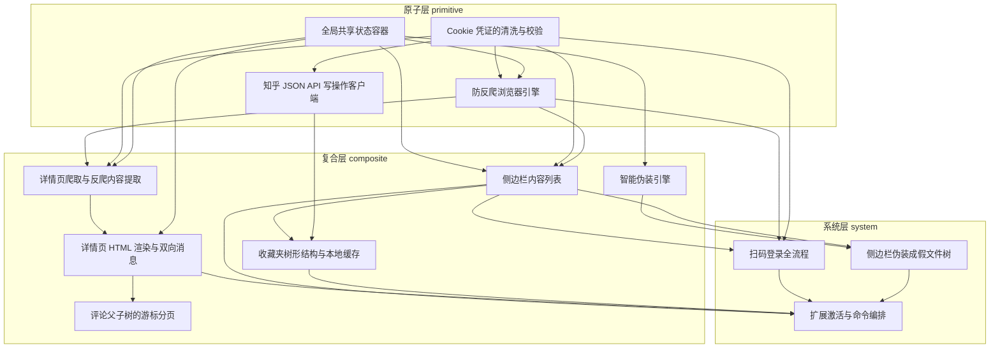

# 导读：zhihu-fisher-vscode 源码解读

## 这本书在讲什么：一句话主线

这本书讲的是一个 VSCode 摸鱼扩展——把知乎塞进编辑器、还能在老板路过时一键换皮成代码——在两块硬骨头面前是怎么落地的：知乎的反爬与登录加密，以及 VSCode 这个受限宿主给扩展只留的几个口子。一句话主线是：**遇到困难不去正面对抗，而是借力已有能力把它降级成一次复用；再为每一类降级配套"两套机制并存"的精细分工，让反爬、登录、阅读连续性、伪装、扩展生命周期这五条战线同时立得住。**

"借力"在这本书里有五次化身：知乎反爬严苛，就**开一台真 Chrome 替我们过安检**（第 3 章）；登录加密算不出，就**让知乎前端 JS 替我们算签名 Cookie**（第 11 章）；写动作不需要渲染，就把浏览器**提纯掉**、只重放那条 XHR（第 4 章）；侧边栏多状态难管，就**借力 VSCode 的 `getChildren` 回调**把它做成状态投影（第 5 章）；扩展停用要清理几十个句柄，就**借力宿主的 `subscriptions`** 让命令组只回吐不登记（第 13 章）。每一处都是"自己造一个"被改写成"复用一个"的具体形状。

紧挨着的是"两套并存"：Cookie 按传输通道分化两套清洗力度（第 2 章）；写操作请求构造彻底统一、成功判定却刻意分裂成三套契约（第 4 章）；webview 更新按"DOM 骨架换不换"分成整页重画与增量消息（第 7 章）；父评论与子评论各跑一套独立游标（第 8 章）；收藏夹一棵树里混用两种分页协议（第 9 章）；伪装引擎给标签条与内容叠层两套稳定性（第 10 章）。读完你会反复看到同一个权衡骨架：**承认两类诉求本质不同，给它们各一套机制，比强行统一更便宜。**

## 怎么读这本书：两条阅读路线

### 一、线性路线（按依赖顺序）

按编排层注入的 topoOrder 从头读到尾，每一章承接前一章打开的口子、为后一章铺路。下面每章一句话点出"承接了什么、打开了什么"，相邻章节主题轴切换的地方我特别标了**跳轨点**——零基础读者遇到台阶时可以据此绕行，先走主题路线。

1. **全局共享状态容器**（primitive）：全书地基——立起一块模块级可变单例当扩展全生命周期的共享内存，从此不再讲依赖注入。
2. **Cookie 凭证的清洗与校验**（primitive）：第一份住进容器的数据——三道预处理（清洗 → 静态校验 → 动态探测）应对脏、缺、失效三种病。
3. **防反爬浏览器引擎**（primitive）：开真 Chrome + 抹一处指纹——把反爬从"对抗"降级为"伪装"；挂上单例浏览器与页面注册表。
4. **知乎 JSON API 写操作客户端**（primitive）：**【跳轨点·读→写】** 写动作反过来——把浏览器从写操作里提纯掉、只重放 XHR；同一台 Chrome 不再是唯一通道。如果读者已被"伪装"这条线绕晕，可以先跳到主题路线一理清"读 vs 写"的分界，再回到第 5 章。
5. **侧边栏内容列表**（composite）：借力 VSCode 的 `getChildren` 回调把侧边栏做成"状态的投影"——按优先级分支表达六七种运行态。
6. **详情页爬取与反爬内容提取**（composite）：钻进已伪装的页面上下文里抠数据；为"页面是动态的"这一现实配两套一致性护栏（批次上限 + 关键词校验）。
7. **详情页 HTML 渲染与双向消息**（composite）：以"DOM 骨架换不换"为分水岭，让整页重画与增量消息两条路径并存，保住长文阅读连续性。
8. **评论父子树的游标分页**（composite）：把"累积全集"与"当前页切片"强行拆开，父评论与子评论各维护一套独立游标。
9. **收藏夹树形结构与本地缓存**（composite）：三级树 + 两种分页协议 + 三道判停互证 + 选单单独缓存——把评论章的"两层一种分页"扩到极限。
10. **智能伪装引擎**（composite）：**【跳轨点·数据→视觉】** 主轴从"抓数据/分页"完全切换到"OS 视觉与隐私"——身份冻结给标签条、内容重画给叠层，两层不同稳定性。如果读者到这里觉得"突然换了一本书"，是正常的——可以先走主题路线四把伪装体系理一遍再回来。
11. **扫码登录全流程**（system）：借力而非逆向的极致落地——一行加密都不写，让知乎前端 JS 替我们算签名 Cookie。
12. **侧边栏伪装成假文件树**（system）：声明式可见性——一条 `setContext` 翻变量、静态 `when` 条件互斥，让整组视图原子替换。
13. **扩展激活与命令编排**（system）：**【跳轨点·功能→工艺】** 主轴从"具体功能"切换到"装配工艺"——这是元层面的换轨，把前面所有零件拼成一台真正能跑的扩展。

### 二、按主题路线

针对常见阅读目标，各列一条精简的章节子序列。读者可以按需取用，不必线性读完。

- **路线一·反爬与登录链路**（"扩展怎么在知乎这种站活下来？"）：第 2 → 3 → 6 → 11 → 4 章。这条线把"伪装/借力"的骨架看清，尤其是第 3 章与第 4 章的读/写分界、第 11 章的借力总纲，是全书最具教学价值的部分。
- **路线二·侧边栏与树协议**（"侧边栏的各种列表与切换怎么管？"）：第 1 → 5 → 9 → 12 章。这条线把 "`getChildren` 回调 + 状态投影 + `setContext` 翻变量" 这组 VSCode 树协议用法看透。
- **路线三·WebView 阅读连续性**（"用户读长文怎么不闪？"）：第 6 → 7 → 8 章。这条线把"整页重画 vs 增量消息 + 累积/显示分离"这组原理看清，是任何"页面即应用"宿主里都会复用的骨架。
- **路线四·摸鱼伪装体系**（"失焦时整个界面怎么换皮？"）：第 10 → 12 章。这条线把"身份冻结 vs 内容重画 + 声明式可见性"这组视觉伪装原理看清，是 OS 与编辑器协作的精彩样本。
- **路线五·扩展装配与生命周期**（"VSCode 扩展怎么组装？"）：第 1 → 13 章。这条线把"组合根 + 句柄统一销毁"看透，是任何宿主型插件的标准骨架。

## 贯穿全书的核心原理

下面五条原理都在多章以不同化身现身。读者一旦认出"这其实是同一个原理的又一次落地"，理解就会贯通。

1. **借力而非对抗 / 把困难降级为复用**——不去自己重造或逆向，而是复用某个已有能力。
   - 第 3 章（开真 Chrome 替我们过反爬安检）、第 4 章（写动作提纯掉浏览器、只重放请求）、第 11 章（让知乎前端 JS 替我们算签名 Cookie）、第 12 章（借力宿主 `setContext` + `when` 条件做声明式可见性）、第 13 章（借力宿主 `subscriptions` 做句柄销毁）。
   - 第 4 章是这条原理的"反向化身"——它把"借力浏览器"提纯掉，证明借力与提纯是同一件事的两面。

2. **按性质分级，给两类诉求各一套机制（不强求统一）**——承认两类诉求本质不同，比强行抹平更便宜。
   - 第 2 章（清洗按传输通道分化）、第 4 章（请求构造统一 vs 成功判定分裂）、第 6 章（批次上限 + 关键词校验两套护栏）、第 7 章（整页重画 vs 增量消息）、第 8 章（父评论游标 vs 子评论游标）、第 9 章（HTML 分页 vs JSON 偏移分页混用）、第 10 章（身份冻结 vs 内容重画）、第 13 章（显式注入重对象 vs 全局单例取轻对象）。
   - 这是全书最高频复现的原理，几乎每一章都有它的化身。

3. **累积与显示分离**——存的是全集或会变状态，显示/读取只取当前那一片。
   - 第 7 章（`isLoaded` 门控——首屏全画、之后增量）、第 8 章（评论累积列表 vs 当前页切片）、第 9 章（树每次真拉 vs 选单走缓存——展示路径与复用路径分离）。

4. **多道不可靠判定互证 / 不要单一可信源**——接口给的信息都不可靠，多个判定叠加才能稳。
   - 第 2 章（静态校验只查存在性 + 动态探测反推失效两层缺一不可）、第 6 章（先关旧面板 + 关键词校验防 AI 直答缓存归属错误）、第 9 章（三道闸判停互证——总数/启发式/加载前后没变）。

5. **共享单例 + 显式清理**——共享资源换效率，代价是生命周期必须自己管到底。
   - 第 1 章（模块级可变单例当扩展全生命周期的共享内存）、第 3 章（单例 Chrome + 页面注册表 + 反向判定清扫孤立页面）、第 11 章（复用浏览器单例 + 新开隔离上下文——清理粒度从浏览器级下沉到上下文级）。

## 全书脉络图

下面的依赖图由编排层依据 `outline.json` 的 `dependsOn` 与 `topoOrder` 程序化生成——图本身 100% 忠于大纲，不需要我画。读图先看三件事：

**① 箭头方向**：从前置指向后继，即"踩在谁肩膀上"。被指向最多的章是地基，指向别人最多的章是装配工艺。

**② 最显眼的根节点**：`global-shared-store` 与 `cookie-manager`——这两章是全书的两个地基，几乎所有 composite 与 system 章都直接或间接依赖它们。前者撑起"扩展全生命周期的共享内存"，后者撑起"知乎凭据的干净度"——这两件事是后续所有花活的前提。

**③ 最显眼的汇聚点**：`command-assembly`（依赖 5 个前置章）是全书最大的装配节点——它把侧边栏、详情页、登录、收藏、伪装五条战线的产物胶合成一台真正能跑的扩展。其次是 `qr-login-flow`（依赖 3 个）与 `sidebar-disguise-filetree`（依赖 2 个）。

**④ 跨 layer 的关键边**（值得特别留意）：
- `cookie-manager`（primitive）→ `sidebar-tree-provider`（composite）：凭据直接跳到侧边栏，因为侧边栏的列表拉取必须先有干净 Cookie。
- `puppeteer-browser-engine`（primitive）→ `qr-login-flow`（system）：浏览器引擎跳过整个 composite 层直连登录流程——登录需要浏览器但不需要侧边栏/详情爬取的中间机制，这是全书最显著的跨层边。
- `sidebar-tree-provider`（composite）→ `sidebar-disguise-filetree`（system）：侧边栏伪装直接依赖侧边栏本身，两者共用同一组视图槽位。
- `webview-content-crawling` → `webview-render-messaging` → `comments-cursor-pagination`：composite 层内部的"读 → 渲染 → 评论"链是最长的同层依赖链。

顺着图读，你会看到这本书的拓扑骨架：两个地基章在最底层、五个 composite 章在中间织成一张相互依赖的网、三个 system 章在最顶层把所有零件装配成端到端能力。

下图由 outline 的 `dependsOn` + `topoOrder` 程序化生成（箭头方向：前置 → 后继）：

